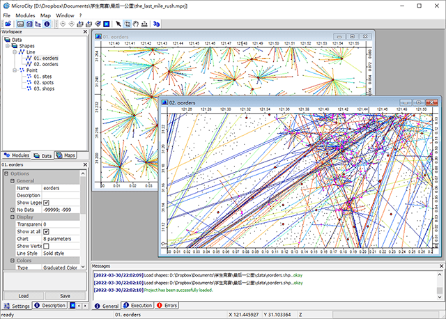
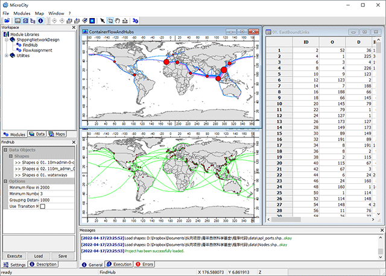
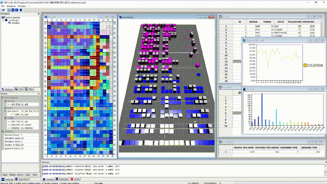
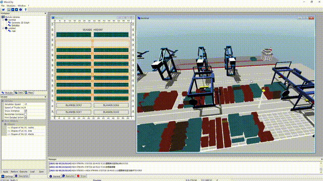
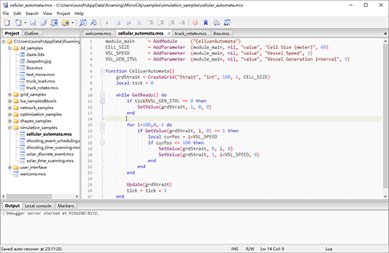

# 1.1 MicroCity的功能
MicroCity被设计为一款方便的空间规划工具，具有**便携、紧凑和快速**的特点。
## 一个建模框架
基于GIS、网络和混合整数规划库，MicroCity可以作为一个建模框架来解决交通运输问题，例如**城市物流和航运规划**： 
<!--  -->

&nbsp;&nbsp;
<!--  -->

 
## 一个仿真平台
基于3D计算机图形和离散事件仿真引擎，MicroCity可以作为一个仿真平台来评估物流场景，例如**自动化仓库和集装箱码头**： 
<!--  -->

<!-- &nbsp;&nbsp; -->
<!--  -->

 
## 通过脚本模块定制
MicroCity可以通过模块来扩展其功能，这些模块可以从[SAGA](https://saga-gis.sourceforge.io)继承或在**脚本编辑器**中进行脚本编写和调试： 
  &nbsp;&nbsp; 

目前，MicroCity主要用于教学和研究，可以自由分发。 

> 这篇文章使用ChatGPT翻译自其他语言，如果有问题请在[**反馈**](https://github.com/huuhghhgyg/MicroCityNotes/issues/new)页面提交反馈。