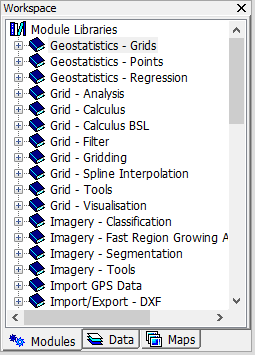

# 1.1 What MicroCity can Do
MicroCity is designed to be a handy spatial planning tool, which is **portable, compact and fast**.
## A Modeling Framework
Based on GIS, Networks and Mixed Integer Programming libraries, MicroCity can be used as a modeling framework to solve transporation problems, such as **City Logistics and Shipping Planning:** 
<!--  -->

&nbsp;&nbsp;
<!--  -->

 
## A Simulation Platform
Based on 3D CGI and Discrete Event Simulation Engine, MicroCity can be used as a simulation platform to evaluate logistic scenarios, such as **Automated Warehouses and Container Terminals:** 
<!--  -->

<!-- &nbsp;&nbsp; -->
<!--  -->

 
## Customized by Scriptable Modules
MicroCity can extend its functionality with modules which can be inherited from [SAGA](https://saga-gis.sourceforge.io) or scripted and debugged in **Script Editor:** 
  &nbsp;&nbsp; 

Currently, MicroCity is mainly used in teaching and research. It can be freely distributed. 
