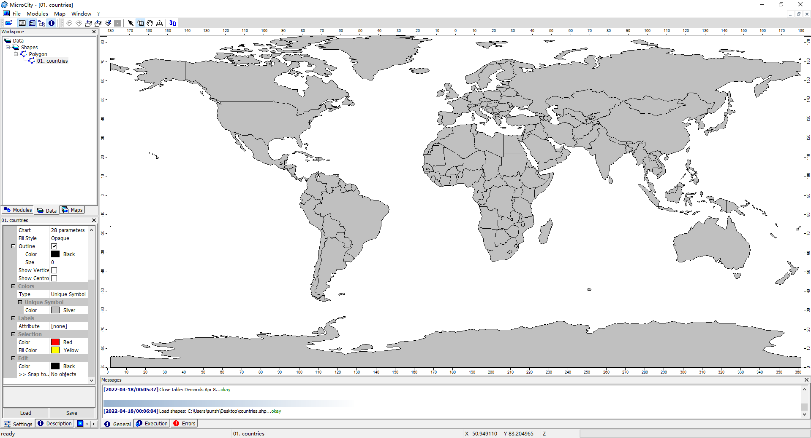
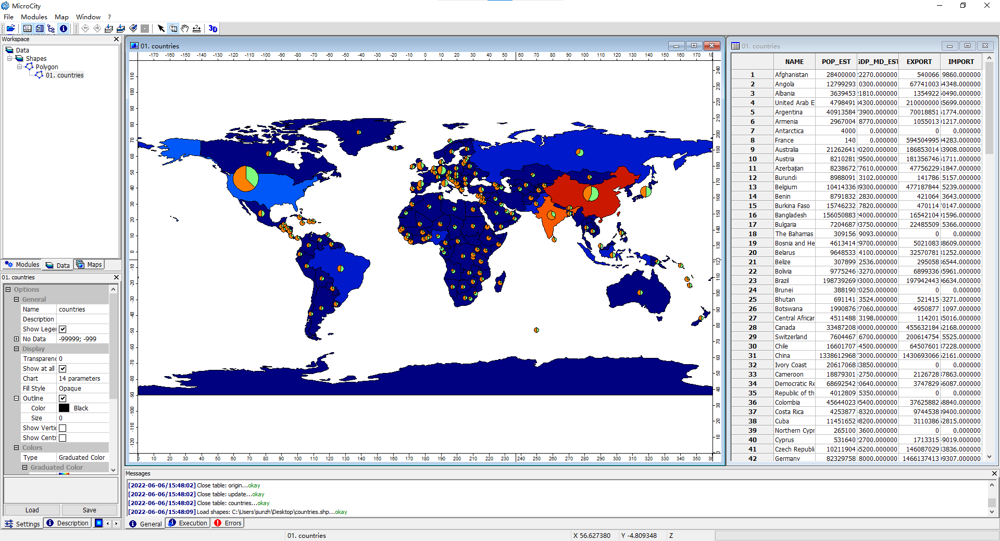

# 2.1 显示世界地图
本教程将指导您在 MicroCity 中操作和可视化地理信息系统（GIS）数据。
## 加载数据和创建地图
**下载** [countries.shp](https://github.com/microcity/microcity.github.io/raw/main/docs/data/countries.shp)（ArcGIS shapefile）和 [countries.dbf](https://github.com/microcity/microcity.github.io/raw/main/docs/data/countries.dbf)（dBase 文件）到同一个文件夹中。打开 **MicroCity**，点击 或将 countries.shp 拖入 MicroCity，然后在工作区面板中选择 **Data Tab**。双击工作区面板中的 **Data->Shapes->Polygon->01. countries**。

## 可视化国家属性
右键点击  **01. countries** 在**工作区面板**中。在弹出菜单中选择 **Attributes->Table->Show**。在 **Settings** 面板中，找到 **Colors->Type** 选项并选择 **Graduated Color**。在其子选项 **Attribute** 中，选择国家的人口属性 **POP_EST**。在 **Settings** 面板中，找到 **Chart** 选项并点击 **...** 按钮。在弹出对话框中，选择饼图（pie）作为图表类型，选择 **GDP_MD_EST** 作为属性（大小），并在 Fields 选项中选择 **EXPORT** 和 **IMPORT** 复选框，然后点击 **Okay** 按钮。

## 编辑形状
在工具栏上选择 **Action** 按钮。左键点击某个国家，右键点击它并在弹出菜单中选择 **Edit Selected Shape**，然后该形状将进入编辑模式。您可以更改其多边形的点，并在右键点击并再次选择 **Edit Selected Shape** 来完成编辑。

> 这篇文章使用ChatGPT翻译自其他语言，如果有问题请在[**反馈**](https://github.com/huuhghhgyg/MicroCityNotes/issues/new)页面提交反馈。