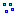
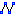
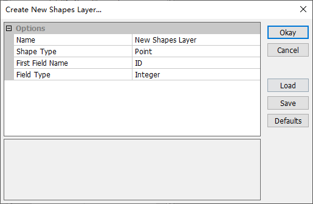
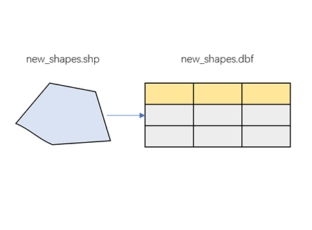
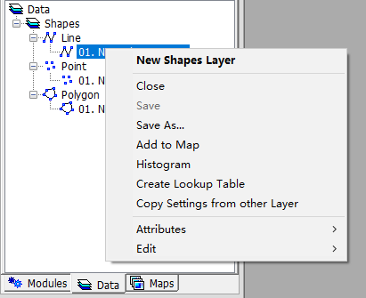
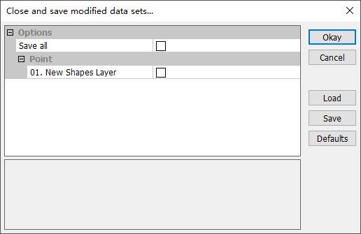
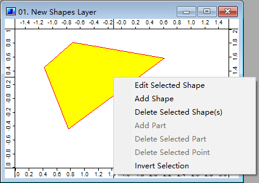
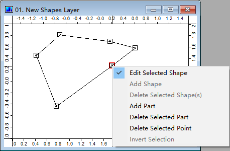

# 3.2 矢量图
MicroCity可以打开、创建和编辑ArcGIS shapefiles（\*.shp），即所谓的**Shapes**，并在**Workspace**面板的**Data**选项卡中进行维护。通过使用**模块**（参见[3.7](3.7_modules.md)），还可以导入或导出其他矢量文件格式，例如可伸缩矢量图形（\*.svg）和AutoCAD绘图交换格式（\*.dxf）。
## 打开、创建、保存和关闭Shapes
用户可以单击**加载**按钮或**文件->Shapes->加载**菜单项来打开ArcGIS shapefile（\*.shp）作为**Shapes**。从菜单中选择**文件->Shapes->新建**，弹出对话框如下所示，可以创建新的**Shapes**。用户可以从**点**，**线**和**面**中选择其中一种形状类型。还显示了ArcGIS shapefile（\*.shp）与同名dBase文件（\*.dbf）之间的关系。

 &nbsp;&nbsp; 

保存**Shapes**可以通过右键单击上下文菜单中的**保存或另存为**来完成。也可以从菜单中关闭**Shapes**并弹出提示对话框以保存它。

 &nbsp;&nbsp; 

## 显示和编辑形状
在**数据**选项卡中双击一个**形状**将为您提供地图视图（有关地图和图层，请参见[3.6](3.6_maps_and_layers.md)）。切换到**操作**按钮，然后右键单击**形状**图层中的一个**形状**，选择**编辑所选形状**，然后进入**编辑模式**。在这个模式下，用户可以添加/删除部分以及添加/删除形状中的点（关于形状的数据结构，请参见[2.2](2.2_searching_for_countries.md)）。通过右键单击上下文菜单**属性->表格->显示**可以访问**形状**的相关属性表格（\*.dbf）（请参见教程[2.1](2.1_showing_a_world_map.md)）。

 &nbsp;&nbsp; 

## 显示设置和数据可视化
用户可以从**设置**面板中更改**形状**的轮廓、填充、标签和其他显示设置。一些选项可以连接属性数据并提供可视化功能（例如[2.1](2.1_showing_a_world_map.md)）。

> 这篇文章使用ChatGPT翻译自其他语言，如果有问题请在[**反馈**](https://github.com/huuhghhgyg/MicroCityNotes/issues/new)页面提交反馈。