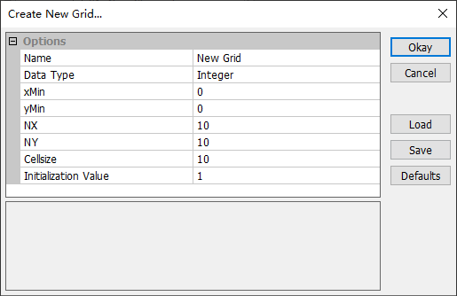
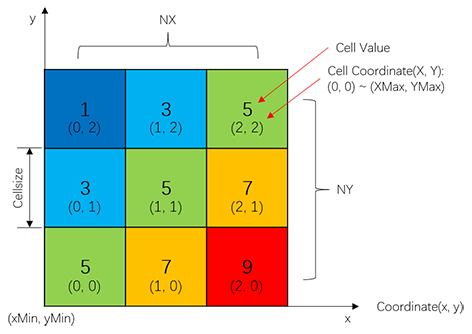
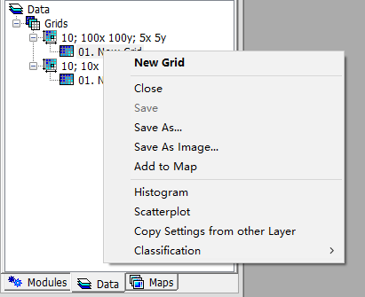
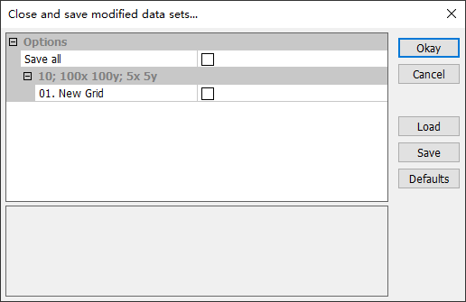
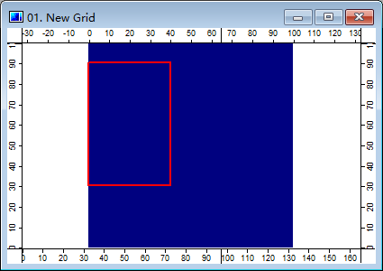
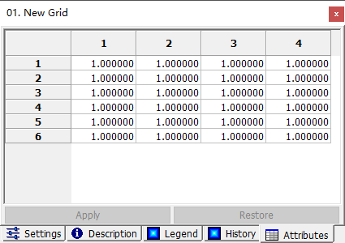

# 3.3 栅格图
MicroCity可以打开、创建和编辑SAGA Grid（\*.sgrd），在**工作空间面板**的**数据**选项卡中被称为**Grid**并进行维护。图像文件（\*.bmp、\*.gif、\*.jpg、\*.png、\*.tif、\*.pcx）也可以被作为**Grid**打开。通过使用**模块**（参见[3.7](3.7_modules.md）），其他栅格文件格式，例如ESRI Arc/Info Grid（\*.adf）和Surfer Grid（\*.grd），也可以被导入或导出。

## 打开、创建、保存和关闭Grid
用户可以点击**Load**按钮或**File->Grid->Load**菜单项来打开一个**Grid**。从菜单**File->Grid->New**中可以创建一个新的**Grid**，然后弹出对话框:

 &nbsp;&nbsp; 

上图是一个Grid的数据结构和定义。Grid从其左下角开始，具有坐标**(xMin, yMin)**，包含**NX*NY个方形单元格**。每个单元格有自己的**整数坐标**(X, Y)，范围从(0, 0)到(XMax, YMax)。

保存Grid可通过右键上下文菜单**Save or Save As**来完成。也可以通过菜单关闭Grid，并获得一个提示对话框来保存它。

 &nbsp;&nbsp; 

## 显示和编辑Grids
双击**数据**选项卡中的一个**Grid**将为您提供一个地图视图（有关地图和图层，请参见[3.6](3.6_maps_and_layers.md)）。切换**Action**按钮 ，然后在**Grid**中选择一系列单元格。然后可以在**设置面板**的**属性**选项卡中编辑这些单元格的值。

 &nbsp;&nbsp; 

## 显示设置和3D视图
用户可以使用**设置**面板来显示单元格的值，更改颜色并设置**网格**的透明度。使用按钮可以创建一个**网格**的3D表面，其中单元格的值被转换为高程（见[3.6](3.6_maps_and_layers.md#controlling-map-views)）。

> 这篇文章使用ChatGPT翻译自其他语言，如果有问题请在[**反馈**](https://github.com/huuhghhgyg/MicroCityNotes/issues/new)页面提交反馈。