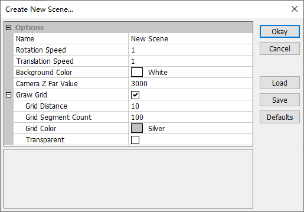
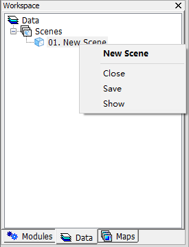
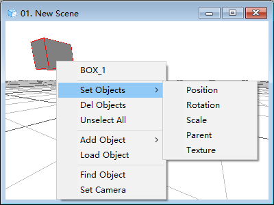
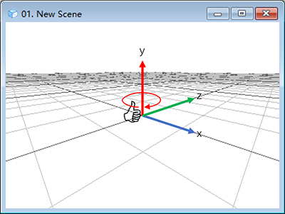

# 3.4 3D场景
MicroCity 3D场景（\*.m3d）是一种存储3D场景信息的数据文件格式。流行的3D文件格式包括3D Studio Max（\*.3ds），Wavefront OBJ（\*.obj）和立体光刻（\*.stl）可以作为场景中的对象进行**加载**（详见下文中的[显示和编辑3D场景](#显示和编辑3D场景)），但不能存储在.m3d文件中。
## 打开、创建、保存和关闭3D场景
用户可以点击**加载**按钮 ，或选择**文件->场景->加载**菜单项来打开一个**场景**。从菜单项**文件->场景->新建**可以创建新的**场景**并填写弹出对话框中的信息，如下所示。点击**确定**按钮之后，**工作区面板**的**数据**选项卡中会出现一个项目。然后可以通过右键单击菜单来**保存**或**关闭**场景：

 &nbsp;&nbsp; 
## 显示和编辑3D场景
从**数据**选项卡双击一个**场景**会显示一个**场景视图**。在场景视图中，用**鼠标左键拖拽**可以旋转相机，用**鼠标右键拖拽**可以平移相机。在场景视图上用**双击左键**可以选择对象，在场景视图上用**双击右键**可以弹出上下文菜单（如下图所示）。可以添加对象、加载对象和设置对象等等。请注意，坐标系中的**旋转**应该遵循**左手**规则。下图展示了坐标系的示例和沿y轴旋转的示例：

 &nbsp;&nbsp; 

在对象的位置和旋转中使用的坐标是**相对于其父对象**的。默认情况下，新对象的父对象为空。
## 显示设置
用户可以通过使用**设置面板**更改**场景**的背景色、参考网格或其他显示选项。

> 这篇文章使用ChatGPT翻译自其他语言，如果有问题请在[**反馈**](https://github.com/huuhghhgyg/MicroCityNotes/issues/new)页面提交反馈。