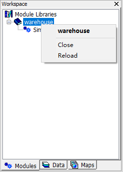

# 3.7 Modules
The functionality of MicroCity can be extended by modules, one type of which is [**SAGA Module**](https://github.com/microcity/microcity.github.io/releases/download/MicroCity1.8/saga_modules2.0.8.zip) (\*.dll). **SAGA Modules** contains many useful libraries for **Shapes** and **Grids**. Another type of **Module** is **MicroCity Script** (\*.mcs), which can be edited and debugged with **ScriptEditor** (see [4.1](4.1_si_overview.md)). 
## Loading, Closing and Executing Modules
**Modules** can be loaded to MicroCity by clicking **Load** button  or **Modules->Load Module Library** menu item. The **Modules** Tab of the **Workspace** Panel will display the loaded **Libraries** (each of which corresponding to a file) and their inside **Modules** . One can close or reload a **Module Library** from the context menu. Executing a moule has many ways: double clicking it, clicking the **Execute** button from the **Settings** Panel, or click the **Execute** context menu item. One can also **Debug** a **MicroCity Script** module by clicking the **Debug** context menu item, that needs the **ScriptEditor** running in the background. MicroCity can also capture runtime errors and pause the execution of modules.

 &nbsp;&nbsp; 
## Accelerating, Stopping the Execution of a Module
**MicroCity Script** module is created with **[Lua](https://www.lua.org/)** language which is very fast. In some cases, if you want much more faster execution speed, you can click the  **Module Libraries** in the **Modules** Tab of the **Workspace** Panel and switch the **Script Running Mode** in the **Settings** Panel from the **Safe Mode** to the **Fast Mode**. Then MicroCity will use **[LuaJIT](https://luajit.org/)** to execute modules.

If a module is being executed, one can stop it by click the **Execute** button in the corresponding **Settings**. In **Safe Mode** the execution can be immediately stopped, but in **Fast Mode** the stopping is depend on the **GetReady()** function called in the script (see [4.2](4.2_ui_control).

 &nbsp;&nbsp; 
