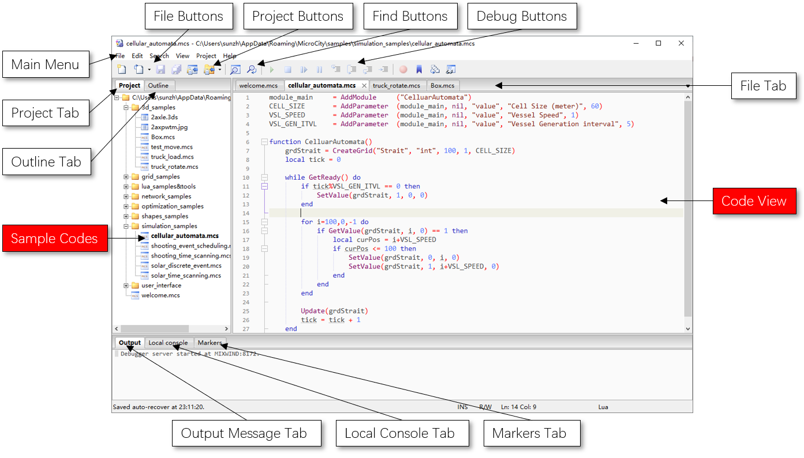

# 4.1 脚本概览
MicroCity使用**模块**（详见[3.7](3.7_modules.md)）来扩展其功能。模块的一种类型是**MicroCity脚本**（\*.mcs），可以在**ScriptEditor**中进行编辑和调试。
## 脚本编辑器  

## 编码和调试MicroCity脚本
**ScriptEditor**基于[ZeroBrane](https://studio.zerobrane.com/)。可以在那里找到详细的信息。要进行调试，您应该保持**Script Editor**打开。然后从**MicroCity**中右键点击**模块**，选择上下文菜单中的**调试**项（详见[3.7](3.7_modules.md#loading-closing-and-executing-modules)）。执行过程可以在**ScriptEditor**的**Code View**中显示。您可以使用**调试按钮**控制执行并查看变量。

## Lua语言和嵌入函数
MicroCity使用[Lua 5.1](https://www.lua.org/manual/5.1/)作为其脚本语言。可以在那里找到参考手册。MicroCity在Lua中嵌入了许多有用的函数，不仅可以控制用户界面、操作数据，还可以解决数学模型和太阳模拟等问题。请阅读以下章节以获取更多信息。

**本参考资料中的约定：**  
Lua中有四种主要的数据类型可以作为参数通过嵌入函数传递，分别是*数字(Number)*、*布尔值(Boolean)*、*字符串(String)*和*对象(Object)*。*对象*类型包括内置的Lua对象，如*表(Table)*、*函数(Function)*和*线程(Thread)*，以及MicroCity对象，如*形状(Shapes)*、*网格(Grid)*、*表(Table)*和*场景(Scene)*。为了明确嵌入函数中的参数类型，在函数描述中我们使用大写、引号和语义信息来避免歧义。参数的小写单词表示*数字*。有时候为了表示整数参数，会在单词后面加上字母'i'，如*iField*。以字母'b'开头并跟随一个单词表示*布尔值*，如*bShow*。用引号括起来的单词表示*字符串*。大写的单词表示*对象*或关键字。以下是一个嵌入函数描述的示例。

```lua
AddParameter(Module, ParentNode, "Value", "id" [, default = 0])
```

在这个例子中，*Module*参数应该是一个*Module*对象。*ParentNode*参数应该是一个*Node*对象，但它作为一个父节点。*"Value"*参数是一个字符串，但它代表MicroCity中的内置类型*Value*，因此这个字符串是不能改变的。*"id"*参数应该是一个用户指定的字符串。*default*参数是一个数字。方括号中的内容是可选的。参数之间的竖线表示"或"的关系。

**编码格式：**  
MicroCity使用ANSI编码格式读写数据，比如shp、txt、csv和dbf等。ScriptEditor和嵌入函数使用UTF-8编码格式读写数据，比如txt或csv等。

> 这篇文章使用ChatGPT翻译自其他语言，如果有问题请在[**反馈**](https://github.com/huuhghhgyg/MicroCityNotes/issues/new)页面提交反馈。