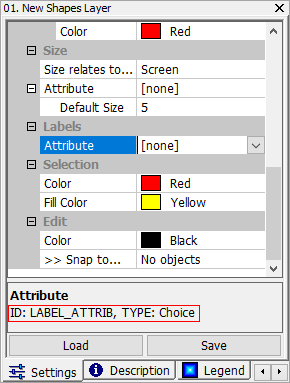

# 4.2 控制用户界面
Microcity Script 可用于控制用户界面上的一些功能，包括模块、数据对象、消息等等。在 **ScriptEditor** 的**项目**标签的"user_interface"文件夹中可以找到一些示例代码。
## 基本用户界面
```lua
Print ("hello" [,...])
```
在*消息面板*中打印数值。
```lua
Note ("hello" [,...])
```
通知用户并暂停执行。
```lua
SetProcessText ("processing")
```
在*MicroCity*的左下角设置一个文本。
```lua
SetProgress (position, range)
```
设置位于*MicroCity*右下角的进度条的 *position/range* 值。
```lua
Sleep (milliseconds)
```
暂停执行 *milliseconds* 毫秒。
```lua
GetReady ()
```
MicroCity与Lua引擎共享同一线程。Lua中的计算量较大会阻塞MicroCity界面。在内部使用该函数可以使MicroCity界面响应用户操作。如果用户取消当前执行，则返回false。
```lua
GetClickXY ()
```
返回用户在*地图视图*中点击的 x,y 坐标。
```lua
GetDragExtent ()
```
返回用户使用鼠标在*地图视图*中拖动矩形时的底部左侧和顶部右侧坐标：Lx，By，Rx，Ty。

## 数据对象
```lua
PATH
```
内部全局变量，保存当前工作目录的字符串，例如"c:\microcity"。
```lua
Open (".\\shapes.shp" [, ".\\grid.sgrd" [, ".\\table.dbf" [, ".\\scene.m3d" , ...]]])
```
从当前工作目录或打开的数据中打开并返回*Shapes*、*Table*、*Grid*和*Scene*对象。
```lua
Close (Shapes|Grid|Table|Scene|Network|RndEngine|LPModel)
```
关闭已打开或创建的*Shapes*、*Table*、*Grid*、*Scene*、*Network*、*RndEngine*或*LPModel*对象。
```lua
Update (Shapes|Grid|Table [, bShow = true])
```
在*MicroCity*中更新*Shapes*、*Grid*或*Table*对象的当前更改。*bShow*表示是否创建对象的视图。如果用户取消当前执行，返回false。
```lua
CreateMap ("name", Shapes1|Grid1 [, Shapes2|Grid2, ...])
```
创建一个*地图视图*，以显示按参数中的顺序分层排列的对象。

## 模块和参数
```lua
AddModule ("Function" [, "name"]) 
```
此函数可以将Lua函数作为模块添加到当前模块库。模块的默认名称是函数的名称。返回一个*Module*对象。

```lua
function AddParameter(Module, ParentNode, "Node", "id")
function AddParameter(Module, ParentNode, "Value", "id" [, default = 0])
function AddParameter(Module, ParentNode, "Range", "id" [, low = 0 [, high = 1]])
function AddParameter(Module, ParentNode, "Check", "id" [, default = 0])
function AddParameter(Module, ParentNode, "String", "id" [, "string" = "")
function AddParameter(Module, ParentNode, "Choice", "id" [, "choice1|choice2|" [, choice = 1]])
function AddParameter(Module, ParentNode, "File", "id" [, "c:\\default.txt" = ""])
function AddParameter(Module, ParentNode, "Color", "id" [, "color" = "255 255 255")
function AddParameter(Module, ParentNode, "Shapes", "id")
function AddParameter(Module, ParentNode, "Grid", "id")
function AddParameter(Module, ParentNode, "Scene", "id")
function AddParameter(Module, ParentNode, "Table", "id")
function AddParameter(Module, ParentNode, "Field", "id")
```
这些函数可以在模块的设置面板中添加参数。返回相应的值或对象。*ParentNode* 可以设置为 *AddParameter* 函数的第一个返回值。如果 *"Field"* 在第三个位置，则 *parent_node* 可以设置为 *Table* 或 *Shapes* 对象，以获取其属性表的头部。

```lua
GetParameter(Shapes|Table|Grid|Scene|Module, "id")
```
从对象的设置面板中返回指定的参数。

```lua
SetParameter(Shapes|Table|Grid|Scene|Module, "id", Number | "String" | Object)
```
在对象的设置面板中设置指定的参数。如果成功，则返回 *true*。请注意，选择参数应从1开始。可以在下图中的参数帮助文本中找到参数的 *"id"*。



> 这篇文章使用ChatGPT翻译自其他语言，如果有问题请在[**反馈**](https://github.com/huuhghhgyg/MicroCityNotes/issues/new)页面提交反馈。