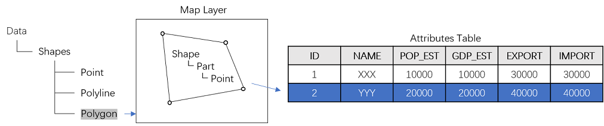
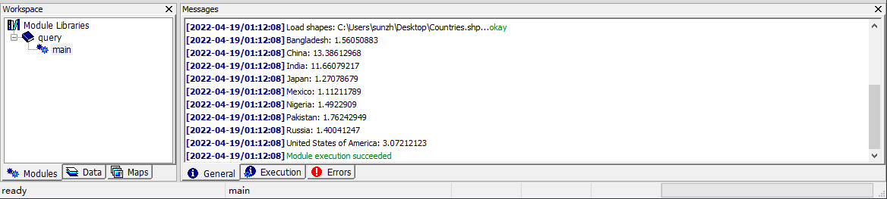

# 2.2 寻找国家
本教程将指导您使用 MicroCity Script 对GIS数据进行编码操作。您需要完成 2.1 内容以继续。

## GIS 数据结构
在 MicroCity 中，GIS 数据由三种类型的**形状**组成：点、折线和多边形，每种类型都可以视为地图图层。在图层中，**形状**对象由一个或多个**部分**组成，而每个**部分**又由一个或多个**点**组成。**形状**对象还与**属性表**中的记录相关联。您还可以编辑形状或其属性（请参阅 [3.2](3.2_vector_shapes.md)）。



如果您想要执行复杂的编辑或处理一批形状，可以使用 MicroCity Script，其中包含许多内置函数可供使用。

## 进行查询
假设我们想要找出人口超过1亿且完全位于北半球的国家。因此，我们需要检查每个形状中每个点的坐标以及形状的人口属性。打开 **ScriptEditor** ，然后输入以下代码：

```lua
local Countries = Open("countries.shp")                 --尝试打开形状图层
for i = 1, GetRecCount(Countries) do                    --循环遍历图层中的所有形状对象
    local country = GetShape(Countries, i)              --获取一个国家的形状对象
    local north = true                                  --假设该国家位于北半球
    for j = 1, GetPartCount(country) do                 --循环遍历所有形状中的部分
        for k = 1, GetPointCount(country, j) do         --循环遍历该部分中的所有点
            local x, y = GetPointXY(country, k, j)      --获取点的坐标
            if y < 0 then                               --如果纬度小于0
                north = false                           --北半球的假设为假
            end
        end
    end
    local pop = GetValue(country, "POP_EST")            --获取人口属性
    local name = GetValue(country, "NAME")              --获取国家名称
    if pop > 100000000 and north  then                  --检查两个条件
        Print(name, ": ", pop/100000000)                --打印结果
    end
end
```

## 运行脚本
将脚本保存为 query.mcs，并使用 MicroCity 打开它，或将其拖到 MicroCity。然后您将在 Workspace 面板的**模块选项卡**中找到一个名为**query**的项目。双击子项**main**。如果弹出对话框，请选择**01. countries**，然后点击**确定**。结果将显示在**消息**面板中。



> 这篇文章使用ChatGPT翻译自其他语言，如果有问题请在[**反馈**](https://github.com/huuhghhgyg/MicroCityNotes/issues/new)页面提交反馈。