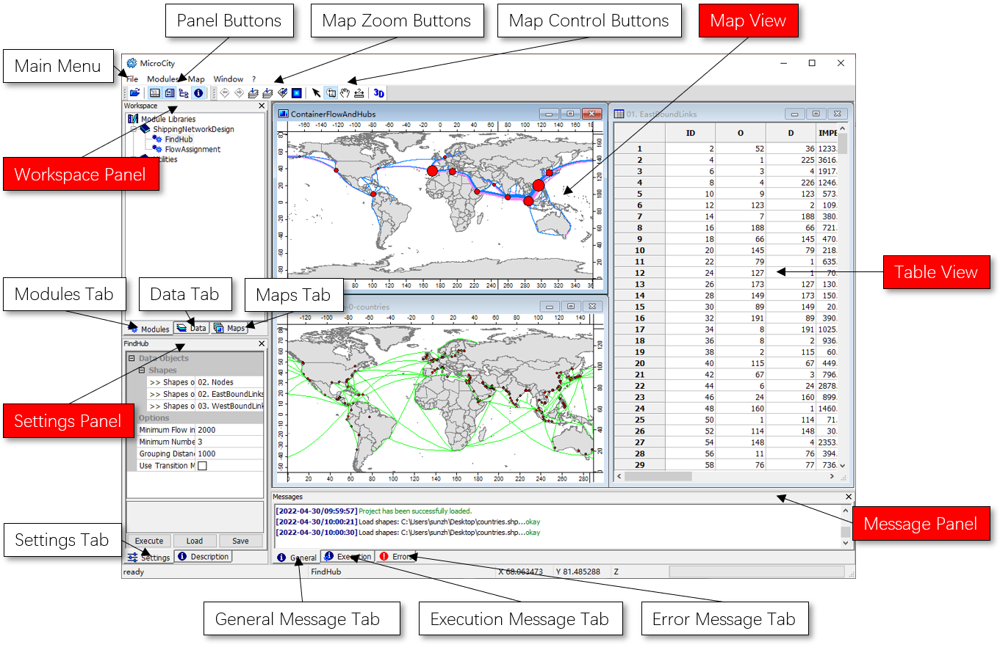

# 3.1 用户界面概览
MicroCity提供了一个简洁的图形窗口界面，以便于对数据和模块进行操作。

## 主窗口及其组件

## 支持的文件类型
MicroCity可以打开ArcGIS shapefile文件(\*.shp)，Grids文件(\*.sgrd)，dBase文件(\*.dbf)，Tabular文本文件(\*.csv, \*.txt)，Point clouds点云文件(\*.spc)，影像文件(\*.bmp, \*.gif, \*.jpg, \*.png, \*.tif, \*.pcx)以及MicroCity 3D场景文件(\*.m3d)。这些数据文件可以在**工作区**面板的**数据**选项卡中进行管理。模块库文件(\*.dll, \*.mcs)可以在**工作区**面板的**模块**选项卡中进行管理和执行。

## 项目管理
已打开的数据文件、模块库文件、设置和子窗口信息可以通过**文件->项目**菜单保存或打开一个**MicroCity项目(\*.mprj)**。mprj文件不包含任何**文件数据**。为方便维护，项目中的文件应放置在同一文件夹或mprj文件的子文件夹中。

> 这篇文章使用ChatGPT翻译自其他语言，如果有问题请在[**反馈**](https://github.com/huuhghhgyg/MicroCityNotes/issues/new)页面提交反馈。