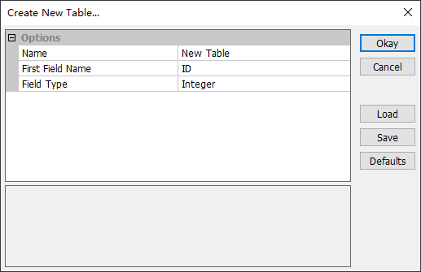
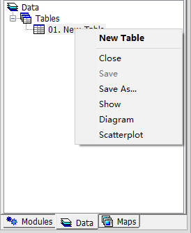
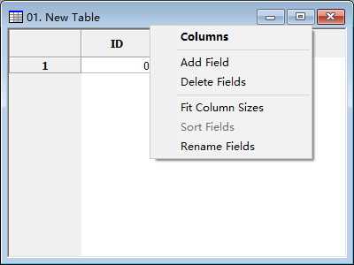
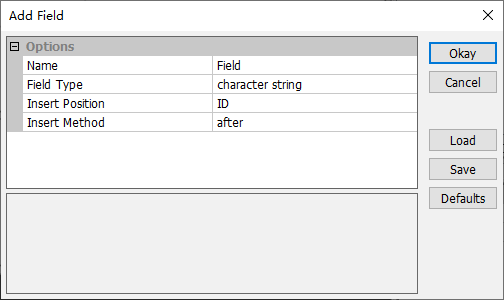

# 3.5 表格
包括 dBase 文件 (\*.dbf)、文本文件 (\*.txt) 和逗号分隔值 (\*.csv) 在内的表格文件可以在 MicroCity 中打开并保存为**表格**。
## 打开、创建、保存和关闭表格
用户可以单击**加载**按钮 ，或选择**文件->表格->加载**菜单项来打开一个表格文件。可以从**文件->表格->新建**菜单项中创建一个新的**表格**，如下图所示的弹出对话框。要保存一个**表格**，可以右键单击上下文菜单中的**保存**或**另存为**选项。

 &nbsp;&nbsp; 
## 显示和编辑表格
双击**数据**选项卡中的**表格**，将显示一个表格视图。通过右键单击表头可以修改表格的结构。如果单击"添加字段"，将显示一个引导对话框（如下图所示）。如果要向表格中插入一条记录，可以右键单击表格左侧的数字，并选择一个上下文菜单项。

 &nbsp;&nbsp; 

> 这篇文章使用ChatGPT翻译自其他语言，如果有问题请在[**反馈**](https://github.com/huuhghhgyg/MicroCityNotes/issues/new)页面提交反馈。