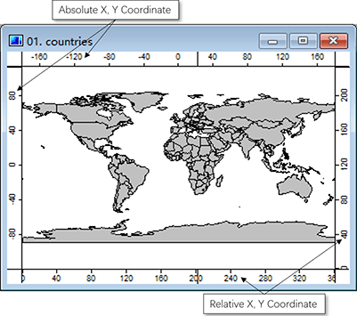
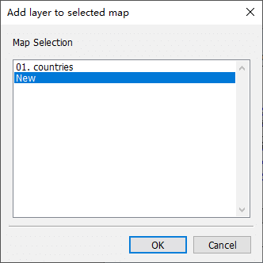

# 3.6 地图和图层
在MicroCity中，**形状**和**网格**可以显示在**地图**中。每个地图可以包含多个图层，每个图层对应一个**形状**或一个**网格**。
## 打开、创建、保存、打印和关闭地图
由于**地图**是基于**形状**和**网格**的，它们不能独立保存或打开，但可以与一个**MicroCity项目**(\*.mprj)一同保存或打开。创建一个**地图**是通过在**工作区**面板的**数据**选项卡中双击一个**形状**或**网格**来实现的。**地图**窗口包含四个坐标栏，可用于定位对象（见下文）。**地图**也可以通过**工作区**面板的**地图**选项卡的上下文菜单进行打印或关闭。

 &nbsp; 
## 在地图中添加、移动、隐藏和关闭图层
一个**地图**可以有多个**图层**，每个图层表示一个数据项。可以通过在**数据**选项卡中双击一个**形状**或**网格**来将一个**图层**添加到一个**地图**中。较低的**图层**可以被上面的图层遮挡。可以通过拖动来移动一个图层，通过双击来隐藏一个图层，通过菜单来关闭一个图层（如下所示）。

 &nbsp;&nbsp; 

## 控制地图视图
当选择一个数据项或图层时，该图层被称为活动图层。可以切换**操作**按钮来选择和编辑活动图层中的对象。通过切换**缩放**按钮或**平移**按钮，可以对地图进行缩放和平移操作。如果在地图中迷失了方向，可以使用**缩放至全图范围**按钮来查看整个地图。其他的缩放控制按钮可用于方便地浏览地图。

如果要比较两个或多个地图之间的差异，可以使用**同步**按钮。可以使用**尺子**按钮测量距离。需要注意的是，默认情况下，在**地球**坐标系下测得的距离单位是**公里**。可以在地图的**设置**面板中将坐标系更改为**非地球**，从而获取没有单位的**笛卡尔**距离。

点击3D按钮可以创建一个3D表面地图，需要一个适当大小的**网格**（参见[3.3](3.3_raster_grids.md#display-settings-and-3d-view)）来实现。

> 这篇文章使用ChatGPT翻译自其他语言，如果有问题请在[**反馈**](https://github.com/huuhghhgyg/MicroCityNotes/issues/new)页面提交反馈。