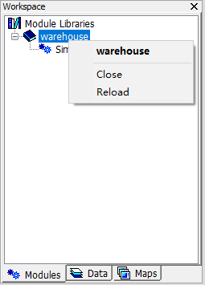
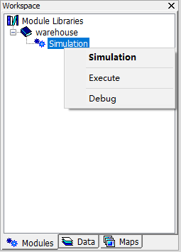
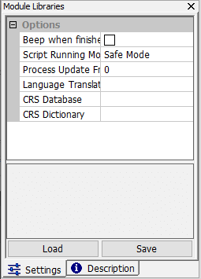
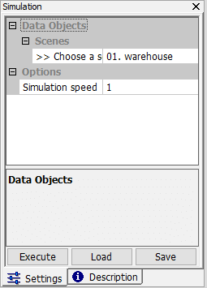

# 3.7 拓展模块
MicroCity的功能可以通过模块进行拓展，其中之一是[**SAGA模块**](https://github.com/microcity/microcity.github.io/releases/download/MicroCity1.8/saga_modules2.0.8.zip)（\*.dll）。**SAGA模块**包含许多有用的**形状（Shapes）**和**网格（Grids）**库。另一种类型的模块是**MicroCity脚本**（\*.mcs），可以使用进行编辑和调试（请参阅[4.1](4.1_si_overview.md)）。
## 加载、关闭和执行模块
可以通过点击**加载**按钮或**模块->加载模块库**菜单项将**模块**加载到MicroCity中。**工作区**面板的**模块**选项卡将显示已加载的**库文件**（每个对应一个文件）及其包含的**模块**。可以通过上下文菜单关闭或重新加载**模块库**。执行模块有多种方式：双击模块，点击**设置**面板的**执行**按钮，或点击**执行**上下文菜单项。还可以通过点击**调试**上下文菜单项来**调试MicroCity脚本**模块，这需要后台运行**ScriptEditor**。MicroCity还可以捕获运行时错误并暂停模块的执行。

 &nbsp;&nbsp; 

## 加速、停止模块的执行
**MicroCity Script** 模块是使用非常快速的 **[Lua](https://www.lua.org/)** 语言创建的。在某些情况下，如果您想要更快的执行速度，可以在 **工作区** 面板的 **模块** 标签中点击  **模块库**，然后在 **设置** 面板中将 **脚本运行模式** 从 **安全模式** 切换到 **快速模式**。然后 MicroCity 将使用 **[LuaJIT](https://luajit.org/)** 来执行模块。

如果一个模块正在被执行，可以通过点击相应的 **设置** 中的 **执行** 按钮来停止它。在 **安全模式** 下，执行可以立即停止，但在 **快速模式** 下，停止操作取决于脚本中调用的 **GetReady()** 函数（参见 [4.2](4.2_ui_control)）。

 &nbsp;&nbsp; 

> 这篇文章使用ChatGPT翻译自其他语言，如果有问题请在[**反馈**](https://github.com/huuhghhgyg/MicroCityNotes/issues/new)页面提交反馈。