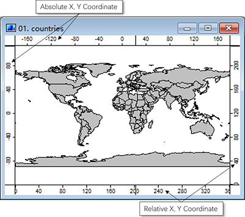
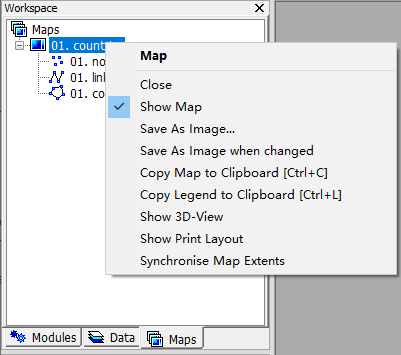
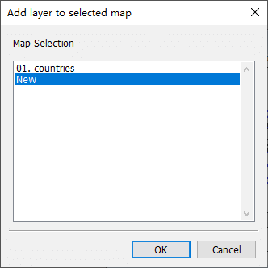
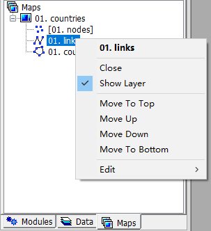
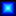

# 3.6 Maps and Layers
In MicroCity, **Shapes** and **Grids** can be showed in **Maps**. Each map may contains multiple layers and each layer is corresponding to a **Shapes** or a **Grid**.
## Opening, Creating, Saving, Printing and Closing Maps
Because **Maps** are based on **Shapes** and **Grids**, they can not be saved or opened independently, but can be saved or opened along with a **MicroCity Project** (\*.mprj). Creating a **Map** is by double clicking a **Shapes** or **Grid** from the **Data** Tab of the **Workspace** Panel. A **Map** window contains four coordinate bars which can be used to locate objects (see below). A **Map** can also be printed or closed from the context menu of the **Maps** Tab of the **Workspace** Panel.

 &nbsp; 
## Adding, Moving, Hiding and Closing Layers in a Map
A **Map** can have multiple **Layers**, each of them represents a data item. One can add a **Layer** to a **Map** by double clicking a **Shapes** or a **Grid** from the **Data** Tab. A lower **layer** can be obscured by upper layers. One can move a layer by dragging, hide a layer by double clicking and close a layer through the menu (as shown below).

 &nbsp;&nbsp; 

## Controlling Map Views
When a data item or a layer is selected, this layer is called the active layer. One can toggle the **Action** button  to select and edit an object in the active layer. By toggling the **Zoom**  or **Pan**  botton, the map can zoomed in, zoomed out or panned. If one lose in a map, he can use the **Zoom to Full Extent**  button to get a full view of the map. Other zoom controlling buttons  can be used to facilitate the map browsing. 

The **Synchronise**  button can be used if you want compare difference between two or more maps. The **Ruler**  button can be used to meassure distances. Note that, by default, the unit of the distances measured is **kilometer** under the coordinate system of **Earth**. One can change the coordinate system to **Non-Earth** from the **Settings** Panel of the **Map**, and get **Cartesian** distance without unit.

One can create a 3D surface map by clicking 3D  button, which need a appropriately sized **Grid** (see [3.3](3.3_raster_grids.md#display-settings-and-3d-view)).
