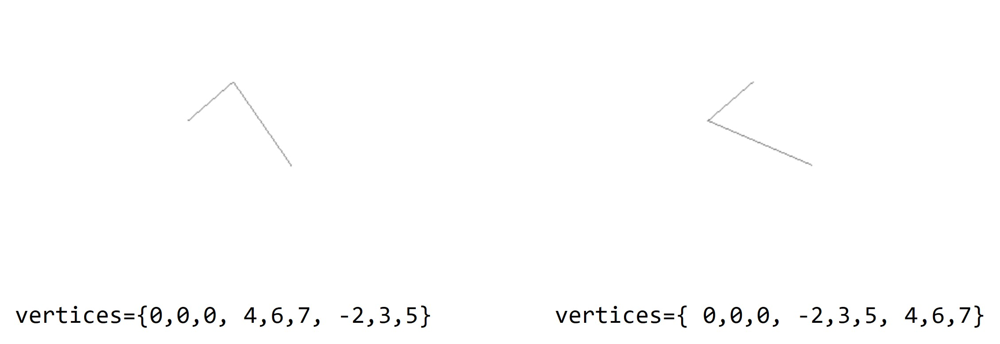
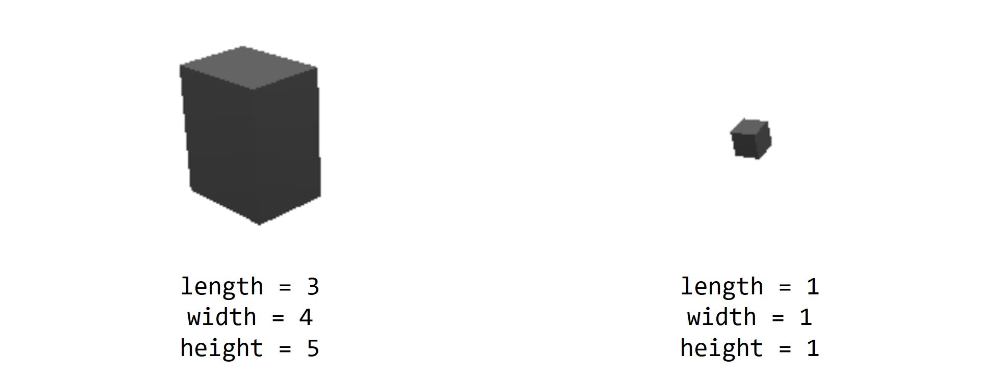

# 3D Objects

This section will introduce the objects and their control functions in a 3D scene.

## Adding Objects

To add objects to the scene, use the following function:

```lua:no-line-numbers
local obj = scene.addobj([type], {key1 = value1, key2 = value2, ...})
```

## Optional Object Properties

Objects added to the scene typically support setting some of the following properties:

| Object Property | Meaning |
| :---: | --- |
| `color` | The color of the object. The format of the color can support built-in colors, hexadecimal, and RGB. Same as the [background color of the scene](./3d-scene-en.md#bgcolor-background-color-of-the-scene) |
| `opacity` | Opacity |
| `hcolor` | The color when the object is selected |
| `size` | The size of the object. The default value is 1 |
| `length` | The length of the object, commonly used for [box](#box) |
| `width` | The width of the object, commonly used for [box](#box) |
| `height` | The height of the object, commonly used for [box](#box) |
| `radius` | The size of the object's rounded corners |
| `segments` | The number of segments, usually used to set the precision of the [sphere](#sphere) drawn |
| `selectable` | Whether the object can be selected |
| `name` | The name of the object |
| `text` | The text value of the object |
| `font` | The font of the text |
| `vertices` | The set of points that make up the corresponding object |

The following are the types of objects that can be added to the scene:

## Object Types

### List of Object Types

* `label`: [Text label](#label)
* `points`: [Set of points](#points)
* `polyline`: [Set of line segments](#polyline)
* `box`: [Cube](#box)
* `sphere`: [Sphere](#sphere)
* `polygon`: [Polygon](#polygon)
* `light`: [Light source](#light)
* `mesh`: [Face made up of points](#mesh)

> For the sake of brevity, the key properties of the optional objects shown in the example below only display the relevant attributes of the object. Other common properties can be added by referring to the [Optional Object Properties](#optional-object-properties).

### label

`label` is a text label. The text of the label can be set in the `text` attribute.

```lua:no-line-numbers
local obj = scene.addobj('label', {text = "Hello World!"})
```

### points

`points` is a collection of points. You can create a single point or multiple points. Each point has three-dimensional coordinates to determine its position in three-dimensional space. The number of points is determined by the `vertices` attribute.

Here is an example of creating a `points` object:

```lua
-- create a point at position (5,5,5)
scene.addobj("points", {vertices = {5,5,5}, size = 5})

-- create two points, the first at (0,0,0), the second at (5,5,5)
scene.addobj("points", {vertices = {0,0,0, 5,5,5}, size = 5})
```

### polyline

`polyline` is a collection of line segments. When multiple points are input in the `vertices` attribute, line segments will be generated based on the order of the coordinates.

Therefore, although the same coordinates are used in the two examples below, the results are different because the order of the input coordinates is different.

```lua
scene.addobj("polyline", {vertices = {0,0,0, 4,6,7, -2,3,5}})
scene.addobj("polyline", {vertices = {0,0,0, -2,3,5, 4,6,7}})
```



polyline point order comparison

> `polyline` does not have a `size` attribute.

### box

`box` is a cuboid. Its shape can be modified mainly through the `length`, `width`, and `height` attributes.

```lua:no-line-numbers
local obj = scene.addobj('box', {length = 3, width = 4, height = 5})
```

Important optional properties of the `box` object:

| Property | Meaning |
| --- | --- |
| `length` | The length of the cuboid |
| `width` | The width of the cuboid |
| `height` | The height of the cuboid |

Based on the above three attributes, we can modify the shape of the rotating `box` in the default sample code.

```lua
-- Add the length, width, and height attributes (default to 1 if not added)
local obj = scene.addobj('box', {length = 3, width = 4, height = 5})

local x = 1
local y = 1
local z = 0
while scene.render() do
	x = x + 0.1
	y = y + 0.1
	obj:setrot(x, y, z)
end
```



Boxes with different lengths, widths, and heights.

### sphere

`sphere` is used to create a sphere object. Its size can be modified by the `radius` attribute, and its model quality can be set by setting the `segments` attribute. Refer to the example of the Earth in the built-in samples for more details.

```lua:no-line-numbers
local obj = scene.addobj('sphere', {radius=15, segments=360})
```

Optional attributes for `sphere` objects:

| Attribute | Meaning |
| --- | --- |
| `radius` | The radius of the sphere. It can be used to control the size of the sphere. |
| `segments` | The number of rendered surfaces of the sphere. The higher the value, the more detailed the sphere model will be. |


The impact of different `segments` on the same sphere

### polygon

`polygon` is used to create a polygon object, mainly set through the `vertices` attribute.

```lua:no-line-numbers
local obj = scene.addobj("polygon", {vertices = {-1,-1,0, -1,1,-0, 1,1,0, 1,-1,0}})
```

> Because the polygon in this example is a square, it looks no different from the `box` introduced above. However, when the shape is set to other types of polygons (such as triangles, pentagons, etc.), the meaning of the polygon can be reflected.

| Attribute | Meaning | Explanation |
| --- | --- | --- |
| `vertices` | The vertices of the polygon | You can set the three-dimensional coordinates of each point in turn in the `vertices` attribute. The third dimension coordinates do not have an impact but play a placeholder role. |
| `size` | Volume | Since the third dimension coordinates do not have an impact, and the area is already determined by the vertices of the polygon, the `size` attribute controls the volume by controlling the third dimension coordinate values of each point. |


The impact of different `size` on the same polygon volume

### External model

Reference external files. However, for MicroCityWeb, only the built-in files on the website can be referenced at present.

For example, in the built-in example, a box-type truck is generated in the view by referencing the internal file:

```lua:no-line-numbers
local obj = scene.addobj('/res/2axle.glb')
```

You can also reference an external model by referencing the URL of the file:

```lua:no-line-numbers
local obj = scene.addobj('https://microcityweb.gitee.io/res/agv.glb')
```

> If you have 3D model resources at hand, you can view them in [3D Viewer](http://3dviewer.net/) and export them as `.glb` models through this website.

### Light

Set the direction of the light, and the optional parameter `vertices` is a three-dimensional vector that represents the direction of the light. Since a strong light source has already been set in the MicroCityWeb scene, this will not be discussed in detail here.

### Mesh

A face composed of multiple points, commonly found in referenced external models. Due to its limited application, it will not be introduced here.

## Object Control Functions

Assuming the 3D object to be manipulated is `obj`.

### getpos()

Gets the position coordinates (x, y, z) of `obj`.

```lua:no-line-numbers
local x, y, z = obj:getpos()
```

### setpos()

Sets the position coordinates of `obj` to (x, y, z).

```lua:no-line-numbers
obj:setpos(x, y, z)
```

### getrot()

Gets the rotation angles (rx, ry, rz) of `obj` in the x, y, and z directions.

```lua:no-line-numbers
local rx, ry, rz = obj:getrot()
```

### setrot()

Sets the rotation angles of `obj` in the x, y, and z directions to (rx, ry, rz).

```lua:no-line-numbers
obj:setrot(rx, ry, rz)
```

### getscale()

Gets the scaling ratios (sx, sy, sz) of `obj` in the x, y, and z directions.

```lua:no-line-numbers
local sx, sy, sz = obj:getscale()
```

### setscale()

Sets the scaling ratios of `obj` in the x, y, and z directions to (sx, sy, sz).

```lua:no-line-numbers
obj:setscale(sx, sy, sz)
```

### getchildren()

Gets the table of child objects of `obj`.

```lua:no-line-numbers
local children = obj:getchildren()
```

### setchildren()

Sets the table of child objects of `obj` to `children_table`.

```lua:no-line-numbers
obj:setchildren(children_table)
```

### getparent()

Gets the parent object of `obj`.

```lua:no-line-numbers
local num = obj:getparent()
```

### setparent()

Sets the parent object of `obj` to `obj0`.

```lua:no-line-numbers
obj:setparent(obj0)
```

### delete()

Delete `obj`.

```lua:no-line-numbers
obj:delete()
```