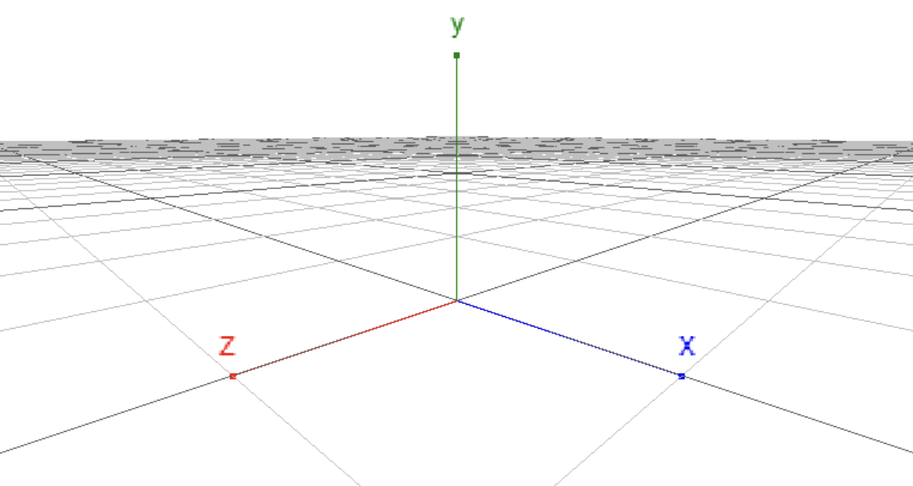

# 3D Scene

This section introduces 3D scenes and their settings.

## MicroCityWeb 3D Scene Coordinate System

The 3D scene coordinate system in MicroCityWeb follows the right-hand coordinate system, and the specific direction of each coordinate axis is shown in the following figure.



Coordinate system in MicroCityWeb

> Note that the three-dimensional coordinate axes x, y, and z here are manually drawn to show the coordinate system in MicroCityWeb and do not directly exist in the three-dimensional scene.

## Setting up a Scene

Setting up a scene requires the use of the `setenv` function, with the specific usage as follows:

```lua:no-line-numbers
local s = scene.setenv({grid="plane|sphere|none", bgcolor="rgb(255, 255, 255)", rotspeed=1, transpeed=1, camtype="ortho|persp", clear=true})
```

It can be simplified as follows:

```lua:no-line-numbers
local s = scene.setenv({key1 = value1, key2 = value2, ...})
```

The variable `s` holds the returned environment object. The optional parameters of the function will be described in detail below.

## Optional Parameters of a Scene

### Parameter List

*   `grid`: [background grid of the scene](#grid-background-grid-of-the-scene)
*   `bgcolor`: [background color of the scene](#bgcolor-background-color-of-the-scene)
*   `camtype`: [camera view](#camtype-camera-angle-of-view)
*   `clear`: [whether to clear the scene](#clear-whether-to-clear-the-scene)
*   `rotspeed` & `transpeed`\*: [adjustment of mouse operation speed](#rotspeed-transpeed)

### `grid`: Background grid of the scene

Optional values

| Value | Meaning |
| --- | --- |
| `"none"` | default, no grid |
| `"plane"` | flat grid |
| `"sphere"` | spherical grid |

### `bgcolor`: Background color of the scene

Optional value types:

| Value Type | Example |
| --- | --- |
| Built-in colors | `"black"`, `"white"`, `"gray"`, etc. |
| Hexadecimal colors | `"#ffffff"`, `"#fff"`, `"#000000"`, `"#000"`, etc. |
| Colors represented by RGB | `"rgb(255, 255, 255)"`, `"rgb(0, 0, 0)"`, etc. |

Example:

```lua
scene.setenv({bgcolor='gray'}) -- Sets the background color to the built-in color "gray"
scene.setenv({bgcolor='#eee'}) -- Sets the background color to the hexadecimal color "#eee"
scene.setenv({bgcolor='rgb(255, 255, 255)'}) -- Sets the background color to white
```

### `camtype`: Camera angle of view

Optional values:

| Value | Meaning |
| --- | --- |
| `"ortho"` | Orthographic. Equivalent to a projection onto the x and y plane. User's view is in two-dimensional space. |
| `"persp"` | Perspective (default). User's view is in three-dimensional space. |

### `clear`: Whether to clear the scene

When the value is set to `true`, the scene is cleared.

> The `setenv` function does not clear the original scene by default, unless the value of the `clear` parameter is manually set to `true`.

### `rotspeed` & `transpeed`

| Value | Meaning |
| --- | --- |
| `rotspeed` | Sets the speed of rotating a 3D object with the mouse. |
| `transpeed` | Sets the speed of translating a 3D object with the mouse. |

These two parameters usually do not need to be set specially, and the default values can be used.

## Others

### Regarding high-frequency setting scenarios

2023/03/21: It has been found that setting the scene too frequently can cause excessive memory usage and browser crashes. Therefore, it is recommended to avoid calling the `scene.setenv()` function in a loop as much as possible. 

If it is necessary to do so, make sure that the frequency of calls is relatively low. This allows the browser to have enough time for garbage collection, otherwise it may cause the browser to crash.