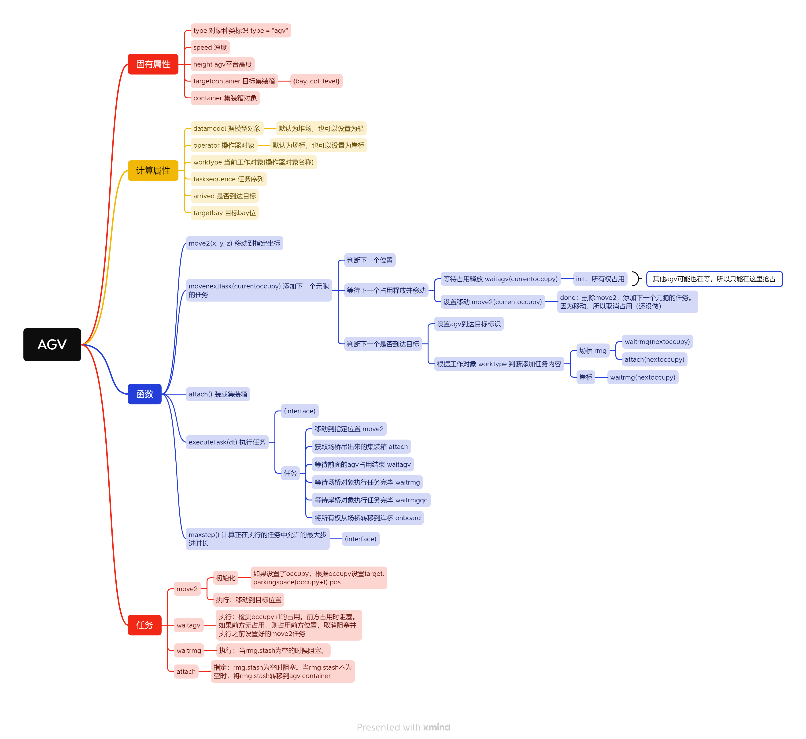

# Port AGV Service Process 3D Simulation Approach

> This train of thought is for reference only.

Simulating the process of a container terminal is a complex task that involves many factors and entities. This article mainly introduces the approach to simulate the process of AGV receiving services from the yard crane to accepting services from the quay crane using MicroCityWeb.

## Implementing Yard Crane Handling of Containers

### Overall Approach
Implementing the handling of containers by the yard crane is the first step in simulating the yard. I plan to use an object-oriented approach for this part, abstracting the yard crane and the yard as objects.

#### Overall Structure
The specific idea is to treat the **yard as a data model** that stores various data, such as container entities, coordinates of containers in corresponding positions (rows, columns, heights), etc. The **yard crane is treated as an operator** responsible for the yard crane's 3D animation and management of data in the yard object.

The benefit of doing this is to decouple the yard crane from the yard, making it easier to expand in the future. In addition, if the object's properties are well considered, multiple objects can be easily created in the same scene to simulate multiple yard cranes operating in the yard.

#### Events and Tasks
I plan to create **task sequences** for the main entity objects that require movement in the overall process. This allows for parallel operations of multiple yard cranes in the same scene, with each yard crane performing its own tasks without interfering with each other. In addition, a central control program is needed to control the execution of tasks at each time node and the 3D animation of the yard crane.

#### Business Process
In this simulation, the main focus of the business process is the movement of containers. Therefore, the most important aspect is the transfer of ownership of containers. The process flow of container ownership transfer is shown in the following diagram:

::: center

Container Object Process Flow
:::

### Object Structure
The following are the structures of the main objects involved in this simulation.

::: center

:::

### Implementation Approach
#### Yard Size
For the yard object, since its main function is to store container objects and related data (such as coordinates of corresponding positions), we need to determine the size of the yard. Therefore, determining the size of the yard is a necessary step. When creating the yard object, we need to determine the size of the yard, including the number of rows, columns, and height. This facilitates subsequent operations.

My approach is to first determine the **area occupied by the yard** and the **number of container layers**. Based on the relevant data, we can calculate the maximum number of rows and columns that can be used to place containers.

* Regarding **the area occupied by the yard**, it can be determined by inputting the coordinates of two points when creating the object. Based on the diagonal formed by connecting the two points, we can determine the area occupied by the yard.
* As for **the number of container layers**, it can be determined by inputting a number when creating the object. Based on these two inputs, we can determine the size of the yard.

#### Events and Tasks
Since the yard crane is the main object that needs to be moved in this simulation, we only need to operate the yard crane during each loop of task execution.

Therefore, I plan to treat the task sequence of the yard crane as a **queue**. During each loop of task execution, we take out the first task from the object's task sequence and execute it. After execution, we check if the task completion condition is met. If so, we delete the task and move on to the next one. This ensures that the yard crane objects execute tasks in order during each loop of task execution.

The method for executing tasks is `executeTask(dt)`, where the object executes tasks based on the duration `dt`. The `executeTask(dt)` function contains the logic for processing tasks, including task type determination, task execution, and task deletion.

If there are multiple yard cranes in the scene, simply add these objects to the list of objects executing tasks. During each loop of task execution, the main control program will iterate through this list of objects and execute tasks for each object.

::: tip
Note that although the task execution appears to be simultaneous in terms of time, it actually depends on the sequence position of the objects.

One example is: suppose two objects need to occupy position A at the same time. According to the order of the task sequence, the object that is executed first will occupy position A, while the object that is executed later will fail to occupy it, even though they are both trying to occupy position A at the same moment. Therefore, it is not strictly simultaneous execution here, but sequential execution according to the task sequence at the same time.

#### Business Process

1. The yard crane first obtains the coordinates of the corresponding position (row, column, height) of the container from the yard and moves the spreader to the designated position in the yard to grab the container. The ownership of the container is transferred from the yard (`cy.containers`) to the yard crane spreader (`rmg.attached`) (by removing the table reference, setting the value to `nil`).
2. The yard crane moves the container to the aisle and releases it there. In the same way, the ownership of the container is transferred from the yard crane spreader (`rmg.attached`) to the aisle (`rmg.stash`), indicating that the container can be picked up.
3. If there is a vehicle that takes away the container, the ownership of the container can be further transferred from the aisle of the yard crane (`rmg.stash`) to the vehicle.

### Results

## Implementation of the Whole Process from AGV Arrival to Service
### Problem Description

Implement the three-dimensional representation of the process above using event scheduling method.

### What's New

The implementation of the previous simulation serves as the foundation for this simulation. Compared to the previous simulation, the most significant improvement in this simulation is:

* Using the **object-oriented** programming paradigm to create objects of four types: yard crane, yard (data model), AGV, quay crane, and ship (data model), and implement the movement methods for the objects and their components.
> If you are not familiar with object-oriented programming, you can refer to [General Knowledge - Object-Oriented Programming](./oop.md).
* Continuing with the idea of **event-driven simulation**, the overall control process is implemented to control multiple objects simultaneously at the same time (primarily achieved through the object's `executeTask(dt)` and `maxStep()` functions). In the object-oriented programming paradigm, `executeTask(dt)` and `maxStep()` can be seen as interfaces. The main program controls the objects by implementing these two interfaces. (Although Lua seems to lack this concept.)
* Using task sequences to implement the flow of each object, achieving mutual waiting between the yard crane and AGV, and between the AGV and quay crane, and coordinating tasks between different objects.
* Attempting to extend the flow from the yard to the AGV, and then to the quay crane and ship, implementing two-level queuing and waiting.

### Object Design
Due to the large number of attributes and functions, the design of objects is presented in the form of a mind map.

::: tip
This section takes up a lot of space. You can also directly jump to the next section [Overall Layout](#overall-layout).
:::

#### Yard
The yard remains as the data model.

#### Yard Crane

#### AGV

#### Quay Crane
The code and structures involving the quay crane are derived mainly from the yard, so they will not be described in detail later.

#### Ship
The ship object also serves as a data model, designed similarly to the yard.
::: center

:::

### Overall Layout

### Overall Process
::: center

Container Flow Process
:::

Compared to the previous simulation, this simulation goes further in terms of the process. It adds the flow of AGV arrival and queuing, as well as the service of the quay crane and container loading onto the ship.

#### Process Analysis
With the introduction of AGVs, the flow between the yard crane, quay crane, and AGV has becomes more complex. First, the arrival of AGVs is random, which may cause queuing. Second, the arrival of AGVs triggers the flows of the yard crane and AGV, which in turn trigger the flow of the quay crane. Therefore, the flow of this simulation is a multi-level flow that needs to consider the coordination between multiple objects.

Especially in the process between AGV and RMG, there is a mutual waiting between AGV and RMG. When the AGV arrives, it needs to notify the RMG to extract the cargo. In the process of extraction by the RMG:

- The RMG needs to wait for the AGV to arrive at the designated position before it can move the cargo onto the AGV.
- The AGV needs to wait for the RMG to grab the container and place it on the AGV before transferring the ownership of the container from the RMG to the AGV.

Therefore, the process between the AGV and the RMG is a mutually waiting process. The specific process can be referred to in the diagram below.

::: center

:::

The process of the quay crane is similar to that of the RMG, which is also a mutually waiting process. The main points are:

- When the AGV arrives at the designated position, the quay crane may be serving other AGVs, so the AGV has to wait.
- When the AGV just enters the service area of the quay crane, it notifies the quay crane to reach the designated position. If the quay crane arrives at the designated position first, it has to wait.

### Implementation Method
#### Implementation of Queuing Process
For AGV queuing, I chose to use cellular automaton as the data model of parking spaces. The length of each parking space is:

$$
\text{Length of Parking Space} = \text{Length of 1 Container in the data model} + \text{Gap between containers}
$$

Since the length of the AGV is slightly longer than that of 1 container, it needs to occupy the length of 2 parking spaces. When executing a task, the AGV checks if the space ahead is blocked, and if not, it moves forward. If the space ahead is the target bay, it moves forward and waits for the RMG operation, then continues to move forward in terms of cells until it leaves. The queuing principles for the RMG and quay crane are also the same.

::: center

Diagram of AGV Cellular Automaton Queuing Model
:::

#### Implementation of Event Scheduling Method
In the previous simulation, I used a variable step size to advance the time for simulation. In this simulation, I used the event scheduling method to accurately advance the events to their occurrence time for execution.

You may have noticed that in the [Object Design](#object-design) section, `executeTask()` and `maxstep()` are marked as `(interface)`. This is because to calculate the accurate advancement time, I need to implement `executeTask()` and `maxstep()` methods in each object. The `executeTask()` method is used to execute the task, and the `maxstep()` method is used to calculate the time remaining for the current task to be completed and obtain the maximum advancement time based on that, and then compare it with the interval time `dt` obtained from the system execution to get the maximum advancement time.

I believe that the following diagram from the course can effectively represent how the event scheduling method is used for simulation and scene refreshing. The first row refers to the business process of simulation, and the Refresh part in the second row refers to refreshing the scene.

### Results

::: warning
The following parts contain animated GIFs, and the images have a large file size. Since this site is hosted on GitHub Pages, if you don't have a special network environment, the animated GIFs may load slowly or even fail to load.
:::

::: tip
If you encounter moiré patterns in the animated GIFs while directly viewing them, you can try opening them to enlarge the view and see if there is any improvement.
:::

RMG running process

Quay crane running process

Overall running process

> This post is translated using ChatGPT, please [**feedback**](https://github.com/huuhghhgyg/MicroCityNotes/issues/new) if any omissions.