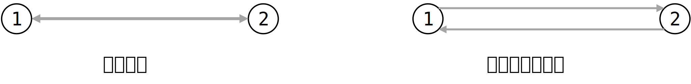

---
head:
- - meta
  - name: keywords
    content: MicroCity,网络,拓补,network
---

# Operating Networks
## Network Topology
Network topology, in simple terms, refers to a network with nodes and connections between them. If we think of connections as roads, then you need to solve the following problems:
1. Is this road one-way or two-way?
2. Where does the road start? Where does it end?

In general, each road in a network diagram is considered to be one-way. If a two-way road is needed, you simply need to add a road in the opposite direction. Like this:

This way, each road has a direction. It is common to use the symbol O for the starting point and the symbol D for the destination point. Using O and D, the direction of each road can be clearly described.

For the example in the above diagram, the road at the top has O=1, D=2, so the direction is described as from 1 to 2; the road at the bottom has O=2, D=1, so the direction is described as from 2 to 1.

## Building Network Topology using Functions
MicroCity can handle networks, and the specific usage of all functions can be found in the reference document: [4.6 Networks](../docs/4.6_networks.md)

Here are some simple methods for creating network objects in MicroCity:
```lua
local network = CreateNetwork() 
```
Create an empty network object and return it. `network` is the returned empty network object.

After creating the object, you can use functions like `AddLink` and `DelLink` to create connections in the network object. See the reference document for specific usage.

```lua
local network, nodes, links = CreateNetwork(Lines)
```
Here, `Lines` is a vector graphic object of type `Line`. In this usage, the `CreateNetwork()` function in MicroCity can directly add starting points and endpoints to the road connections and automatically label the O and D points in the returned `links` object.

In other words, you only need to provide the network connections, and the remaining work of topology can be automatically completed by the function. I believe this may be the most commonly used method for creating network diagrams and conducting topology.

## Simple Example of Network Topology
```lua
-- Open the connection layer
Shapes = Open("Shapes.shp")

-- Create network topology
network, network_nodes, network_links = CreateNetwork(Shapes)

-- Create a layer to store the topologized network nodes
Nodes = CreateShapes("Nodes", "point")
-- Copy the network nodes obtained from topoization to the layer
AddField(Nodes, "ID", "int")
for i = 1, GetRecCount(network_nodes) do
	CopyShapeTo(Nodes, 0, 0, GetShape(network_nodes, i))
end

-- Create a layer to store the topologized network connections
Links = CreateShapes("Links", "line")
-- Copy the original attribute fields from the network connections to the layer
for i = 1, GetFieldCount(Shapes) do
	AddField(Links, GetField(Shapes, i))
end
-- Add attribute fields for the connections, and corresponding data will be added later using functions
AddField(Links, "ID", "int")
AddField(Links, "O", "int")
AddField(Links, "D", "int")
AddField(Links, "IMPEDANCE", "double")
AddField(Links, "DIRECTION", "int")
AddField(Links, "CAPACITY", "double")
-- Copy the network lines obtained from topoization to the layer (including corresponding data)
for i = 1, GetRecCount(network_links) do
	CopyShapeTo(Links, 0, 0, GetShape(network_links, i))
end

-- Update the layers
Update(Nodes)
Update(Links)
```
> The example is modified from the built-in editor of MicroCity.

Although the network connection was established at the beginning, it is possible that during the topology process, the nodes on the connection may overlap, causing the continuous connection to be divided into multiple segments. Therefore, the resulting `Links` layer may be different from the input layer. The topology nodes `Nodes` obtained from the topology process correspond to the resulting links `Links`, so it is recommended to use the topological processing result of the Links layer as the connection between network nodes.

### Pitfall: Creating Network Objects
If you need to create a network again using the `CreateNetwork(Nodes, Links)` function, you need to retain the attributes added during the topological process, otherwise there will be errors in network initialization:
```lua
AddField(Links, "ID", "int")
AddField(Links, "O", "int")
AddField(Links, "D", "int")
AddField(Links, "IMPEDANCE", "double") -- impedance
AddField(Links, "DIRECTION", "int") -- direction
AddField(Links, "CAPACITY", "double") -- capacity
```

If you are only doing a one-time topology of the network and will not use the topologically processed network to create a network object again, you still need to create the above attributes first. The topologically processed data is not filled in according to the attribute names, but according to their positions.

If only `O` and `D` attributes are created, the `ID` data will be filled in the `O` attribute, and the `O` data will be filled in the `D` attribute. If only the `ID`, `O`, and `D` attributes are created in the order mentioned above, the data will be filled correctly due to the data order being filled based on their positions.

### CopyShapeTo Function
The `CopyShapeTo()` function is used in the topological process to copy a `Shape` object to the corresponding position in the `Shapes` layer and perform position transformation in the `Shapes` layer based on the input `dx` and `dy`. Here, `dx` and `dy` represent the displacements in the x and y directions (referred to as deltax and deltay).
```lua
CopyShapeTo(TargetShapes, dx, dy, Shape1 [, Shape2, ...])
```
Based on the usage of the function, it also supports copying to multiple layers and then performing the transformation. If you only want to copy the shape to the corresponding position of the corresponding layer without transformation, you can set `dx` and `dy` to `0`, like this:
```lua
CopyShapeTo(TargetShapes, 0, 0, Shape1 [, Shape2, ...])
```
For the specific usage of the `CopyShapeTo()` function, please refer to [4.3 Vector Graphics and Tables](../docs/4.3_shapes_and_tables.md)

## Using the Network Topology Algorithm
After performing the network topology, you can use the built-in functions to solve many problems, such as generating a minimum spanning tree, finding the shortest path, or calculating the shortest distance. This article will take the calculation of the shortest path and its length as an example to explain the process and pitfalls of calculating the shortest path.

### Calculating the Shortest Path and Its Length
To calculate the shortest path, it is necessary to determine which two points in the network the shortest path is between. Here, `startID` and `endID` represent the starting point and the endpoint, respectively. Let's assume that you have already created a network object and stored it in a variable named `Network`. If you don't know how to create a network graph, you can refer to the [Network Topology](#network-topology) process described above.

#### Creating a Minimum Spanning Tree
**Step 1**: First, create a minimum spanning tree with `startID` as the starting point. Theoretically, after creating a minimum spanning tree with the starting point, you can obtain the shortest distance from the starting point to any point on the network. You can use the `GenSTPTree()` function to create a minimum spanning tree.
```lua
GenSTPTree(Network, startID [, endID])
```
The `endID` here is not necessary, but if it is available, you can provide it to the function. In other words, you have two ways to accomplish this:
```lua
GenSTPTree(Network, startID) -- Method 1
GenSTPTree(Network, startID, endID) -- Method 2 (recommended)
```
It is generally believed that the more complete the information provided, the better the execution effect. Since you already know `endID` before calculating the shortest path, it is recommended to provide it to the function.
> The usage of this function with brackets has been explained here, and this notation will be used directly in the following text.

**Step 2**, obtain the information corresponding to the shortest path. As mentioned earlier, the shortest route between two points can only be determined after the starting point and the destination point are determined. Since the minimum spanning tree was created using the starting point `startID` earlier, now we only need to provide the destination point `endID` in order to obtain the shortest path and its length. The following explains the methods to obtain the shortest path length and the shortest path using the `Network` object.

#### Obtaining the Shortest Path Length
MicroCity's documentation provides three ways to obtain the shortest path.

**The first method** is used when the shortest path spanning tree has already been calculated and the information for the starting point has been inputted. Therefore, now only the information for the destination point needs to be provided (even if it has been provided already). The function requires a network object `Network` and the endpoint `endID` is used as follows:
```lua
local len = GetSTPLen(Network, endID)
```

**The second method** calculates the shortest path length between two points on the network by providing the starting point `startID` and the destination point `endID`. This usage does not require generating the shortest path spanning tree before calculating the shortest path and can be used directly. The `Network` parameter represents the network object and is used as follows:
```lua
local len = GetSTPLen(Network, startID, endID)
```

**The third method** calculates the shortest path length between two points on the network by providing the xy coordinates of the starting and destination points. This usage also does not require generating the shortest path spanning tree before calculating the shortest path and can be used directly. The coordinates of the starting point are set as `x1` and `y1`, the coordinates of the destination point are set as `x2` and `y2`, and the `Network` parameter represents the network object and is used as follows:
```lua
local len = GetSTPLen(Network, x1, y1, x2, y2)
```

#### Obtaining the Shortest Path
MicroCity's documentation provides three pieces of information that can be obtained, namely:
1. The sequence of point or line **IDs**
2. The sequence of point or line **indices**
3. The sequence of point or line **shapes**.

For detailed usage of the functions, please refer to [4.6 Networks - Algorithms](../docs/4.6_networks.md#algorithms). Here, only the second method, which returns the sequence of point or line indices, will be used as an example.

To return the sequence of points:
```lua
GetSTPPath (Network, endID, "iNodeShp")
```
To return the sequence of lines:
```lua
GetSTPPath (Network, endID, "iLinkShp")
```
This way, the sequence of point or line indices can be obtained.

---

### Pitfall: Sequences
In [Getting Started with Lua](./lua), we introduced **sets** in Lua, which provide rich features to assist in code writing. However, we have not heard of **sequences**. A sequence is something like this:
```lua
local x, y = GetCenterXY(Shapes) -- using this function temporarily
```
Here, `x` and `y` form a sequence. Here's another scenario:
```lua
GetDistance (x1, y1, x2, y2 [, x3, y3, ...]) -- using another function here temporarily
```
In this case, the more points that are inputted, the more return values there will be. If four points are inputted, it can be handled like this:
```lua
-- Normal case
d1, d2, d3, d4 = GetDistance(x1, y1, x2, y2, x3, y3, x4, y4)

-- Only the first two return values can be kept
d1, d2 = GetDistance(x1, y1, x2, y2, x3, y3, x4, y4)

-- Of course, only one return value can be kept as well
d1 = GetDistance(x1, y1, x2, y2, x3, y3, x4, y4)
```

The number of input parameters and output parameters in the above function are related. If `n` points are inputted as parameters, `n` distances will be returned. However, for the network topology, when returning the shortest path, the returned values are always parameter sequences, and I don't know how many parameters the function will give me; and when there are too many output parameters, it is also not feasible to manually create many variables to store these parameters.
```lua
-- Wrong approach:
local indexList = GetSTPPath(Network, endID, "iLinkShp")
-- The GetSTPPath() function does not return a table
-- The indexList obtained here is only the index of the first Link, which is a numerical value.
```


Since the left side of the equal sign cannot be changed, let's make changes on the right side. Do you remember how to define a simplest table?

```lua
local list = {1, 2, 3, 4, 5}
```

The `[to_be_replace[x]]` on the right side can actually be seen as a sequence. So, as long as you add parentheses to the return value of a function, you can pick them all up ( •̀ ω •́ )✧

```lua
local indexList = { GetSTPPath(Network, endID, "iLinkShp") }
```

The `indexList` obtained using the above method is a variable of table type. Then, you can start performing various operations on the collection 😋

> This post is translated using ChatGPT, please [**feedback**](https://github.com/huuhghhgyg/MicroCityNotes/issues/new) if any omissions.