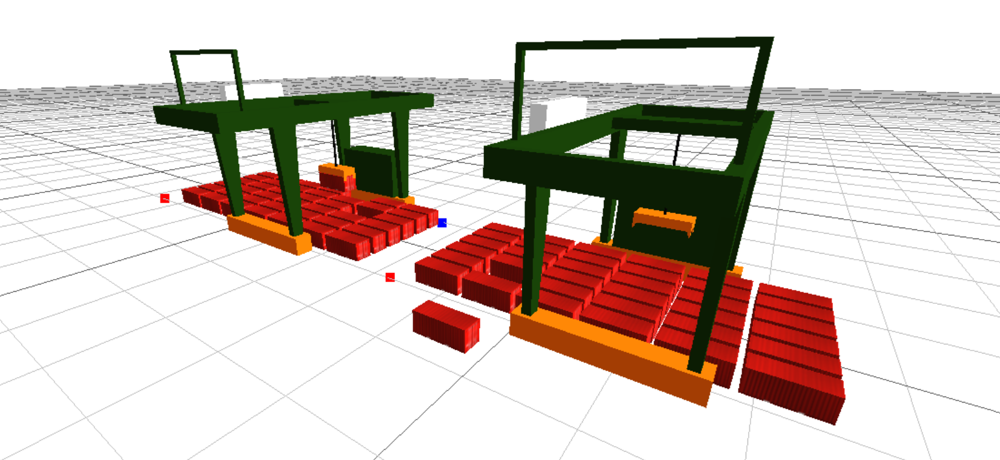

# Object-Oriented Programming

Object-Oriented Programming (OOP) is a programming paradigm that abstracts real-world entities into objects in the program world. Objects communicate with each other through message passing, forming the functionality of a program.



According to online sources, OOP has three main characteristics: encapsulation, inheritance, and polymorphism. However, in this simulation, encapsulation is the most frequently used, while the opportunities for inheritance and polymorphism are rare. Additionally, I haven't implemented object message passing in MicroCity yet. If I do, I will update this article accordingly. Therefore, the following mainly introduces how to use encapsulation in Lua code for MicroCity.

::: tip
The code examples in this article are applicable to MicroCityWeb and may not necessarily work for the desktop version of MicroCity. Furthermore, this article is based on personal insights and does not guarantee absolute correctness in terms of concepts.
:::

## Basic Concepts of Object-Oriented Programming
### Classes and Objects

In simple terms, **a class is a template for objects, and an object is an instance of a class.**

A class is a fundamental concept in object-oriented programming that represents a category of things. The concept of a class can be understood as a category of objects—such as AGVs, shelves, and gantry cranes. You can think of a class as a template for a category of things, and objects are specific instances created based on this template.

A good example is the mentioned shelf. A shelf is a class, and a specific shelf is an object. The shelf class contains various attributes, such as the shelf's location and the items it holds. Different shelf objects created from the shelf class belong to the shelf class, such as Shelf 1, Shelf 2, etc. Although their attributes may differ, they are all objects of the shelf class.

### Class Attributes and Methods

In MicroCity simulation, based on my personal experience, classes usually have attributes but not necessarily methods. Continuing with the example of a shelf mentioned earlier, attributes are the characteristics of a class, such as the location of the shelf and the items on the shelf. Methods represent the behaviors of a class and are usually implemented with functions, such as an AGV lifting or placing a shelf, an AGV moving, or driving a shelf.

## Advantages and Disadvantages of Using Object-Oriented Programming in Simulation
### Advantages
In MicroCity, when dealing with scenarios involving the movement of multiple objects of the same type and playing animations of object movements (such as AGVs, shelves, and gantry cranes), a considerable amount of coordinate calculations and position settings are required. If each object needs to be implemented individually, the code for modifying the coordinate of each object will become very long, making it difficult to maintain. **By using the object-oriented programming paradigm, data processing code can be encapsulated into individual objects, making the code more readable and maintainable.**

Furthermore, if multiple objects of the same type need to be created in a scene, each object may have different parameters. By encapsulating using object-oriented methods, each object's parameters can be encapsulated within the objects themselves. When the simulation process or scale becomes more complex, **the reusability of the code can be increased.**

For simulations, the most important aspect is understanding the business process and business logic. **Using object-oriented programming can make the simulation's business process and logic more clear, improve code readability, and increase maintainability.** Furthermore, when it is necessary to modify the business logic of a class of objects, you only need to enter the class and make the modification. For example, modifying the scheduling algorithm for all gantry cranes in a port only needs to be done once because all gantry cranes share the same scheduling algorithm.

Based on personal experience, when using object-oriented methods to encapsulate objects, it is mostly intended to create a generic object and then create multiple objects of the same type in subsequent simulations automatically or manually, with different parameters for each object. This increases code reusability and improves code readability, providing convenience for future maintenance and modifications, and lays a foundation for large-scale simulations.

### Disadvantages
**If the simulation is small in scale and involves simple operations with a small codebase, it is not recommended to use object-oriented methods for code encapsulation.** Using object-oriented methods will increase the number of lines of code, and may make the code appear more complex than the original problem. (Of course, there will be no consequences if you still choose to use it, except that it may look strange.) Specifically, you can refer to the provided code examples in the following sections and notice that most of the code is dedicated to describing classes and their business logic, while the code for the business process is simple and occupies a small proportion.

## Implementation of Object-Oriented Programming in Lua
In Lua, the concept of object-oriented programming is typically implemented using tables. A table is a data structure in Lua that can represent arrays, dictionaries, objects, etc. In object-oriented programming, tables can be used to represent objects.

### Example
Since the objects created in MicroCity are tables, we can encapsulate the object's attributes directly in a table and return that table when creating an object.

Here's an example:

```lua
-- The function will return an AGV object
function AGV()
    -- Create a 3D object of an AGV in MicroCity
    local agv = scene.addobj('/res/agv.glb')

    -- Set the properties of the object
    agv.position = {0, 0, 0} -- Set the position of the object
    agv.speed = 1 -- Set the speed of the object

    function agv:move(dx, dy, dz)
        agv.position = {agv.position[1] + dx, agv.position[2] + dy, agv.position[3] + dz} -- Modify the object's coordinates

        agv:setpos(agv.position[1], agv.position[2], agv.position[3]) -- Set the object's position
        scene.render() -- Render the scene (Not recommended to call here, just for demonstration purposes)
    end

    return agv -- Return the object
end

-- Object usage
local obj = AGV() -- Create an object
obj:move(1, 0, 0) -- Move the object 1 unit in the x direction
```

Or you can choose to encapsulate the object within a table and return that table after creating the object.

```lua
-- The function will return an AGV object
function AGV()
    -- Set the object's properties directly in the table to be returned
    local agv = {
        object = scene.addobj('/res/agv.glb'),
        position = {0, 0, 0},
        speed = 1
    }

    function agv:move(dx, dy, dz)
        agv.position = {agv.position[1] + dx, agv.position[2] + dy, agv.position[3] + dz} -- Modify the object's coordinates

        agv.object:setpos(agv.position[1], agv.position[2], agv.position[3]) -- Set the object's position
        scene.render() -- Render the scene (Not recommended to call here, just for demonstration purposes)
    end

    return agv -- Return the object
end

-- Object usage
local agv = AGV() -- Create an object
agv:move(1, 0, 0) -- Move the object 1 unit in the x direction
```

There is also another method to create objects using `setmetatable`, this belongs to advanced usage, but I feel like it is not used very often. However, it seems like this method can be used to achieve class inheritance, if you are interested, you can search for it yourself. Here is the code implementation of the shelf class that I wrote for an earlier assignment as a reference. (Now I feel like this class is not written very well 😂, for example, `x` and `y` can be replaced with `pos = {x, y}`, and `x_origin` and `y_origin` can be replaced with `origin = {x, y}`).

```lua
-- Shelf
Shelf = {
    x = 1,
    y = 1,
    cargo = {"box"}, -- Items on the shelf
    x_origin = 1, -- Shelf's original x coordinate
    y_origin = 1 -- Shelf's original y coordinate
}

function Shelf:New(x, y)
    local self = {}
    setmetatable(self, {
        __index = Shelf
    })
    self.__index = self

    self.x = x
    self.y = y
    -- Set the original coordinates
    self.x_origin = x
    self.y_origin = y
    return self
end
```

## Types of Classes

Here, I would like to summarize the main types of classes that I have created.

1. **3D entity classes:** These classes mainly control the movement of 3D entities, such as AGVs and cranes. Most of them have physical entities that need to be moved. Some even include sub-objects, such as crane objects that have hoists, ropes, and cranes as sub-objects.
2. **Data model classes:** These classes represent various entities in a system, such as yards, shelves, and goods. For example, a yard class contains data about the yard's dimensions, the goods in the yard, and the containers in the yard.

It should be noted that I do not strictly categorize these types, as certain classes may possess the characteristics of multiple types. For instance, an AGV class also includes data about the AGV's position and speed, while a shelf class merely stores the shelf model. The movement of the shelf model is controlled by the AGV, and the more important function of the shelf class is to record the information of the goods on the shelf. Therefore, I consider these types as rough distinctions, and the specific implementation should be based on the actual business processes and requirements.

> This post is translated using ChatGPT, please [**feedback**](https://github.com/huuhghhgyg/MicroCityNotes/issues/new) if any omissions.