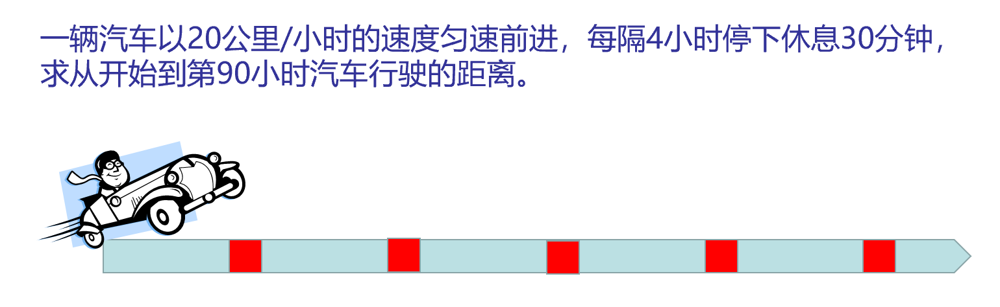

# Time Advancement Methods
The time advancement method in simulation refers to how the simulation time is progressed during the simulation process.

## Classification of Time Advancement Methods
There are three major categories of common simulation time advancement methods:
* Event scheduling method: Event scheduling method is an event-based simulation method that sorts events in the simulation system and simulates them based on the order of their occurrence.
* Fixed increment advancement method: The fixed increment advancement method refers to fixing a time increment during the simulation process. After setting the starting time, the simulation time is advanced based on the time increment.
* Master clock advancement method: The master clock advancement method refers to controlling the entire simulation system during the simulation process using a master clock. It controls the simulation process by controlling the clock.

## Example
### Event Scheduling Method
The event scheduling method is an event-based simulation method that sorts events in the simulation system and simulates them based on the order of their occurrence. During the simulation process, the simulation system determines the next event to occur based on the current simulation time and the time of each event, and advances the simulation time to the time when the event occurs.

The event scheduling method consists of the following three main steps, which are also the main steps of the control program for the event scheduling method:
* Time scanning: Determine the time when the next event will occur and advance the simulation clock to that moment.
* Event identification: Correctly identify the event that is about to occur.
* Event execution: Correctly execute the event that has occurred.

The basic principle flowchart of the event scheduling method is as follows:

```flow
init=>start: Initialization
scan=>operation: Time Scanning
exec=>operation: Event Execution
ise=>condition: Check if it is the end
e=>end: Simulation End

init->scan->exec->ise
ise(no)->scan
ise(yes)->e
```

For the specific implementation of the event scheduling method in MicroCityWeb, please refer to [Discrete Event Simulation and Program Control - Coroutine](./event-scheduling.md).

### Fixed Increment Advancement Method
The fixed increment advancement method refers to fixing a time increment during the simulation process and advancing the time simulation based on the increment from the starting time. Within each time step, if no event occurs, the simulation clock is advanced by one unit of time T; if there are multiple events within the step, these events are considered to occur at the end of the step.

::: center


Example
:::

#### Code Flow Example
```lua
while scene.render() do
    t = t + dt
    if t % cycle ~= work_time then
        d = d + v * dt
        print("Time after departure:", t, "hours")
    else
        print("Time after departure:", t, "hours, resting")
    end

    car:setpos(CastToLine(d)) -- Linear trajectory

    os.sleep(200)
end
```
> This is the main flow of the code and cannot be used directly.

### Master Clock Advancement Method
The master clock advancement method refers to controlling the entire simulation system during the simulation process using a master clock. It controls the simulation process by controlling the clock. The master clock advancement method can be divided into two types: synchronous master clock and asynchronous master clock. Synchronous master clock means that all modules use the same master clock for advancement, while asynchronous master clock means that different modules use different master clocks for advancement.

The last part of the [Automated Warehouse Simulation Approach](./warehouse-simulation.md) mentions the [improvement space](./warehouse-simulation.md#improvement-space) and ultimately implements the master clock advancement method with synchronous master clock.
> The implementation is done but the code is not included.

#### Changes from the Automated Warehouse Simulation to the Master Clock Advancement Method
Specifically, the following changes were made based on the original approach:
* Most of the `os.sleep()` related to the event scheduling method were deleted. Due to the simplicity of the simulation process, the event scheduling method related to loading and unloading operations is retained to optimize resource utilization.
* Set a global simulation clock and change the idea of the `Agv:Move()` function from "executing tasks and refreshing the scene at a fixed step size" to "monitoring changes in the simulation clock duration, executing tasks based on the duration changes, and refreshing the scene".
* Added simulation speed adjustment.

From the above changes, it can be seen that the core of the simulation has shifted from event tasks to the simulation clock. In this, the part of scene refreshing is implemented using `os.clock()`.

#### Example of Master Clock Advancement Method

Below is a simple example of the dominant clock driving method and the `os.clock()` function, modified from the built-in block rotation example in MicroCityWeb.

```lua
local obj = scene.addobj('box')

-- Initial position
local x = 1
local y = 1
local z = 0

local rx, ry = 0.1, 0.1 -- Rotation speed in the x and y directions
local simspeed = 10 -- Simulation speed

local t = 0 -- Global simulation clock
local t0 = os.clock() -- Record the start time of the simulation
while scene.render() do
    local dt = os.clock() - t0 -- Calculate the time difference since the last recorded time
    t = t + dt -- Move the simulation clock forward by the corresponding time difference
    
    -- Set the current rotation position of the block
	x = x + rx * dt * simspeed 
	y = y + ry * dt * simspeed 
	obj:setrot(x, y, z)
	
    t0 = os.clock() -- Record the simulation time
end
```
Explanation:
* When the simulation speed `simspeed` is 1, it means that the simulation clock is moving at the same speed as the real-world clock. `simspeed` can be considered as an acceleration factor.
* `dt` represents the time difference between two recorded times, and the time step in the simulation is calculated as `dt * simspeed`.
  ::: info
  It should be noted that the value of the time increment `dt` is generally not the same in each loop cycle, and the specific value of `dt` generally depends on the computational power of the computer.
  :::
  ::: tip
  Sometimes there is not much time-consuming operation between two recorded times, and the calculated `dt` may be 0. Generally, there is a `scene.render()` between two time recordings, which usually ensures a non-zero time difference between the two samples.
  :::


> This post is translated using ChatGPT, please [**feedback**](https://github.com/huuhghhgyg/MicroCityNotes/issues/new) if any omissions.