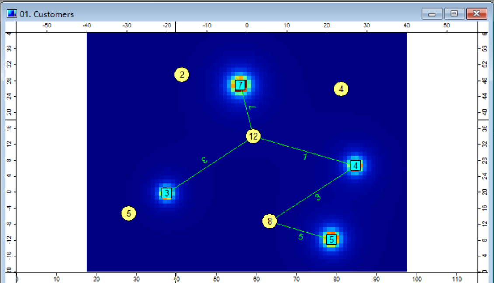

---
head:
- - meta
  - name: keywords
    content: MicroCity,结果,可视化
---

# Visualization of Results
This article introduces various methods for visualizing computational results. This includes changing the color of the content, changing the size of shapes, and changing the attribute labels displayed for elements.

## Changing Shape Color
In the graphic properties box located at the bottom left corner of the program interface, the type of color displayed can be changed by modifying the `Type` attribute under the `Colors` section. There are 3 options available:
- Unique Symbol: Specifies a specific color for all graphics in the same layer, which will not be discussed further here.
- [Lookup Table](#lookup-table-changing-color-based-on-table-values): Displays the corresponding color based on a numerical query from a table.
- [Graduated Color](#graduated-color-displaying-gradient-color-based-on-values): Sets a gradient color based on the numerical values in the table.

### Lookup Table - Changing Color Based on Table Values
By changing the `Type` attribute to `Lookup Table`, the color of the graphics can be modified based on the values in the table, achieving the effect of selecting specific graphics.


In this example, the `Attribute` of `Lookup Table` is changed to `SELECT` in order to control the color of lines based on the values in the `SELECT` column of the table (as shown in the above image of attribute settings). When the value is 0, the color is displayed as black, and when the value is 1, the color is displayed as red. The values in the `SELECT` column of the table and the specific settings in the `Lookup Table` are shown in the following images.


The final effect achieved is shown below.


### Graduated Color - Displaying Gradient Color Based on Values
By changing the `Type` attribute to `Graduated Color`, different colors can be displayed based on the varying numerical values in the table, achieving the effect of displaying a gradient color.


In this example, a gradient color is displayed based on the population size of each country. It can be observed that China has a large population, hence the color displayed is red, while India also has a significant population, resulting in an orange color. Other regions have smaller populations, but differences can still be discerned through the colors.


The `Colors` attribute under `Graduated Color` can also be adjusted with other color schemes. The settings interface is shown in the following image, but each individual setting will not be listed here.


If interested, the manual can be referred to for example [2.1 Showing a World Map](../docs/2.1_showing_a_world_map.md) to manually experiment with changing this attribute.

## Changing the Display Size of Shapes and Labels
### Selection of Reference System
There are 2 reference systems for displaying the size of content: one based on the map and one based on the screen. In this case, both the size of shapes and the display of labels are set to the same reference system.

When content is displayed **based on the map**, the size of the content will be synchronized and scaled according to the size of the map, as shown in the following images:
::: center

(Enlarging the content based on the map)


(Shrinking the content based on the map)
:::

When content is displayed **based on the screen**, the size of the content remains relatively consistent regardless of the map scaling, as shown in the following image:
::: center

(Enlarging the content based on the screen)

Translate into English:


(Shrunk with the screen as the reference system)
:::

Therefore, when drawing, **the reference system should be selected according to the purpose of the drawing**.
- If you need to draw shapes with a specific size or label with a specific size on a map, such as drawing a circle with a radius of 10 km, you should use **the map as the reference system**.
- If you only need labels and graphics to be displayed clearly at any size, you can choose **the screen as the reference system**.

#### Application examples of reference system
Draw dots in the picture, set the radius of the circle to be the same as the size of the circle, and set the center of the circle to be the center of each green dot. **The size of the gray circle represents the coverage range of each green dot**.


In the picture, the gray circle is drawn for each green dot with a radius of 16, representing the coverage range of each green dot. These gray circles are stored in a layer called `Range.shp`, and the layer type is `Points`.

### Setting the reference system
The size reference system for graphics and labels can be set in the bottom left corner of the program interface.


The two positions marked in the picture can adjust the size reference system for graphics and the size reference system for labels respectively.
- **Setting the size reference system for graphics**: Adjust the size reference system for graphics under the `Size` column in the `Size relates to...` section. Adjust the `Default Size` to adjust the size of the graphics relative to the coordinate system.
- **Setting the size reference system for labels**: Adjust the size reference system for labels under the `Labels` column in the `Size relates to...` section. Adjust the `Default Size` to adjust the size of the labels relative to the coordinate system.

## Changing the displayed labels
### Manually changing the displayed labels
The size reference system for graphics and labels can be set in the bottom left corner of the program interface. The labels displayed in the picture above are `ID`. If you need to change it to other columns in the table, you can change the `Attribute` property under the `Labels` column to achieve it.

The position to be changed is shown in the picture. If you need to display the value in the corresponding `MSG` column in the table, you only need to change the `Attribute` property value under the `Labels` column to `MSG`.


However, every time the graphics are changed and the `Update()` function is executed, the label will be hidden. If the script to be executed contains the `Update()` function for this layer, there is no need to manually reconfigure the displayed labels after each script execution. **The displayed labels can be automatically selected through the script**.

### Automatically changing the displayed labels
**The value of an attribute can be changed using the `SetParameter()` function**. Taking the `Attribute` property under the `Labels` column in the picture above as an example, you can see that its `ID` is `LABEL_ATTRIB` and its type is `Choice` in the bottom bar.
> It should be noted that when the type is `Choice`, the parameter values are numbered starting from 1 and the numbering corresponds to the contents of the drop-down menu in order.

After clicking on this property, you can see that `MSG` is in the second position.


Since the numbering in Lua usually starts from 1, the number for `ID` here corresponds to 1, and the number for `MSG` corresponds to 2. The object to be operated on is `MSG`, so the function needs to fill in the parameter value of type `Choice` as 2.

Now that all the required parameters have been obtained, the `SetParameter()` function can be used to change the displayed labels.
```lua
-- transports is the graphic layer
SetParameter(transports, "LABEL_ATTRIB", 2)
```
> The `SetParameter()` function needs to be executed after the `Update()` function, otherwise the effect will be overwritten by the `Update()` function.

Now let's take a closer look at the specific usage of the `SetParameter()` function:

```lua
SetParameter(Shapes|Table|Grid|Scene|Module, "id", Number|"String"|Object)
```

| Parameter | Meaning |
| --- | --- |
| Parameter1 | The input object, which can be `Shapes`, `Table`, `Grid`, `Scene`, or `Module` |
| Parameter2 | The `id` corresponding to the attribute. In the previous context, it is `LABEL_ATTRIB` |
| Parameter3 | If you need to change the attribute value, it only accepts three types: Number, String, and Object |

The introduction of the `SetParameter()` function can be found in the [4.2 User Interface Control](../docs/4.2_ui_control.md) document, please refer to it.

## Using Raster Grids

Raster grids can also be used for visualization, and I believe the most common application of raster grids is to **draw heat maps**. The generation of a heat map is mainly achieved by modifying the value of each cell on the raster grid. If you are not familiar with the specific structure of raster grids, you can refer to the [3.3 Raster Grids](../docs/3.3_raster_grids.md) document. For controlling raster grids using scripts, you can refer to the [4.4 Grids](../docs/4.4_grids.md) document.

One scenario of using raster grids to draw heat maps is **plotting price maps**. When plotting a price map, we can iterate through each grid point on the raster grid, calculate the sum of distances from that grid point to each warehouse, and set the value of that grid point to this sum. This way, we can obtain a heat map. This method helps us visualize the distribution of prices and discover the trends and patterns of prices.





> This post is translated using ChatGPT, please [**feedback**](https://github.com/huuhghhgyg/MicroCityNotes/issues/new) if any omissions.