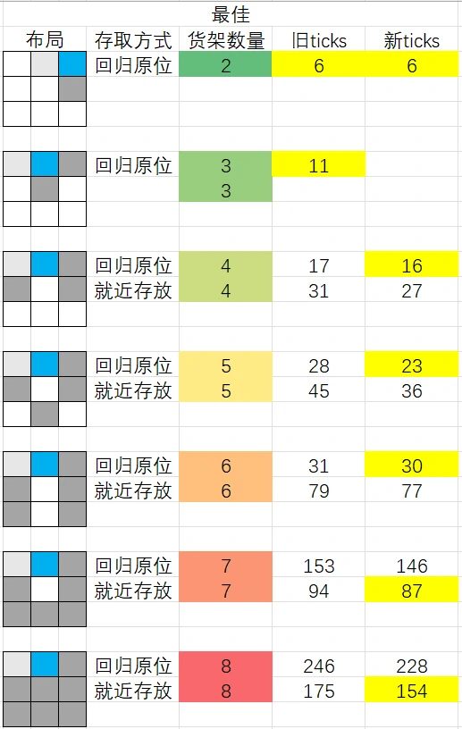
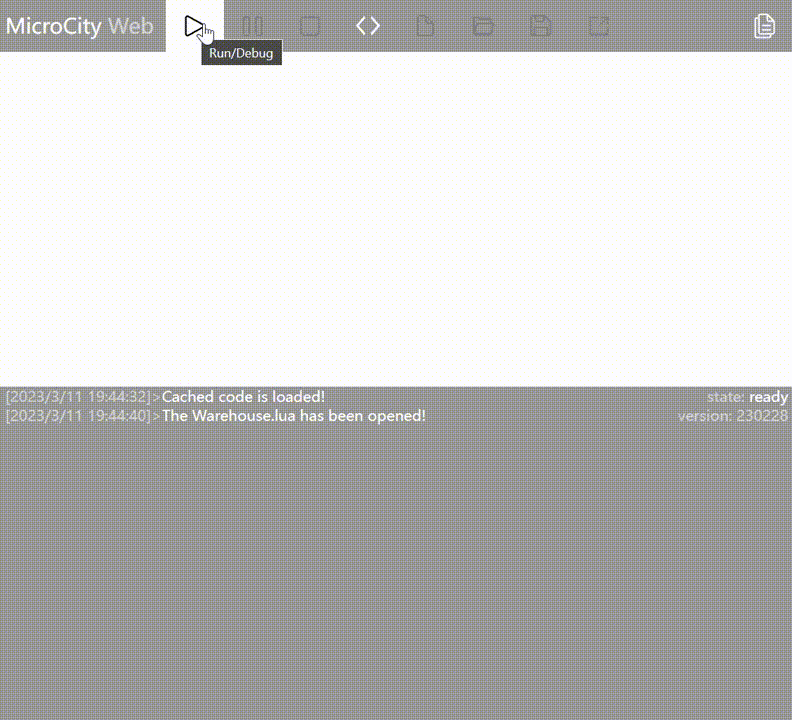
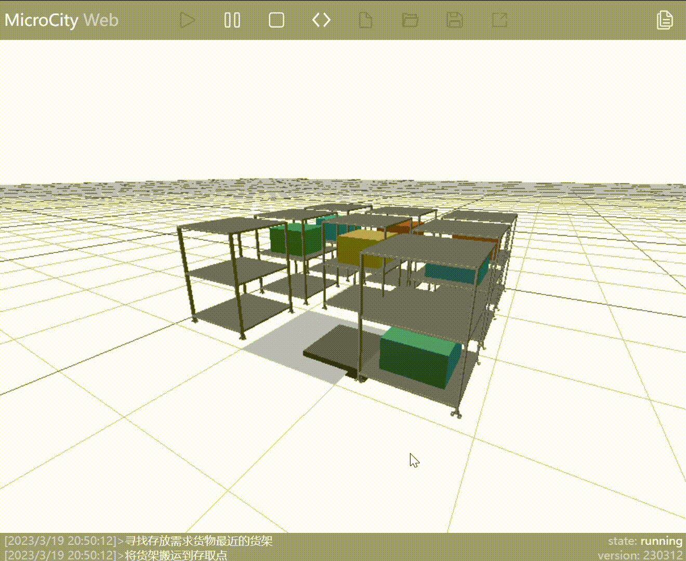
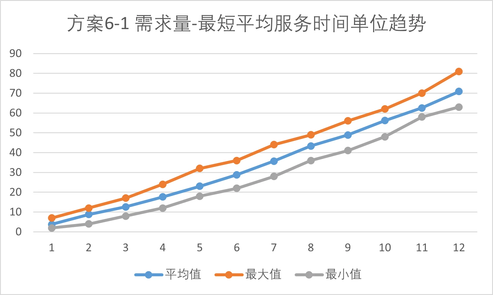

# Ideas for Warehouse Automation Simulation

> The ideas in this article are for reference only and it is recommended to make appropriate improvements.

## Specific Problem: Warehouse Simulation based on Cellular Automata


In this problem, the locations of inbound and outbound can be changed, and the forklift is an AGV.

In other words, this is actually a cellular automata simulation of a mobile rack warehouse. The AGV can pass through the bottom of the rack, move to the bottom of the rack, lift the rack, and transport it to the inbound/outbound point.

### Basic Assumptions
* All items on the racks are the same.
* Only one item is placed on each rack.

Therefore, outbound and inbound can be considered as completely opposite processes, so here we only need to discuss the outbound case in detail. It is assumed that there is already an item on the rack by default.

### Overall Implementation Idea
* Assign $(x, y)$ coordinates to each cell in the entire $3\times3$ warehouse to facilitate subsequent movement operations.
* With AGV as the core, operate the racks. When the AGV is in the lifted state and moves the rack, you only need to synchronize the coordinate position of the rack with the position of the AGV to achieve the effect of AGV moving the rack.

#### Business Process
Randomly generate the order list according to the required quantity, and the AGV moves the racks to the outbound point in order based on the order list.

#### Business Logic
When performing outbound, the AGV first finds the nearest rack and moves to the position of that rack, lifts the rack. For the rack (AGV), set the destination for movement and calculate the difference in Manhattan distance.
  * Before each movement, determine the direction of rack movement ($x$ or $y$ direction) by checking for obstacles.
  * If both directions are blocked, prioritize the $y$ direction (as specified) and recursively move away the obstacles in this direction to make space for the rack to move. If there is no space in the $y$ direction, then move in the $x$ direction.

### Process Optimization: About the Old Method and the New Method
Both of these methods are viable, but the **new method optimizes for specific scenarios by reducing the number of steps through obstacle prediction**. See the problem in the figure below:

**Old Method: No Obstacle Prediction** (Inbound and outbound points are at position $x=3,y=3$)
::: center

:::

👉 After the AGV completes the outbound operation for the first rack and moves towards the second rack, it finds that the first rack blocks the way, so it goes back to move the first rack away, and then proceeds to do the outbound operation for the second rack.

**New Method: Obstacle Prediction** (Inbound and outbound points are at position $x=3,y=3$)
::: center

:::

👉 After the AGV completes the outbound operation for the first rack, it checks if other racks need to be moved before it can reach the inbound/outbound point. If necessary, it moves the obstructed racks and then proceeds to do the outbound operation for the next rack.

::: info
In line with the principle of minimizing the occupation of the inbound/outbound points, when there is an empty space, the AGV will move the rack at the inbound/outbound point. Therefore, some seemingly redundant operations are not without comprehensive considerations.
:::

Optimal layout schemes for different numbers of racks (animated graphics)
The case with 8 racks has already been shown above. Here, we only show the cases with 5 and 7 racks from the table. For other cases, please refer to the appendix.

### Collection and Analysis of Simulation Data
#### Maximum Inbound/Outbound Efficiency
The simulation results are shown in the figure below, representing the layout of racks with the best efficiency for the same number of racks.
* Optimal rack layout: For the same number of racks, the layout with the minimum number of operations (ticks) to retrieve all items.

**Explanation of the Layout Diagram**
* White: No rack is placed.
* Light gray: Rack, but the AGV is initially positioned below this rack.
* Gray: Rack.

**Explanation of the Table**
* Rack Quantity: Number of racks in the layout diagram.
* Old Ticks: Number of operations to retrieve items using the old method (no obstacle prediction).
* New Ticks: Number of operations to retrieve items using the new method (with obstacle prediction). The new method will be explained later.
* Highlighted in yellow: Scheme with the minimum number of operations (minimum ticks) in the same layout.

::: center

:::

#### Maximum Space Utilization
If all positions are filled with racks, it will not be possible to access all racks. Therefore, the method with the highest space utilization is to place 8 racks.

**Color Indications**
* Green: Rack with items.
* Purple: Rack without items.
* Light purple: Rack lifted by the AGV.
* Dark purple: AGV below this rack, but the rack is not lifted.
* Dark gray: Inbound/outbound points.

> Sometimes, when the refresh rate is too fast, it may not be possible to see the rack being lifted by the AGV.

**The entry and exit points are located at position x=2, y=3.**



### Innovations
* Additional consideration for different types of goods.
* Each simulation generates demand based on the random arrangement of goods on the shelves.
* Object-oriented programming. Using an object-oriented approach helps in abstracting the problem and improving the flow of the process. Good naming conventions make the program's logic and flow clear, ensuring that you won't forget everything after a night's sleep 😂

Different types of goods are represented by different colors. The meaning of AGV state colors, empty shelf colors, and entry/exit point colors remains the same.
* Purple: Shelf without goods
* Light purple: Shelf lifted by AGV
* Dark purple: AGV is positioned beneath the shelf but hasn't lifted it
* Dark gray: Entry/exit point

Example with 5 shelves:
::: center

:::

Example with 8 shelves:
::: center

:::

## Simulation Enhancement: 3D Automated Warehouse Simulation


In this part, the question has slightly changed. The requirement is to **add a third dimension** to the cellular automaton warehouse simulation and create a simulation of an automated warehouse. The specific requirement is shown in the image above.

### Overall Approach
#### Adding the Third Dimension

Based on the core of the **Cellular Automaton-based Warehouse Simulation**, the part of the simulation that uses cellular automata will be rewritten as an internal data table to serve as an internal data model, monitoring and controlling the state of the entire simulation process.

Since the **Cellular Automaton-based Warehouse Simulation** uses an object-oriented approach to encapsulate objects, and object methods are extensively used in building the business logic and flow, only the object methods need to be rewritten (e.g., `Agv:Move(dx, dy)`) to achieve the transition from cellular automaton simulation to 3D automated warehouse simulation.
> If the overall program structure is well-designed, applying "object-oriented" techniques will significantly improve maintainability and reduce the difficulty of migration.

The AGV and shelf models can be directly reused. For the goods, you only need to set the relative height list from the shelves to achieve automatic placement of goods at the specified height.
::: tip
If you need to reuse existing models, or if you want to upload models to the repository maintained by the author of this document, please refer to the documentation on [3D Objects - External Models](./3d-objects.md#external-models).
:::

#### Significant Fluctuation in the Demand for Inbound and Outbound Goods
* According to the requirements, there are basically only two scenarios: 3 shelves and 6 shelves.
* Since the number of shelves is limited and the **Cellular Automaton-based Warehouse Simulation** has obtained the best layout for warehouse performance, the corresponding optimal layouts for the respective number of shelves can be directly reused. In this problem, only the placement of goods in fixed shelf layouts needs to be considered.
* For the case of **3 shelves**, the optimal layout is a symmetrical configuration in terms of height, with a distance of 1 from the entry/exit point. Therefore, only one scenario needs to be simulated, and the data collected from it.
* For the case of **6 shelves**, three scenarios were selected for multiple simulations to obtain the average, maximum, and minimum Ticks consumed by each scenario for inbound and outbound operations.
  > Ticks represents the number of times the AGV moves and serves as a unit of operation time. Further improvements are mentioned in the following section: [Areas for Enhancement](#areas-for-enhancement).
* Based on the above analysis, since there are limited scenarios, the best layout for goods can be determined by simulating the placement of goods at various positions, randomizing the types of demanded goods while keeping the total demand constant, and analyzing the obtained data.

### Enhancements
During testing, it was found that the original strategy of moving shelves was not reasonable. Therefore, the shelf movement strategy was improved.

**Old Strategy:** Find the shelf closest to the AGV that contains the requested goods and move it to the entry/exit point.



As seen in the animation, the AGV has moved the shelf containing the required goods (represented by blue blocks) to the entry/exit point. However, because the AGV moves the shelf adjacent to the one with the requested goods, it doesn't perform the outbound operation on the goods already at the entry/exit point.

**New Strategy:** Find the shelf closest to the entry/exit point that contains the requested goods and move it to the entry/exit point. By changing the strategy, the aforementioned issue has been resolved.


### Innovation

Due to the large number of tests, the main process is written into a function for adaptive improvement, achieving automatic simulation tests for all cases and outputting data. The following figure is an example of running the automatic simulation test.


Code for the automatic simulation test process, for reference only:

```lua
-- Batch test
local cargo_ubs = {1, 2, 3, 4, 5, 6, 7, 8, 9, 10, 11, 12} -- Test demands (upper limit) sequence

local output_string_list = {} -- List of test result strings
for k, v in ipairs(cargo_ubs) do
    local test_result = {} -- Test result sequence for this demand upper limit
    cargo_ub = v -- Set the quantity upper limit
    for j = 1, test_count do
        scene.setenv({
            grid = 'plane',
            clear = true
        }) -- Clear the scene

        print("Test (", j, "/", test_count, "): Demand quantity is", cargo_ub)
        local tick = ModelRun() -- Run the simulation model and return the test result
        table.insert(test_result, tick) -- Insert the test result into the test result sequence
    end

    local output_string = ""
    print("Test result sequence for demand quantity", cargo_ub, ":")
    for i = 1, #test_result do -- Output the test result sequence to the list string
        output_string = output_string .. test_result[i] .. "\t"
    end
    print(output_string)
    table.insert(output_string_list, output_string)
end

-- Output the list of test results
for i, str in ipairs(output_string_list) do
    print("Test result sequence for demand quantity", cargo_ubs[i], ":", str)
end
```

A bug was discovered during the automatic simulation test process, as described in the following text.

### Shelf Layout Scheme


Color Legend
* Light Blue: Inbound and outbound points
* White: Empty space
* Dark Blue, Red, Yellow: Colors corresponding to 3 types of goods

Assumptions
* Each shelf contains 2 items of the same type
* Random demand for goods, no preference for type
* Only one item is taken out at a time

### Simulation Results and Analysis
Simulate and test each quantity scenario in the layout scheme for each item 30 times, and calculate the maximum, minimum, and average values of the results for each scenario. The final conclusion is that in the case of 6 shelves, Layout Scheme 2 performs the best.

#### Scheme 3: 3 shelves


#### Scheme 6
Trend in Average Ticks for Scheme 6


Optimal layout scheme for Scheme 6: Scheme 2


Trend graph of "Demand Quantity - Shortest Average Service Time" for each sub-scheme should also be plotted. Taking Scheme 6-1 as an example, the x-axis represents the quantity of goods demanded, and the y-axis represents the shortest average service time (Ticks).



### Improvement Space
Since the specific execution time of the event is not given in the title, and the time unit is not specified, we only measure the number of operations on the shelves as the time cost. In other words, the time is calculated afterwards, and I think most of the students might have the same idea at this point. Although there is no problem with the final result, the idea can be changed to adapt to later studies.

The current approach is task-driven. Although it can obtain the correct result, it does not make use of simulation time. This approach does not have any issues when controlling only one entity. However, when dealing with multiple entities simultaneously, the current approach cannot handle the situation where multiple entities complete tasks at the same time, and can only achieve the situation where multiple entities complete tasks one after another. The specific process of the current approach is as follows:
```flow
event=>start: Task queue
eventcond=>condition: Tasks remaining
exec=>operation: Execute current task
addtime=>operation: Calculate time spent
sumtime=>end: Get total time

event->eventcond
eventcond(yes,left)->exec->addtime->eventcond
eventcond(no,bottom)->sumtime
```

Since the time advance method is used, the simulation world has its own time. For us, we can control the simulation speed by multiplying a multiplier on the simulation time, which is the simulation speed. In addition, this approach is more flexible in supporting multiple objects. The specific process is as follows:
```flow
event=>start: Task queue
eventcond=>condition: Tasks remaining
time=>operation: Get current time (consider simulation speed)
exec=>operation: Refresh task execution progress
sumtime=>end: Get total time

event->eventcond
eventcond(yes,left)->time->exec->eventcond
eventcond(no,bottom)->sumtime
```
This way, the simulation is changed to be time-centric, and the progress of all entities in the scene can be refreshed directly when refreshing the task execution progress. Since the simulation is time-centric, it is necessary to set the rate/time of various operations to ensure the accuracy of time calculation. In MicroCityWeb, there are some techniques that can be used for time advance simulation.

#### Update simulation time with system time
The `os.clock()` function can get the current system time (in seconds, but in decimal). With this function, synchronization between simulation time and real time can be achieved. Usage examples can be found in [Time Lapse](./timelapse.md#主导时钟推进法) (Chinese only).

Since time is the core of the entire simulation, it is necessary to specify the time required for operations that were not previously defined. In the improved part, the additional time required for the following operations is considered:
* Time required for goods to enter and leave the storage
* Time required for the AGV to lift and lower the shelves

> This post is translated using ChatGPT, please [**feedback**](https://github.com/huuhghhgyg/MicroCityNotes/issues/new) if any omissions.