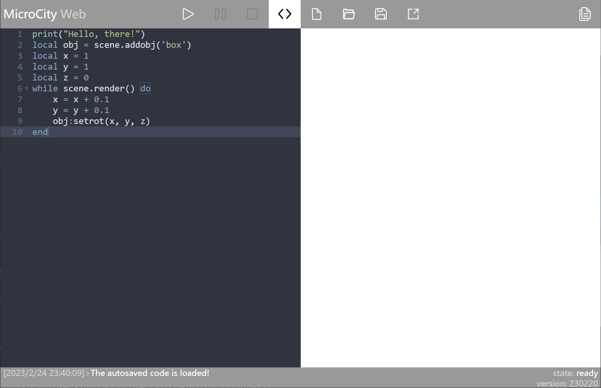

# Introduction to the User Interface

The overall interface of MicroCityWeb is shown in the following figure. This article will provide a detailed introduction to the user interface (UI) operations of MicroCityWeb.

## Overview of Interface Zones
Overall, the interface of MicroCityWeb can be roughly divided into four areas:
* [Top - Blue Area](#blue-command-area): performs various operations on code and files
* [Left - Green Area](#green-code-editor): code editor
* [Right - Red Area](#red-canvas-area): view area
* [Bottom - Yellow Area](#yellow-code-output-area): output information, recognize program running status

Next, we will provide a detailed description of the usage and functions of these areas.

## Blue: Command Area
The content of this area is shown in the following figure, with nine available buttons.

### Program Control
The first three buttons are mainly used to control program execution. Their specific functions are as follows:

1.  **Run/Debug:** Clicking the left mouse button will run the code in the [code editor](#green-code-editor) on the left-hand side of the webpage, while right-clicking will debug the code.

2.  **Pause:** If the program is running, clicking this button will **pause** its execution (if supported).

3.  **Stop/Force Stop:** If the program is running, clicking the left mouse button will stop its execution. If left-clicking does not stop the script, right-clicking can forcibly terminate its execution.

### Code Editing

Buttons 4-7 are mainly related to code editing.

4.  **Show/Hide Editor:** If the left code editor is open, clicking this button will close it. If it's closed, clicking it will reopen it. If you right-click, the editor can be expanded to full screen.
    
5.  **Open Built-In Code:** You can directly load built-in code (import built-in models), such as cubes, trucks, earth, world maps, etc. The specific models will be introduced in detail when the [red canvas area](#red-canvas-area) is introduced.
::: center

Built-in code list
:::
    
6.  **Open Local Code:** 

    **Left-click**: A dialog box will pop up when you left-click, and you can choose a code file (.lua) on your local machine. After confirming the selection to open the file, the text of the code file will be automatically imported into the code editor on the left.

    **Right-click**: You can select one or more files to upload to MicroCityWeb by right-clicking. The "Save" button (⑦) on the right can be clicked to view the list of uploaded files.
    
7.  **Save Code:**

    **Left-click**: When you save a file for the first time, a save file dialog box will pop up after you click the save button. You can choose the save location and fill in the file name. If you have previously saved the file locally and you have made modifications to the file and want to save the changes, you can simply click the save button to save the changes directly to the previously saved file.

    **Right-click**: You can view the list of uploaded files, and you can click on a file in the list and download it to your local machine.

### Others

8. **Share.** After clicking the button, a dialog box for entering a password will pop up. Afterwards, you will receive a link that anyone can use to access your share. 
    
    If you enter a password in the dialog box, others who open the link can only run your program code and observe the running result, but cannot view your code (unless you tell them the password); if you do not enter a password, others can not only run your code to view the running result but also view the code you have written.

9.  **View help documentation.**

## Green: Code Editor

The integrated code editor on the left side of MicroCityWeb is based on AceEditor and therefore has some of its features.

### Keyboard Shortcuts

Below are some commonly used keyboard shortcuts to help you edit code more efficiently.

**Most Common**

<kbd>Ctrl</kbd>+<kbd>Z</kbd>: Undo

**Line Operations**

<kbd>Ctrl</kbd>+<kbd>D</kbd>: Delete a line
<kbd>Ctrl</kbd>+<kbd>Shift</kbd>+<kbd>D</kbd>: Duplicate a line

<kbd>Alt</kbd>+<kbd>↑</kbd>: Move line of code up
<kbd>Alt</kbd>+<kbd>↓</kbd>: Move line of code down

**Find Content**

<kbd>Ctrl</kbd>+<kbd>K</kbd>: Find the next occurrence of selected content in the code

**Indentation**

<kbd>Ctrl</kbd>+<kbd>[</kbd>: Increase code indentation
<kbd>Ctrl</kbd>+<kbd>]</kbd>: Decrease code indentation

**Modify Values**

<kbd>Ctrl</kbd>+<kbd>Shift</kbd>+<kbd>↑</kbd>: Increase the numeric value before the cursor by 1
<kbd>Ctrl</kbd>+<kbd>Shift</kbd>+<kbd>↓</kbd>: Decrease the numeric value before the cursor by 1

## Red: Canvas area

Built-in code can be imported into the scene, see Command Area - Code Editing for details.

After importing the scene code, click the "Run" button to load the scene.

::: center

Built-in car model

Built-in Earth model
:::

### Scene Operations

Scene operations, including viewpoint movement and rotation, need to be performed in the canvas area. Therefore, the following will introduce the basic operations of the canvas area.

* Zooming in and out of the scene: Scroll the mouse wheel up to zoom in and down to zoom out.
* Translation: Hold down the right mouse button and drag.
* Rotation
  * Scene rotation: Hold down the left mouse button and drag to rotate from your viewpoint.
  * Object rotation: Click on the object, the color of the object changes, and then hold down the left mouse button on the object to rotate around the object's center.
  

These operation rules apply to both two-dimensional and three-dimensional objects.

## Yellow: Code Output Area

After opening MicroCityWeb, the code output area is shown below. Clicking on the code output area will cause the entire area to move up, allowing you to see more historical output information.

Regarding the information output in this area, the code output area will output the following information:
* **Script output:** The left side is the output of the script, including the output time and content.
* **Script running status:** The first line on the right side shows the script running status. "state: ready" indicates that the script is ready to start running (not yet running), and "state: running" indicates that the script is running.
* **MicroCityWeb version number:** Indicates the current version number of MicroCityWeb being used. If there is a difference from the known version, you can force a refresh to load the latest version.

## Notes

**Turn off automatic translation:** If your operating system language is not English and the browser has automatic translation enabled, it needs to be manually disabled, otherwise there will be errors when running the code.