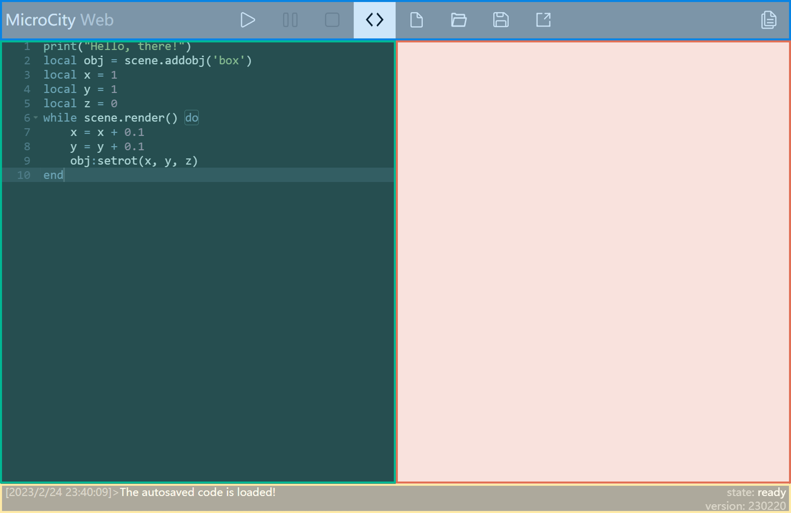
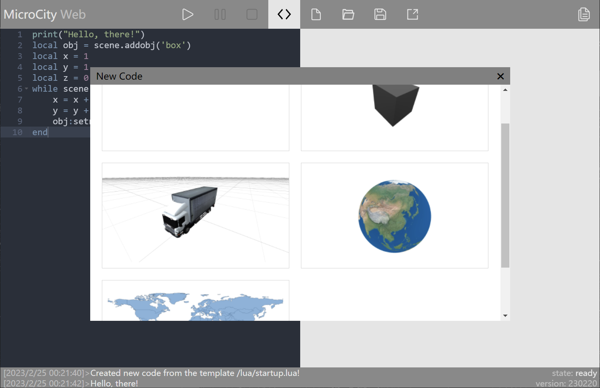
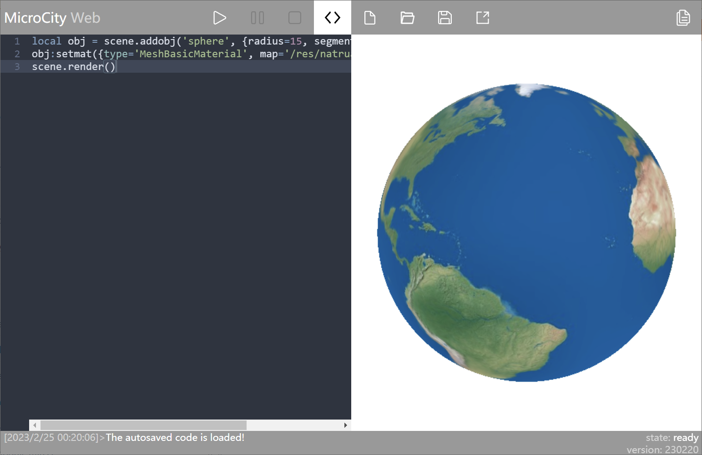
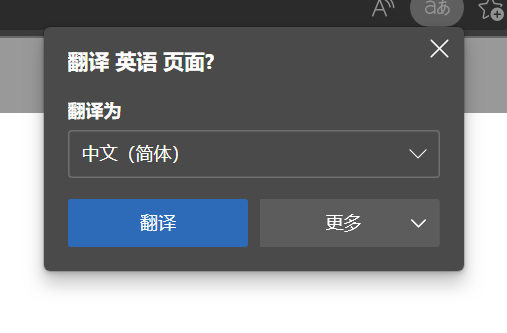

# User Interface Overview
The overall interface of MicroCity Web is shown in the following image. This article will provide a detailed introduction to the user interface (UI) operations of MicroCity Web.

## Overview of Interface Sections
In general, the interface of MicroCity Web can be divided into 4 sections.
* [Top - Blue Section](#blue-section-commands): Executes various operations on code and files
* [Left - Green Section](#green-section-code-editor): Code editor
* [Right - Red Section](#red-section-canvas): View area
* [Bottom - Yellow Section](#yellow-section-code-output): Output information, recognizes program running status

Below, we will provide a detailed explanation of the usage and features of these sections.

## Blue Section - Commands
The content of this section is shown in the following image, and there are a total of 9 available buttons.

Their specific functions are as follows:
- [Program Control](#program-control)

  1. Run/Debug
  2. Pause Execution
  3. Stop Execution/Force Stop

- [Code Editing](#code-editing)

  4. Show Editor / Hide Editor
  5. Open Sample Code
  6. Open Local Code File / Upload File to Virtual Disk
  7. Save Code / Download

- [Others](#others)

  8. Share
  9. View Help Documentation

### Program Control
The first three buttons are mainly used to control program execution. Their specific functions are as follows:

1. **Run/Debug:** Left-clicking will run the code in the left side [Code Editor](#green-code-editor) of the webpage; Right-clicking will start debugging the code.

2. **Pause Execution:** If the program is running, clicking this button will pause the program execution (if supported by the program).

3. **Stop Execution/Force Stop:** If the program is running, left-clicking this button will stop the program execution. In some cases where left-clicking fails to stop the script, right-clicking can forcibly terminate its execution.

### Code Editing
Buttons numbered 4 to 7 are mainly related to code editing.

4. **Show Editor / Hide Editor:** If the left-side code editor is open, clicking this button will close it. If it is closed, clicking this button will open it again. If you right-click, the editor can expand to full screen.

5. **Open Sample Code:** This button loads built-in code (imports built-in models), such as cube, truck, earth, world map, etc. The specific models will be discussed in detail when introducing the [Canvas area](#red-canvas-area).

::: center

List of built-in codes
:::

6. **Open Local Code File / Upload File to Virtual Disk**

   **Left-clicking:** This opens a file dialog where you can select a code file (.lua) on your local machine. After selecting a file, its contents will be automatically imported into the left-side code editor.

   **Right-clicking:** You can choose one or more files to upload to MicroCity Web. Right-clicking the "Save" button (⑦) allows you to view the list of uploaded files.

7. **Save Code / Download**

   **Left-clicking:** When you save a file for the first time, clicking the save button will prompt a save file dialog where you can choose the save location and enter a file name. If you have previously saved the file locally, and you have made modifications and want to save the changes, simply click the save button to directly save the changes to the previously saved file.

   ::: tip
   In the new version of MicroCity Web, the code and uploaded files are packaged as `.mw` files.
   For more information, please refer to [File Saving | Debugging Related](./debug.md/#file-saving).
   :::

   **Right-clicking:** You can view the list of files uploaded to the virtual disk and download them to your local machine by clicking on a file in the list.

### Others
8. **Share:** After clicking this button, a dialog will pop up asking for a password. Afterwards, you will receive a link that anyone can use to access your shared content.

If you enter a password in the pop-up dialog box, when others open the link, they can only run your program code and observe the running result, without being able to view your code (unless you inform them of the password); if you do not enter a password, others can not only run your code to view the running result, but also view the code you wrote.

9. **View the help documentation.**

## Green area: Code Editor

The integrated code editor on the left side of MicroCity Web is based on AceEditor, so it also has some features of AceEditor.

### Keyboard shortcuts
Below are some common shortcuts to help you edit code more effectively.

**Most commonly used:**
* <kbd>Ctrl</kbd>+<kbd>Z</kbd>: Undo

**Line operations:**
* <kbd>Ctrl</kbd>+<kbd>D</kbd>: Delete a line
* <kbd>Ctrl</kbd>+<kbd>Shift</kbd>+<kbd>D</kbd>: Duplicate a line
* <kbd>Alt</kbd>+<kbd>↑</kbd>: Move the line of code up
* <kbd>Alt</kbd>+<kbd>↓</kbd>: Move the line of code down

**Search content:**
* <kbd>Ctrl</kbd>+<kbd>K</kbd>: Find the next occurrence of the selected content in the code

**Code indentation:**
* <kbd>Ctrl</kbd>+<kbd>[</kbd>: Increase code indentation
* <kbd>Ctrl</kbd>+<kbd>]</kbd>: Decrease code indentation

**Modify values:**
* <kbd>Ctrl</kbd>+<kbd>Shift</kbd>+<kbd>↑</kbd>: Increment the value of the number before the cursor
* <kbd>Ctrl</kbd>+<kbd>Shift</kbd>+<kbd>↓</kbd>: Decrement the value of the number before the cursor

## Red area: Canvas
You can import scenes from built-in code, see [Command Area - Code Editing](#代码编辑)
> After importing scene code, you need to click the "Run" button to load the scene.

::: center

Built-in car model

Built-in earth model
:::

### Scene operations
Operations on scenes, including perspective movement and rotation, need to be performed in the canvas area. Therefore, the basic operations in the canvas area are explained below.
* Zoom in/out on the scene: Scroll up the mouse wheel to zoom in and scroll down to zoom out.
* Pan: Hold down the right mouse button and drag.
* Rotate
  * Scene rotation: Hold down the left mouse button and drag to rotate from your perspective.
  * Object rotation: Click on the object, and after the color of the object changes, hold down the left mouse button and drag to rotate around the object as the center.
  

The above operations apply to both 2D and 3D objects.

## Yellow area: Code Output
After opening MicroCity Web, the code output area is as follows. Clicking on the code output area will cause the entire area to move up, allowing you to see more historical output information.

Speaking of the information output in this area, the code output area will display the following information:
* **Script output:** The left side shows the output of the script, including the output time and script output content.
* **Script running status:** The first line on the right side indicates the running status of the script. `state:ready` indicates that the script is ready to start running (not running), `state:running` indicates that the script is running.
* **MicroCityWeb version:** Indicates the current version of MicroCityWeb being used. If it differs from the known version, you can force refresh to load the latest version.

## Notes

**Disable Auto-Translate:** If your operating system language is not English and your browser has auto-translate enabled, you need to manually disable it, otherwise code execution will result in errors.

> This post is translated using ChatGPT, please [**feedback**](https://github.com/huuhghhgyg/MicroCityNotes/issues/new) if any omissions.