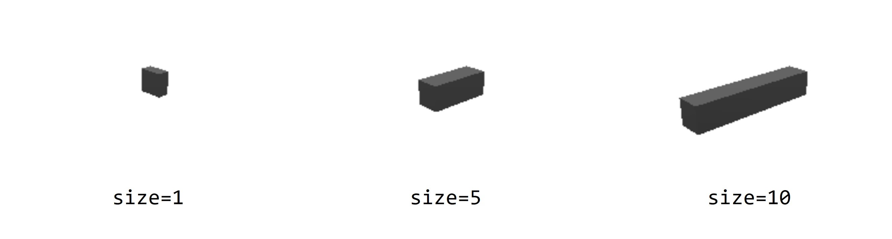

# 3D 对象
本节将介绍三维场景的对象及其控制函数。

## 添加对象
向场景中添加对象，函数形式如下

```lua:no-line-numbers
local obj = scene.addobj([类型], {key1 = value1, key2 = value2, ...})
```

## 对象可选属性列表
添加到场景中的对象通常支持设置以下属性中的某些属性
|对象属性|含义|
|:---:|----|
|`color`|对象的颜色。颜色的格式支持内置颜色、十六进制、RGB。与 [场景背景颜色](#bgcolor-场景背景颜色) 的设置相同|
|`opacity`|透明度|
|`hcolor`|选中时的颜色|
|`size`|对象的大小，默认值为1|
|`length`|对象的长度，常用于 [box(立方体)](#box)|
|`width`|对象的宽度，常用于 [box(立方体)](#box)|
|`height`|对象的高度，常用于 [box(立方体)](#box)|
|`radius`|对象圆角大小|
|`segments`|份数，通常用于设置 [sphere(球体)](#sphere) 绘制的精度|
|`selectable`|是否可被选中|
|`name`|对象名称|
|`text`|对象文本值|
|`font`|文本字体|
|`vertices`|构成对应对象的点集合|

支持添加到场景中的类型如下

## 对象类型
### 对象类型列表
- `label`：[文本标签](#label)
- `points`：[点集合](#points)
- `polyline`：[线段集合](#polyline)
- `box`：[立方体](#box)
- `sphere`：[球体](#sphere)
- `polygen`：[多边形](#polygen)
- `light`：[光源](#light)
- `mesh`：[点构成的面](#mesh)

> 为了简洁起见，下方示例的对象可选属性中只展示对应对象的关键属性。其他通用的属性可以参考 [对象属性列表](#对象可选属性) 自行添加。

### label
`label` 是文本标签。可以在 `text` 属性中设置label的文本。

```lua:no-line-numbers
local obj = scene.addobj('label', {text = "Hello World!"})
```

### points
`points` 是点集合。可以只创建单个点，也可以创建多个点。每个点都有三个维度的坐标以确定其在三维空间中的位置。点的个数通过 `vertices` 属性确定。

下面是一个创建 `points` 点集对象的示例
```lua:no-line-numbers
-- 在坐标为(5,5,5)的位置创建一个点
scene.addobj("points", {vertices = {5,5,5}, size = 5})

-- 第一个点的坐标为(0,0,0)，第二个点的坐标为(5,5,5)
scene.addobj("points", {vertices = {0,0,0, 5,5,5}, size = 5})
```

### polyline
`polyline` 是线段集合。当在vertices属性中输入多个点的坐标时，将会依次根据点坐标连线，得到线段集合。

因此，虽然下面两个例子中使用了相同的点坐标，但是由于点坐标输入顺序不同，得到的结果也不同。

```lua
scene.addobj("polyline", {vertices = {0,0,0, 4,6,7, -2,3,5}})
scene.addobj("polyline", {vertices = {0,0,0, -2,3,5, 4,6,7}})
```

::: center

polyline点顺序对比图
:::

> `polyline` 没有 `size` 属性

### box
`box` 是长方体。主要通过 `length`、`width` 和 `height` 属性修改其形状。

```lua:no-line-numbers
local obj = scene.addobj('box', {length = 3, width = 4, height = 5})
```

`box` 对象的重要可选属性
|属性|含义|
|:--:|--|
|`length`|立方体的长度|
|`width`|立方体的宽度|
|`height`|立方体的高度|

基于以上三个属性，我们可以修改默认示例代码中旋转的`box`的形状。

```lua
--添加了length, width, height三个属性（不添加默认都为1）
local obj = scene.addobj('box', {length = 3, width = 4, height = 5})

local x = 1
local y = 1
local z = 0
while scene.render() do
	x = x + 0.1
	y = y + 0.1
	obj:setrot(x, y, z)
end
```

::: center

不同长宽高设置的box
:::

### sphere
`sphere` 是球体。可以通过 `radius` 属性修改其大小，还可以通过设置 `segment` 属性设置其模型质量。具体可以参考内置示例中地球的例子。

```lua:no-line-numbers
local obj = scene.addobj('sphere', {radius=15, segments=360})
```

`sphere` 对象的可选属性
|属性|含义|
|:--:|--|
|`radius`|球体的圆角大小。可以用于控制球体的大小。|
|`segments`|球体的渲染面数。设置值越高球体的模型越精细。|

::: center

不同segment对于相同sphere的影响
:::

### polygen
`polygen` 是多边形。主要通过 `vertices`属性对其进行设置。

```lua:no-line-numbers
local obj = scene.addobj("polygon", {vertices = {-1,-1,0, -1,1,-0, 1,1,0, 1,-1,0}})
```

> 由于此处举例的多边形为正方形，因此看上去与上面介绍的`box`没什么差别。但是当形状设置为其他类型的多边形时（如三角形、五边形等），多边形的意义就能被体现出来了。

|属性|含义|说明|
|:--:|:--|:--|
|`vertices`|多边形的顶点|可以在vertices属性中依次设置每个点的三维坐标。第三维的坐标不会产生影响，但是起到占位作用。|
|`size`|体积|由于第三维的坐标不影响，且多边形的顶点确定后面积就已经确定，因此`size`属性通过控制每个点的第三维坐标值来控制体积。|

::: center

不同size对于相同polygon体积的影响
:::

### 外部模型
引用外部文件。但是目前对于MicroCityWeb来说，暂时只能引用网站中内置的文件。

例如内置示例中引用网站内部文件在视图中生成一辆厢式货车：
```lua:no-line-numbers
local obj = scene.addobj('/res/2axle.glb')
```

还可以通过引用文件的网址引用外部模型：
```lua:no-line-numbers
local obj = scene.addobj('https://huuhghhgyg.github.io/ModelResource/models/F16-lite.glb')
```

> 如果需要外部模型，可以到 [ModelResource仓库](https://github.com/huuhghhgyg/ModelResource) 中找有没有合适的模型。如果其中没有合适的模型，但是你手上又有特别想用的模型，可以按照 [ModelResource仓库提供的指引](https://github.com/huuhghhgyg/ModelResource) 进行Pull Request请求上传模型。一旦你的Pull Request被同意，Github工作流会立即将你上传的模型部署到仓库网页中供使用。

### light
设置光源的方向，可选参数 `vertices` 为一个三维向量，表示光的照射方向。由于MicroCityWeb的场景中已经设置了很强的光源，因此此处不过多做介绍。

### mesh
多个点构成的面，多见于引用的外部模型中。由于应用较少此处不做介绍。

## 对象控制函数
下面假定要操作的三维对象为 `obj`

### getpos()
获取 `obj` 对象的位置坐标 (x, y, z)
```lua:no-line-numbers
local x, y, z = obj:getpos()
```

### setpos()
设置 `obj` 对象的位置坐标为 (x, y, z)
```lua:no-line-numbers
obj:setpos(x, y, z)
```

### getrot()
获取 `obj` 对象在 x, y, z 方向上的旋转弧度值 (rx, ry, rz)
```lua:no-line-numbers
local rx, ry, rz = obj:getrot()
```

### setrot()
设置 `obj` 对象在 x, y, z 方向上的旋转弧度值为 (rx, ry, rz)
```lua:no-line-numbers
obj:setrot(rx, ry, rz)
```

### getscale()
获取 `obj` 对象在 x, y, z 方向上的缩放比例 sx, sy, sz
```lua:no-line-numbers
local rx, ry, rz = obj:getrot()
```

### setscale()
设置 `obj` 对象在 x, y, z 方向上的缩放比例 sx, sy, sz
```lua:no-line-numbers
local rx, ry, rz = obj:getrot()
```

### getchildren()
获取 `obj` 对象的子对象表
```lua:no-line-numbers
local children = obj:getchildren()
```

### getchildren()
设置 `obj` 对象的子对象表
```lua:no-line-numbers
obj:setchildren(children_table)
```

### getparent()
获取 `obj` 对象的父对象
```lua:no-line-numbers
local num = obj:getparent()
```
> 此处只返回一个数值

### setparent()
设置 `obj` 对象的父对象为 `obj0`
```lua:no-line-numbers
obj:setparent(obj0)
```