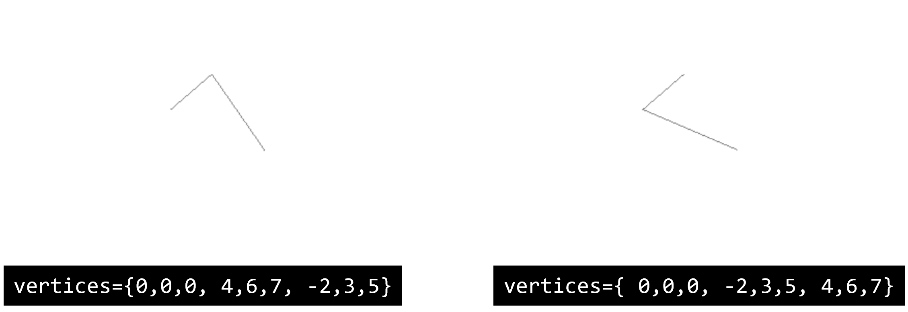
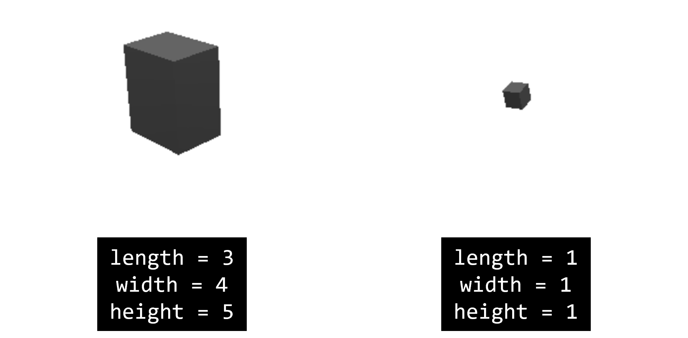
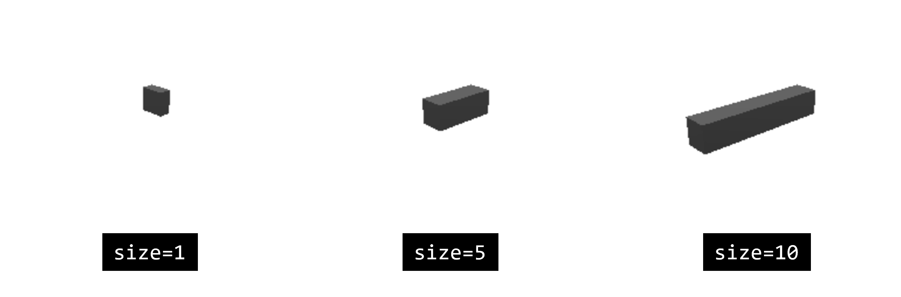

# 3D 场景
本节将介绍设置场景以及对实体对象的控制函数。

## 设置场景
设置场景需要用到`setenv`函数，具体用法如下

```lua
local s = scene.setenv({grid="plane|sphere|none", bgcolor="rgb(255, 255, 255)", rotspeed=1, transpeed=1, camtype="ortho|persp", clear=true})
```

可以简单地表示为如下形式

```lua
local s = scene.setenv({[可选参数1] = [值1], [可选参数2] = [值2], ...})
```

其中变量`s`存放返回的环境对象。下面将详细介绍函数的可选参数。

### 可选参数列表

#### `grid`：场景的背景网格
可选值
* `"none"`（默认值）：无网格
* `"plane"`：平地网格
* `"sphere"`：球形网格

#### `bgcolor`：场景背景颜色
可选值类型
* 内置颜色。如`"black"`, `"white"`, `"gray"` 等
* 十六进制颜色。如`"#ffffff"`, `"#fff"`, `"#000000"`, `"#000"`等
* RGB表示的颜色。如`"rgb(255, 255, 255)"`, `"rgb(0, 0, 0)"` 等

实例

```lua
scene.setenv({bgcolor='gray'}) --设置背景颜色为内置的gray
scene.setenv({bgcolor='#eee'}) --设置背景颜色为#eee
scene.setenv({bgcolor='rgb(255, 255, 255)'}) --设置背景颜色为白色
```

#### `camtype`：摄像机视角
可选值
* `"ortho"`：正视。相当于向x和y构成的平面投影，用户视角在二维空间中。
* `"persp"`：透视（默认值）。用户视角在三维空间中。

#### `clear`：是否清除场景
可选值
* `true`：清除场景

> `setenv`函数默认不清除原来的场景，除非手动设置参数`clear`的值为`true`

#### `rotspeed` & `transpeed`
* `rotspeed`：设置鼠标的旋转三维对象的速度
* `transpeed`：设置鼠标平移三位对象的速度

这两个参数通常不需要特别设置，使用默认值即可。

## 添加对象
向场景中添加对象，函数形式如下

```lua
local obj = scene.addobj([类型], {key1 = value1, key2 = value2, ...})
```

添加到场景中的对象通常支持设置以下属性
* `color`：对象的颜色。颜色的格式支持内置颜色、十六进制、RGB。与[场景背景颜色](#bgcolor-场景背景颜色)的设置相同。
* `size`：对象的大小，默认值为1。

支持添加到场景中的类型如下

### 可选类型
#### label
文本标签。可以在`text`属性中设置label的文本。

#### points
点集合。可以只创建单个点，也可以创建多个点。每个点都有三个维度的坐标以确定其在三维空间中的位置。点的个数通过`vertices`属性确定。

创建具有两个点的`points`示例
```lua
scene.addobj("points", {vertices={0,0,0, 5,5,5}, size=5})
```
其中，第一个点的坐标为(0,0,0)，第二个点的坐标为(5,5,5)。

#### polyline
线段集合。当在vertices属性中输入多个点的坐标时，将会依次根据点坐标连线，得到线段集合。

因此，虽然下面两个例子中使用了相同的点坐标，但是由于点坐标输入顺序不同，得到的结果也不同。

```lua
scene.addobj("polyline", {vertices={0,0,0, 4,6,7, -2,3,5}})
scene.addobj("polyline", {vertices={0,0,0, -2,3,5, 4,6,7}})
```



> `polyline`没有`size`属性

#### box
属性：
* `length`：立方体的长度
* `width`：立方体的宽度
* `height`：立方体的高度

基于以上三个属性，我们可以修改默认示例代码中旋转的`box`的形状。修改后如下

```lua
--添加了length, width, height三个属性
local obj = scene.addobj('box', {length = 3, width = 4, height = 5})

local x = 1
local y = 1
local z = 0
while scene.render() do
	x = x + 0.1
	y = y + 0.1
	obj:setrot(x, y, z)
end
```



#### sphere
球体

#### polygen
多边形

属性：

* `vertices`：多边形的顶点。可以在vertices属性中依次设置每个点的三维坐标。第三维的坐标不会产生影响，但是起到占位作用。

示例
```lua
scene.addobj("polygon", {vertices={-1,-1,0, -1,1,-0, 1,1,0, 1,-1,0}})
```

* `size`：由于第三维的坐标不影响，且多边形的顶点确定后面积就已经确定，因此`size`属性通过控制每个点的第三维坐标值来控制体积。

#### [文件路径]
引用外部文件。但是目前对于MicroCityWeb来说，暂时只能引用网站中内置的文件。例如内置示例中引用网站内部文件在视图中生成一辆厢式货车：
```lua
local obj = scene.addobj('/res/2axle.glb')
```

#### mesh

?

#### light 光源

?
