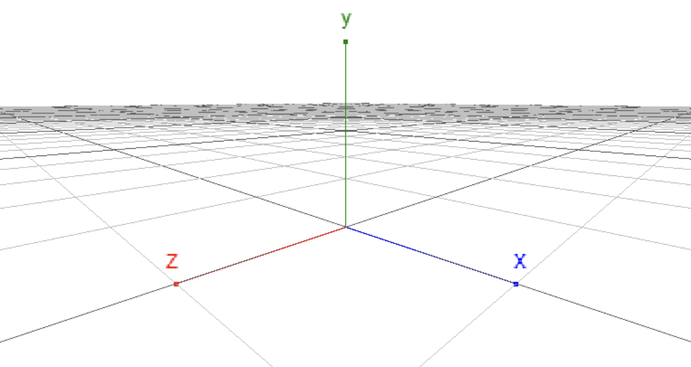

# 3D 场景
本节将介绍三维场景及其设置。

## MicroCityWeb三维场景坐标系
MicroCityWeb中的三维场景坐标系符合右手坐标系，各个坐标轴的正方向具体见下图。

::: center

MicroCityWeb中的坐标系
:::

## 设置场景
设置场景需要用到 `setenv` 函数，具体用法如下

```lua:no-line-numbers
local s = scene.setenv({grid="plane|sphere|none", bgcolor="rgb(255, 255, 255)", rotspeed=1, transpeed=1, camtype="ortho|persp", clear=true})
```

可以简单地表示为如下形式

```lua:no-line-numbers
local s = scene.setenv({key1 = value1, key2 = value2, ...})
```

其中变量 `s` 存放返回的环境对象。下面将详细介绍函数的[可选参数](#场景可选参数)。


## 场景可选参数
### 参数列表
- `grid`：[场景的背景网格](#grid-场景的背景网格)
- `bgcolor`：[场景背景颜色](#bgcolor-场景背景颜色)
- `camtype`：[摄像机视角](#camtype-摄像机视角)
- `clear`：[是否清除场景](#clear-是否清除场景)
- `rotspeed` & `transpeed`*：[鼠标操作速度调整](#rotspeed-transpeed)

### `grid`：场景的背景网格
可选值
|值|含义|
|:-:|---|
|`"none"`|默认值，无网格|
|`"plane"`|平地网格|
|`"sphere"`|球形网格|

### `bgcolor`：场景背景颜色
可选值类型
|值类型|示例|
|:-:|---|
|内置颜色|`"black"`, `"white"`, `"gray"` 等|
|十六进制颜色|`"#ffffff"`, `"#fff"`, `"#000000"`, `"#000"`等|
|RGB表示的颜色|`"rgb(255, 255, 255)"`, `"rgb(0, 0, 0)"` 等|

实例

```lua
scene.setenv({bgcolor='gray'}) --设置背景颜色为内置的gray
scene.setenv({bgcolor='#eee'}) --设置背景颜色为#eee
scene.setenv({bgcolor='rgb(255, 255, 255)'}) --设置背景颜色为白色
```

### `camtype`：摄像机视角
可选值
|值|含义|
|:-:|---|
|`"ortho"`|正视。相当于向x和y构成的平面投影，用户视角在二维空间中。|
|`"persp"`|透视（默认值）。用户视角在三维空间中。|

### `clear`：是否清除场景
值设置为 `true` 时，清除场景

> `setenv` 函数默认不清除原来的场景，除非手动设置参数 `clear` 的值为 `true`

### `rotspeed` & `transpeed`
|值|含义|
|:-:|---|
|`rotspeed`|设置鼠标的旋转三维对象的速度|
|`transpeed`|设置鼠标平移三位对象的速度|

这两个参数通常不需要特别设置，使用默认值即可。

## 其他
### 有关高频率设置场景
2023/03/21：目前发现过高频次设置场景会导致内存占用过高，进而导致浏览器崩溃的问题。因此建议尽量不要循环调用 `scene.setenv()` 函数。

如果必须这么做，请确保调用频率相对较低，这样允许浏览器有一定的时间进行GC（垃圾清理），否则可能导致浏览器崩溃。