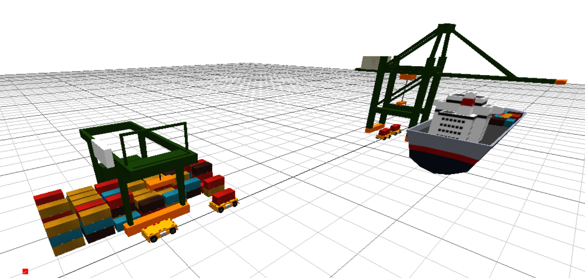
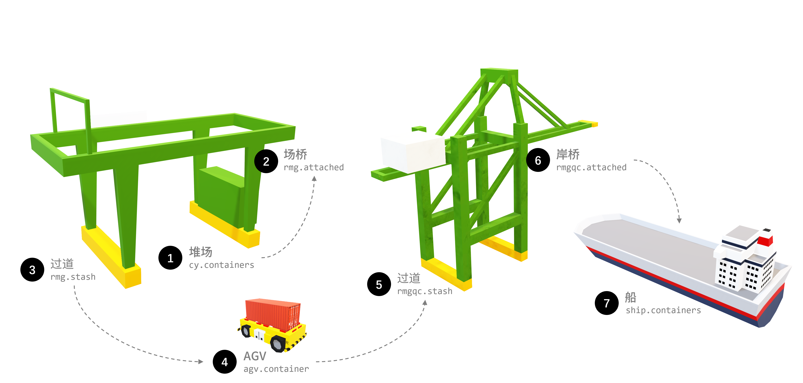
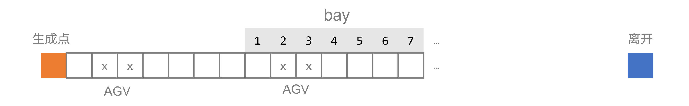

# 港口AGV服务流程三维仿真思路

> 本文思路仅供参考。

集装箱码头的流程仿真是一个比较复杂的仿真，需要考虑的因素、涉及到的对象比较多。本文主要介绍如何使用MicroCityWeb实现AGV从接收场桥服务到接受岸桥服务流程的思路。

## 实现场桥对集装箱的抓取

### 总体思路
实现场桥对集装箱的抓取是实现堆场仿真的第一步。这个部分我打算使用面向对象的方法实现，即将场桥和堆场抽象为对象。

#### 总体结构
具体的想法是将**堆场对象作为数据模型(DataModel)**，主要存放各种数据，如存放集装箱实体、对应位置(行、列、高度)的集装箱坐标等数据；**将场桥对象作为操作器(Operator)**，主要实现场桥的三维动画、实现对堆场对象中数据的管理。

这样做的好处是可以将场桥和堆场解耦合，方便后续的扩展。此外，如果对象属性考虑得比较周全，可以方便地在同一个场景中创建多个对象，实现多个场桥对堆场的操作。

#### 事件和任务
我打算为整体流程中涉及到需要移动的主要实体对象创建**任务序列**。这样可以做到在同一个场景中实现多个场桥的并行操作，各个场桥执行各自的任务，互不干扰。此外，还需要一个总控制程序控制每个时间节点的任务执行情况，并控制场桥的三维动画。

#### 业务流程
在这部分的仿真中主要业务流程聚焦于集装箱的移动。因此，最重要的就是集装箱所有权的流转。集装箱的所有权流转流程如下图所示：

::: center

集装箱对象流转过程
:::

### 对象结构
以下是这个仿真中主要涉及到的对象的结构

::: center

:::

### 实现方法
#### 堆场规模
对于堆场对象，由于它的功能主要是存放集装箱对象及其相关数据（比如对应位置的坐标），那么就还会出现一个问题，堆场的规模有多大？因此确定堆场的规模是一个必要的步骤。在创建堆场对象时需要确定所创建的堆场的规模，即行数、列数、高度。这样可以在创建堆场对象时就确定堆场的规模，方便后续的操作。

我的做法是首先确定堆场对象的**占地大小**和**集装箱层数**，然后由相关数据去计算最多能摆放几行几列的集装箱。

* **堆场占地大小方面**，通过在创建对象时输入两点坐标来确定，根据两点连成的对角线构成一个矩形，从而确定堆场的占地面积。
* **集装箱层数方面**，通过在创建对象时输入一个数字来确定。根据这两个输入就就可以确定堆场的规模。

#### 事件和任务
由于在这个仿真中需要移动的对象主要是场桥，因此每次循环执行任务的时候只需要操作场桥即可。

因此，我打算将场桥的任务序列作为一个**队列**，每次循环执行任务的时候，从对象的任务序列中取出第一个任务执行，执行完毕后判断是否满足任务执行完毕的条件，如果满足则删除这个任务，执行下一个任务。这样可以保证每次循环执行任务的时候，场桥对象能够按照次序执行任务。

执行任务的方法为 `executeTask(dt)` ，对象根据推进时间的长短 `dt` 执行任务。在 `executeTask(dt)` 中存放了处理任务的逻辑，包括判断任务类型、执行任务、删除任务等。

如果场景中存在多个场桥，只需要将这些对象添加到执行任务对象的列表中即可。主控程序每次循环执行任务时，会遍历这个对象列表，依次执行每个对象的任务。

::: tip
注意此处任务执行虽然在时间点上看是同时执行的，但是其实和对象所处的序列位置有关。

一个例子就是：假设两个对象同时需要抢占位置A，那么按照任务序列的顺序，先执行的对象会抢占到位置A，后执行的对象会抢占失败，尽管它们在同一时刻都在抢占位置A。因此，此处不是严格的同时执行，而是同一时刻按照任务序列的顺序执行。
:::

#### 业务流程

1. 场桥首先从堆场中获取对应位置(行、列、高度)集装箱的坐标，并将吊具移动到堆场指定集装箱位置，抓取集装箱。集装箱所有权从堆场（`cy.containers`）转移到场桥吊具（`rmg.attached`）（通过解除表引用实现，将值设为 `nil`）。
2. 场桥将集装箱移动到过道并放下集装箱。以同样的方式将集装箱所有权从场桥吊具（`rmg.attached`）移动到过道（`rmg.stash`），表明集装箱可以被提取。
3. 如果有车辆将集装箱接走，则可以进一步将集装箱所有权从场桥过道（`rmg.stash`）移动到车辆上。

### 运行结果

## 实现AGV到达至服务的全流程
### 问题描述

使用事件调度法实现以上流程的三维化形式

### What's New

上一个仿真的实现是实现这个仿真的基础。相比于上一个仿真，这个仿真最为显著的改进体现在：

* 使用**面向对象**编程模式，创建场桥、堆场（数据模型）、AGV、岸桥、船（数据模型）共4个类型的对象，并实现对象本体和其各部件的移动方法。
> 如果不了解面向对象编程，可以参考[通用知识-面向对象编程](./oop.md)
* 延续**面向事件的仿真**的思路，实现了总控制流程，实现同一时刻对多个对象同时进行控制（主要通过对象的 `executeTask(dt)` 和 `maxStep()` 及相关函数实现）。在面向对象的编程模式中，可以将 `executeTask(dt)` 和 `maxStep()` 视为接口，主程序通过实现这两个接口，实现对对象的控制。（尽管lua中似乎没有这部分的概念）
* **使用任务序列实现各个对象的流程**，实现场桥和AGV之间、AGV和岸桥之间的相互等待，实现不同对象之间的任务协同。
* 尝试**将流程从堆场至AGV延伸至岸桥、船**，实现两级排队等待。

### 对象设计
由于属性和函数实在太多，因此使用思维导图的形式展示对象的设计。

::: tip
此处占用篇幅较大，您也可以直接跳转到下一部分[总体布局](#总体布局)
:::

#### 堆场
堆场仍然作为数据模型。

#### 场桥

#### AGV

#### 岸桥
岸桥的代码和涉及结构主要衍生自堆场，因此后面不详细叙述。

#### 船
船对象的主要作用也是作为数据模型，设计思路同堆场。
::: center

:::

### 总体布局

### 总体流程
::: center

集装箱流转流程
:::

相比于之前的仿真，这个仿真在流程上更进了一步，添加了AGV到达、排队的流程，还添加了岸桥服务、集装箱装船的流程。

#### 流程分析
AGV出现后，场桥、岸桥和AGV之间的流程也变得更加复杂。首先，AGV的到达是随机的，因此可能造成排队现象。其次，AGV的到达会触发场桥和AGV的流程，而场桥和AGV的流程又会触发岸桥的流程。因此，这个仿真的流程是一个多级流程，需要考虑多个对象之间的流程协同。

特别是AGV和场桥之间的流程，其中存在AGV和场桥的相互等待。AGV到达的时候需要通知场桥提取货物。在场桥提取的过程中:

* 场桥需要等待AGV到达指定位置后，才能将货物移动到AGV上
* AGV需要等待场桥的抓取并将集装箱放在AGV上以后，才能将集装箱的所有权从场桥转移到AGV上

因此，AGV和场桥之间的流程是一个相互等待的流程。具体流程可以参考下图。

::: center

:::

而岸桥的流程和场桥的流程类似，也是一个相互等待的流程。主要体现在：

* 当AGV到达指定位置时，岸桥可能在服务别的AGV，此时AGV要进行等待
* 当AGV刚进入岸桥的服务区域时，通知岸桥到达指定位置，如果岸桥先到达指定位置，则此时岸桥要进行等待

### 实现方法
#### 排队流程的实现
AGV排队的情况我选择使用元胞自动机作为停车位的数据模型。其中，停车位的长度为：

$$
\text{停车位长度}=\text{对应数据模型中1个集装箱的长度}+\text{集装箱间隔长度}
$$

由于AGV的长度比1个集装箱略长，因此需要占用2个停车位的长度。每次执行任务时，AGV会判断前方空间是否被阻塞，如果没被阻塞则向前移动。如果前方位置为目标bay，则前进后等待场桥作业，获取集装箱后继续以元胞为单位向前移动直到离开。场桥部分排队和岸桥部分排队原理也相同。

::: center

AGV元胞自动机排队模型示意图
:::

#### 事件调度法的实现
在之前的仿真中，我使用了非固定步长的时间推进法来实现仿真。在这个仿真中，我使用了事件调度法来实现仿真。相比于时间推进法，事件调度法的特点是可以准确地将事件推进到发生的时刻，从而执行对应事件。

你可能注意到了[对象设计](#对象设计)部分我将 `executeTask()` 和 `maxstep()` 标记为(interface)，这是由于为了计算准确的推进时间，我需要在每个对象中实现 `executeTask()` 和 `maxstep()` 方法。其中，`executeTask()` 方法用于执行任务，`maxstep()` 方法用于计算距离到达下一个事件的发生时间（当前任务还剩多久能执行完），然后得到最大能够推进的时间，再去跟系统运行得到的间隔时间`dt`进行比较得到最大的推进时间。

我认为课件中的下面这张图能够很好地表示如何使用事件调度法来进行仿真并刷新场景。其中，第一行指的是仿真的业务流程，第二行Refresh部分指的是刷新场景。

### 运行结果

::: warning
由于以下部分内容均为动图且图片体积较大。由于本站托管于GitHubPage，因此如果您没有的特殊网络环境可能会造成动图加载缓慢甚至加载失败。
:::

::: tip
如果您直接观看动图的时候动图区域出现了摩尔纹，可以尝试将动图点开放大看，再看看是否有改善。
:::

场桥运行过程

岸桥运行过程

总体运行过程

