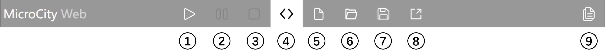

# Discrete Event Simulation and Program Control

## Coroutines

MicroCityWeb provides several coroutine-related functions that facilitate the implementation of event scheduling.

### coroutine.queue

Adds a function or coroutine to the coroutine queue for execution after a specified relative time.

```lua:no-line-numbers
coroutine.queue(rt, f|co [, argument list...])
```

Parameters

| Parameter | Description |
| --- | --- |
| `rt` | Relative time from the current queue. It should be greater than or equal to 0. In other words, it specifies the time after which the input function or coroutine will be executed. |
| `f/co` | Function or coroutine. If it's a function, you only need to input the function name. |

### coroutine.qtime

Retrieves the current time of the queue.

```lua:no-line-numbers
local time = coroutine.qtime()
```

### Example

Here are two examples provided:

*   [Adding Coroutines to the Queue](#adding-coroutines-to-the-queue): Demonstrates how to add coroutines to the queue and display the current queue time within the function.
*   [Vehicle Movement](#vehicle-movement): Shows how to use coroutines to refresh the scene based on real-world time.

#### Adding Coroutines to the Queue

This example demonstrates how to add coroutines to the queue and display the current queue time within the function.

```lua
function Show()
    print("Current time:", coroutine.qtime())
end

function ShowShort()
    print("Current time (short):", coroutine.qtime())
end

coroutine.queue(10, Show)
coroutine.queue(20, Show)
coroutine.queue(15, ShowShort)
coroutine.queue(5, Show)

-- Result:
-- Current time: 5.0
-- Current time: 10.0
-- Current time (short): 15.0
-- Current time: 20.0
```

#### Vehicle Movement

This example demonstrates how to use coroutines to refresh the scene based on real-world time.

```lua
scene.setenv({grid='plane'}) -- Set the scene background grid

-- Vehicle
local car = scene.addobj('/res/2axle.glb')
car.speed = 1 -- Car speed

-- Initial time
local t = os.clock()
local dt = 0

-- Refresh time state t and dt (based on CPU intervals to synchronize with real-world time)
function refreshtime()
    dt = os.clock() - t
    t = os.clock()
end

-- Coroutine updates the scene
function update()
    if not scene.render() then return end -- Render the scene and check if the program is terminated
    coroutine.queue(dt, update) -- Add the next update based on CPU step time
    carmove() -- Move the vehicle
    refreshtime() -- Calculate the current dt
end

-- Vehicle movement
function carmove()
    print("Car moves at", t)
    local x, y, z = car:getpos()
    car:setpos(x, y, z + dt * car.speed)
end

-- Initial update (add the first update)
-- Since subsequent updates are added within the function, the updates will loop automatically
coroutine.queue(dt, update)
```

## Random Numbers

### Creating a Random Seed

```lua:no-line-numbers
local seed = math.randomseed(x [, dist])
```

Parameters

| Parameter | Description |
| --- | --- |
| `x` | Random seed. Different input values will produce different random numbers. To get different values each time, consider setting the random seed `x` to the current time. |
| `dist` | Random distribution (optional). If not set, the default is a uniform distribution. If this parameter is set, you can also specify `mu` and `sigma` as parameters for the corresponding distribution. |

The `dist` parameter can be set to one of three distributions:

*   `'normal'`: Normal distribution
*   `'exponential'`: Exponential distribution
*   `'poisson'`: Poisson distribution

In addition, you can set parameters for these distributions, where the `mu` key represents the mean and the `sigma` key represents the standard deviation.

### Example

```lua
-- Create a random seed with a Poisson distribution
local seed = math.randomseed(os.time(), {distribution = "poisson", mu = "3"}) -- Poisson distribution with a mean of 3

-- Output a random number
print(seed:random())
```

## Program Control

Program control, in this context, mainly refers to controlling the execution of a program using the buttons in the user interface, including pause, resume, and stop.

<center>



Command Bar

</center>

> This mainly refers to the first three buttons in the command bar.

In MicroCityWeb, program control refers to the pause, resume, and stop of the 3D interface rendering implemented through the `scene` object. The specific function is as follows:

```lua:no-line-numbers
local state = scene.render()
```

Here, the return value of `scene.render()` is stored in the `state` variable. The `state` variable can be either `true` or `false`, representing the running or terminated state of the program (button 3 in the command bar).

Pausing the rendering of 3D objects is also achieved by calling `scene.render()`. If the refresh of 3D objects is implemented by continuously calling the `scene.render()` function and the refresh interval is not controlled by `os.sleep()`, it is possible to pause the rendering of the 3D interface at a certain state. This is because if `os.sleep()` is used to control the speed of 3D object movement and the pause button is clicked while the program is in the `os.sleep()` process, the program may not respond immediately, resulting in the pause button becoming ineffective. Therefore, it is recommended not to use `os.sleep()` for controlling the speed of 3D object movement, but to use other parameters to control the duration of advancement in order to control the speed of 3D object movement.