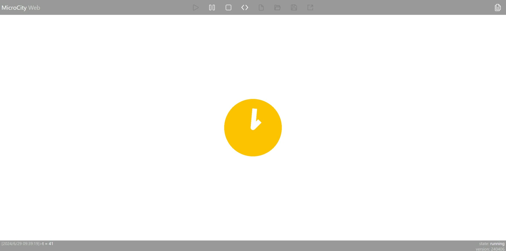
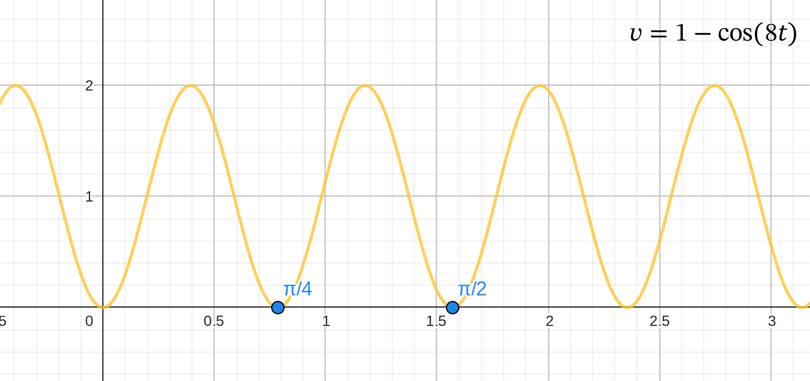
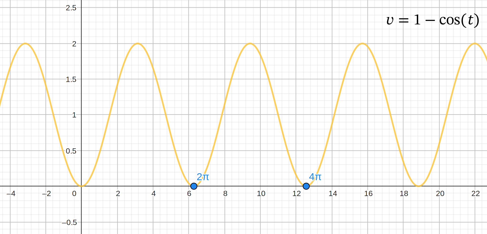

# 绘制一个时钟



## 目标

本文的目标是制作一个时钟，每秒钟时针和分针都会进行非线性运动，并且能够持续循环，这也可以算是一种仿真。

具体的运动如下：

- 时针每 1 秒为周期旋转 45°，并且每个周期内的速度非线性，先快后慢；
- 分针每 1 秒为周期旋转 360°，同样以非线性速度运动。

## 绘制时钟

### 时针和分针

如何画指针

以绘制时针为例，我们可以通过绘制一个长方形来实现。首先，将时针长方形的长度设置为参数 `len_hour`；由于时针和分针的宽度相同，都设置为参数 `radius`。通过添加一个 polygon 对象，我们可以绘制一个长方形。

```lua
local hand_minute = scene.addobj("polygon", {
    vertices = {-radius, 0, 0, -radius, len_minute, 0, radius, len_minute, 0, radius, 0, 0},
    size = 0,
    color = 'white'
})
```

分针同理，只需将 `len_hour` 替换为 `len_minute` 即可。

```lua
local hand_hour = scene.addobj("polygon", {
    vertices = {-radius, 0, 0, -radius, len_hour, 0, radius, len_hour, 0, radius, 0, 0},
    size = 0,
    color = 'white'
})
```

### 背景板和转轴

时钟的背景板和时针的转轴都是圆形，而 MicroCity 中没有提供绘制圆形的函数。但是我们可以通过绘制多边形来模拟圆形。

```lua
-- circle
function get_circle_vertices(radius)
    local vertices_circle = {}
    local segment = 360
    local radius_step = math.pi * 2 / segment
    print()
    for i = 1, segment do
        local k = 3 * (i - 1)
        vertices_circle[k + 1], vertices_circle[k + 2], vertices_circle[k + 3] = radius * math.cos(i * radius_step),
            radius * math.sin(i * radius_step), 0
    end

    return vertices_circle
end
```

这个函数的思路是，将圆分成指定的份数（通过参数 `segment` 设置），然后通过三角函数计算出每个点的坐标。这样就可以得到一个近似圆形的多边形。

然后我们可以通过这个函数绘制背景板和转轴，转轴已经通过 `radius` 参数控制其半径大小；背景板通过 `radius_bg` 参数控制大小。

```lua
-- draw background circle
local bg_circle = scene.addobj("polygon", {
    vertices = get_circle_vertices(radius_bg),
    size = 0,
    color = '#fec300'
})
bg_circle:setpos(0, 0, -1)

-- draw pointer core circle
local core_circle = scene.addobj("polygon", {
    vertices = get_circle_vertices(radius),
    size = 0,
    color = 'white'
})
```

## 让指针运动

### 运动函数

我们首先确定时针的运动函数。为了实现时针的非线性运动，我们可以使用三角函数。通过适当的函数变换，我们可以使得时针在每个周期的开始和结束时速度为 0，而在周期中间时速度逐渐加快然后再减慢。

这个函数的基本表达式为：

$$
v=1-cos(8t)
$$



而分针每个周期的运动速度正好是时针的 8 倍，因此分针的运动函数只需在时针运动函数的基础上修改三角函数的参数即可。

$$
v=1-cos(t)
$$



### 函数转换

如果 x 表示为时针真实走过的弧度，将上面的运动函数积分可以得到时针 x-t 关系的函数：

$$
x=\int v dt = \int (1-cos8t) dt = t - \frac{1}{8}sin8t
$$

同理，分针的运动函数为：

$$
x=t-sin(t)
$$

### 设置运动

在 MicroCity 中，通过 `setrot()` 函数设置时针的旋转角度。由于旋转方向是顺时针，而正方向为逆时针，因此需要对角度进行取反。

得到时针和分针的弧度位置代码如下：

```lua
function x_hour(x)
    return -(x - math.sin(x * 8) / 8)
end

function x_minute(x)
    return -(x - math.sin(x))
end
```

根据上图可知，时针和分针的周期分别为 $\pi/4$ 和 $2\pi$。为了与我们构建的目标相对应，我们需要将时间周期（1s）分别缩放为 $\pi/4$ 和 $2\pi$，实现与目标周期相对应。

可以在具体调用时进行调整（方便适应未来修改为不同的周期）：

```lua
local speed = math.pi * 2

-- set rotation
hand_hour:setrot(0, 0, x_hour(t / 8 * speed))
hand_minute:setrot(0, 0, x_minute(t * speed))
```

## 与现实时间对应

现在时针和分针已经可以按照给定的输入实现非线性的速度运动了，但是这个运动并没有与现实时间对应起来。

我们可以通过 `os.clock()` 函数获取当前的时间，并通过记录这个值计算出每次调用这个函数的时间差，以此令仿真时间 `t` 与真实世界时间相对应。

因此，循环部分可以这样写：

```lua
local t = 0
local last_time = os.clock()
while scene.render() do
    -- align with real world time
    t = t + (os.clock() - last_time)
    last_time = os.clock()

    -- set rotation
    hand_hour:setrot(0, 0, x_hour(t / 8 * speed))
    hand_minute:setrot(0, 0, x_minute(t * speed))

    print()
    print('t =', math.floor(t))
end
```

如果想要检验时针与分针是否真的在1秒时完成一次周期，可以在循环最后通过如下代码检验：

```lua
-- 检验1圈为2*pi
if t>=1 then
    break
end
```

## 效果和代码

### 效果

最终实现的仿真效果如下：

<iframe src="https://mcw.zhhuu.top/#/H4sIAAAAAAAACu1aW3PTSBbm2VX8hy7mwVKQjZ1AoKj1VO3DPO8PSKVSstV2NLYlj9SGhJQpw8ISBg9Q3DKQMCEDDDPsjpOaZcGVC/yYtWT7ib+w2xdJrYvtBAjUVOkUVKS+nD6X75w+3XJBV+CRQ6ZMJpOZnj6J/2ZPn8rwfzFNnZw6fSR7cnpq6lR2ejqbPZKdPJXN4HmHLRimuolk40gmg2QjL1cq35pDxo3r/5OSWYAaTJsQQe2csJQAAICCXEWLNQhyIKkbaF5PJhpiIpFKAQUWVU1Fqq6ZiYpekCvAkBW1boIcyLKGCtTmqqpWR3j6Ga5xXq8bIAdO+ibO5Ut47iThbs7LNegwnpc1xWNEhZQVRc9/Kxyr6ZXFkq4dkwCV9xw0kFqAWIylFGUsgQz55756cpH2Mc14ckMizE31ApYgQ98KekXHaiTPz6sIEsNw8jIdP420mFlI1lDjQSTFRi6oRqECE8W6VsB+BCWI5mjbnCOYQHmLhA3VzuliQ7HoDa7bhKUq1BDIganpDNfOnGwiWAM5UJXRfLqmggkwCU44c8jomqFqSKALFnUDqBgUkstW0UmPx7eMVwITQFBBCmRFtzcg5kwZHAfZWSmyfXJI+9QsyDmwnqAyF3RTwGJz6oiSuygm/3hT1cLjATUM1JQEeTAgqhtaUIQE6cehZsjnQV4ulEuGXtcUx29U/3zJc8S+wTbc03P5kjgSQl8VYWEqkyEgctc+a0JU002BQTcrenLXdFVD0AAF3YB+yXHLJ5V9tOAc9l3EL5AgEhZE3g0pYQGkPO8tgAlwRgQnwBmReoSbTdPFmPkim0e1xpGRYc9mDULFHw1OlpRNNIfUKlZEN9OFil4oC2Li/LxagcxUBtQUaAiiExKpFJArakkD51U0DwwoV8B53agoALMhI/DSCBwHgscRpLylWJBHr+wsYUIEDB3J2ACkzU12GAOGjhgGmGURthuYoJqKojeDWi44h9kTcTNCSYE+JxHIJSVquWJF1w0BiZ6U9tPm4GUra60tdzvbkxM11elQiwB9ncsCNA81pw1T3oBy2WnA3iIe8xs68aW350OnmmweekUzpv7DFKz/Jqfi+u+zkFyCGkpX6vIhrjHa/9nTk5lTfv9PnTw1Gfv/s5C7s/0VA0EQj3L1G8EGLvaOutWOs30tZSVcomUbktdX1RVYATmgqRWutaaTUjfj1Ko425K1uns/9Pba73db1q2X9tp1fLKwV1/ZD7be77Z6qx1r7253+6a9eavbednd2bG+3+g9uvI3Qy2pmsccyWYZ+w+FliU9pFANNsLv6lArwGCfiWRy1kiqSgUmaXvjaII+0ChxTkXkLcn3qNgm9JFa4SKRB8iawjfjcbqBe3xs1Sr8xjBIyZLNwNQZbCLr6qV+u9N7dKXf3ui1V+yV14OVV/3NTetNu9/6u7X6iueAN3BqZ/qOnzGP5cfWixtW6wG1H32lZncUw6NurvfurVvX9uz7W7TRxQTh5hR6CxJYlMAF0TMZp1n0IKgpzkIBngqsQASFIcz8vRyX/1eYDAurHevqv0cILSsK9ragyVUogZpsyFVT5JGQr8C0qpnQQAJzAwcOCSzxExvcTGyxXy7bP63ZP272ftserPzR+/613byEUfvPG9byjn39RX+j5U1Qi0w3irCLOZA06pqmaqUkqUm8kZ4ZXDA6I6MG8eAv6IZeR6oG099hOOEqLwX67S1r7z5z/m7TenGDwsjPjBVXM0mQTvNAd99UBT8nZwFZDCpARkkpvKLoZ8v112Ed4nqPsoMLsEAO3OSVm0X8PBY2xKt+f4zQAOkmMlStJDiqiEwXa/nJ4OEzapukBMIQmMnOzuDDYxJr61suoF1Ie4otA1b1czASW1nRUc8HKCrM4Md1a3ml29nu/bb9frfVf7dqXX3OA82HrK/C/EEuBzLjkcWlueGwcjPVh4BFr9X2CxZ6jApAwWciahz75q/9d6sf7XzK7Ox4v48UfB9R6A0+WDj4Ux7dFlkc32l1t290d15HxgdjFogPa/mZ/eB3Hl6D+++s7V8+FEljvMUOvbJZ5nMoPoiSwKhrNblQjgiMmexsQO5bl+37W4OXrf7mpYh8SubOOOvMYmnxnhuWl0JEgfl6KY0MuQDxxcq+QDy497C/ufl+t2X/sWGvXbevv7WWmSOS6bSzdBDNupmGCyoSgrltmA4UPYcofXgLoPkluV/J/a5Vhuw4IZ3IHoTLl+7Ou97aOl3aetMOxLb9tGmvP+eLFKv1wGcsB0JDbeRAbKkxRHK1CDQdsYFpXGwOTZH7jOhRWKQLXBwmbmCtwDwhVK2EtAnnR1p1WMtv7Adb/21e5neU3s5d+/E6LrS5PW98PDmZabgaI6cJCoqouyIEf9q0/8NQGUzvrufTCuJLagWBFNfzdaiQxrJ6Gystmxn6nr3obt+k1TXFJu2NirkRwcVyANllmOakndfD2r1sdTpARoCMG7cHso2MpemfceHvqojvvdwXCSSt9k+Dh1f7b+9aV5/TXtLsBpi1e5k28naKXC+YVw6SEfy7VP/d7f5Gy1553W+/7e21ibl6j66ckyt1aDV33XFerJbhYk4CZECu4TsRYUjhj1Kkz38CJZGVcze+6GBxNw+aWkJBy2xShovDc8pwGx0o9zpasAKG20fKcJEKGUrDQwwfEUB+fZi5vphG1NefQiey9oznJvxVhlcy5O4DFKZMfC+kynBRAkkuxkj/qBIwavdJM2Qiow5JYntyDR/A2i17+XbErgYOUBRidjSLswi/92zwjztskC8wuZOKk765WBEjjOydqWjUvKQ7SbfTtP+1Qa5iXtk3n9OtIyIHNCIzAHnodpr47mb3CT7APLrCH9Z9aaCYk2SjZOaWGhFJoKgdQvhjZLCZ6aJIjuQOw6gzOTjQwceNk6Lm3lsVNVbLkr6zHtKKWkSY7C8zg4MmCV5rbHCqOCnKR2v9UdnCsQKfJ/DqH5gm+IZxUfhlgy2y/uEELQq+8xDvmEOOUy/0UAP0XtwJR50CK/LiyMADHx15+LiHEXhMq1fz0Dj26QKPSO/GHpWn2/mh29m2729Zv68kJU+CzxN947Dp1bLONjeTnR0NX64cHH+vNhKpYDhU1SI57OU4AUecZgIQjTxtgMijDBiKUHahLIF0Oh2xPeA7tskP2CEYqshYymNf91T0/FtbkEBtUQK1C/5b/7MlegkeFb7cHf2SN78RCQNoIq/cxyb1ChNY+IZ+uGD/g0BzT9zW49v2k2v+Tu63NVNA0SOgz605o3o1F35O+fWYUWeHzsdS8tM5hvhCCZ/gMvg7SLD3BP22L+dNIdAVFaaurfaz1FDG4IRzMYq/bIW0Cu05fKQSplV5ITKRQxOJIndzeb05WGs69++HVD+OywmHvrWNhB8LHt0kPyEk20/4QpDBS2wcFLqMLQWDgsBfcgGIeN/iPAiD4wHvgwk8dyKIZN0IrxgmN1jG7gfETviU7HyN4zt9X9380GJKho8gB0vUaZqIXFd4d8wR4oBPnN7ZT6YIy6MJ0v+lP4LHFFNMMcUUU0wxxRRTTDHFFFNMMcUUU0wxxRRTTDHFFFNMMcUUU0wxxRTTn5T+B7SZdAgAUAAA" width="100%" height="600" style="border-radius:8px;"></iframe>

🔗 [在MicroCityWeb中打开](https://microcity.github.io/#sf5ymu)

### 代码

```lua
scene.setenv({
    camtype = 'ortho'
})

-- definitions
local radius = 1
local len_minute = 8
local len_hour = 4
local radius_bg = 12

-- shapes
local hand_minute = scene.addobj("polygon", {
    vertices = {-radius, 0, 0, -radius, len_minute, 0, radius, len_minute, 0, radius, 0, 0},
    size = 0,
    color = 'white'
})
local hand_hour = scene.addobj("polygon", {
    vertices = {-radius, 0, 0, -radius, len_hour, 0, radius, len_hour, 0, radius, 0, 0},
    size = 0,
    color = 'white'
})

-- circle
function get_circle_vertices(radius)
    local vertices_circle = {}
    local segment = 360
    local radius_step = math.pi * 2 / segment
    print()
    for i = 1, segment do
        local k = 3 * (i - 1)
        vertices_circle[k + 1], vertices_circle[k + 2], vertices_circle[k + 3] = radius * math.cos(i * radius_step),
            radius * math.sin(i * radius_step), 0
    end

    return vertices_circle
end

-- draw background circle
local bg_circle = scene.addobj("polygon", {
    vertices = get_circle_vertices(radius_bg),
    size = 0,
    color = '#fec300'
})
bg_circle:setpos(0, 0, -1)

-- draw pointer core circle
local core_circle = scene.addobj("polygon", {
    vertices = get_circle_vertices(radius),
    size = 0,
    color = 'white'
})

function x_hour(x)
    return -(x - math.sin(x * 8) / 8)
end

function x_minute(x)
    return -(x - math.sin(x))
end

local t = 0
local speed = math.pi * 2
local last_time = os.clock()
while scene.render() do
    -- align with real world time
    t = t + (os.clock() - last_time)
    last_time = os.clock()

    -- set rotation
    hand_hour:setrot(0, 0, x_hour(t / 8 * speed))
    hand_minute:setrot(0, 0, x_minute(t * speed))

    print()
    print('t=', math.floor(t))

    -- 检验1圈为2*pi
    -- if t>=1 then
    --     break
    -- end
end

scene.render()
```