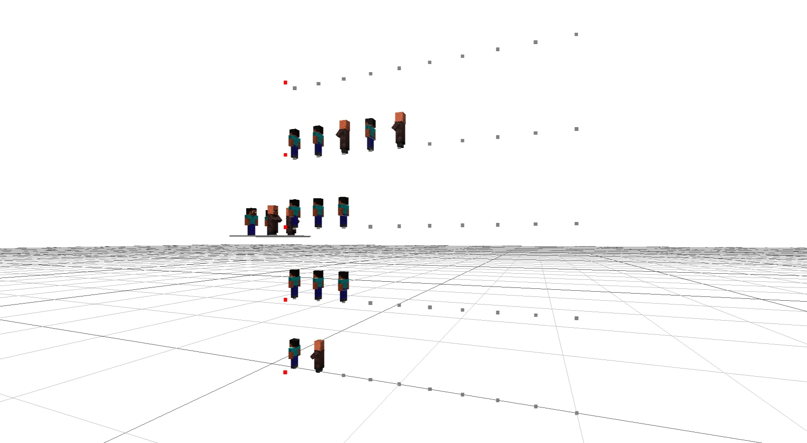
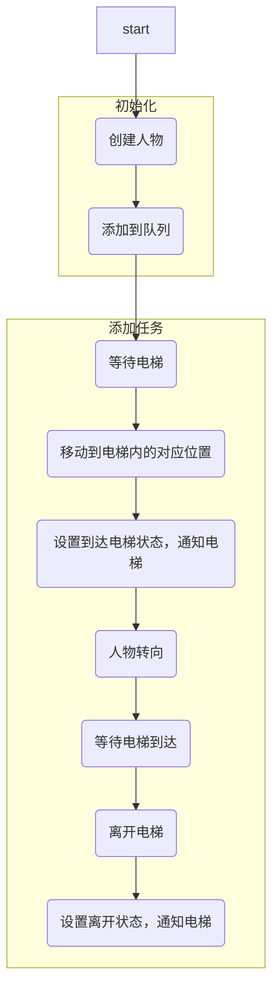
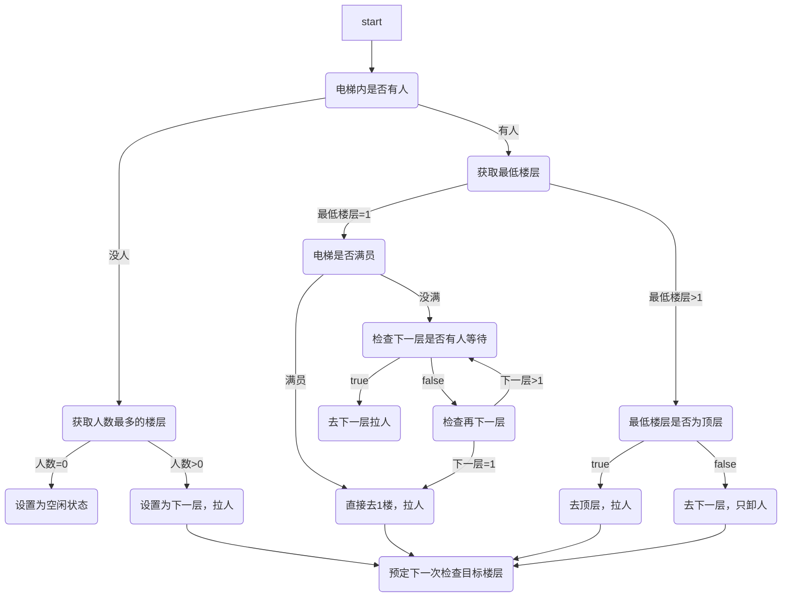

# 构建电梯仿真模型



## 目标

本文的目标是利用[仿真框架](https://github.com/huuhghhgyg/Container-Terminal-Simulation)创建一个电梯情景的仿真模型。主要内容包括[队列的创建](#创建-queue)、[人物的创建](#创建-elevator)、[电梯的创建](#创建-elevator)、[仿真逻辑的实现](#仿真逻辑)。

## 创建 Queue

当等待电梯的人比较多时，需要排队。所以这里我们首先需要创建队列。这里创建一个队列类，方便后续复用。队列类实现了队列的基本功能，包括进入（`add`）、退出（`pull`），并在对应的操作中刷新队列元素位置（`refreshpos`）。

创建 Queue 类的代码如下

```lua
function Queue(config)
    local queue = {}

    if type(config) == "nil" then
        config = {}
    end

    -- 设置属性
    queue.type = 'queue'
    queue.len = config.len or 20 -- 队列长度
    queue.origin = config.origin or {0, 0, 0} -- 原点
    queue.vec = config.vec or {2, 0, 0} -- 增长方向

    -- 计算
    queue.pos = {}
    for i = 1, queue.len do
        queue.pos[i] = {queue.origin[1] + queue.vec[1] * (i - 1), queue.origin[2] + queue.vec[2] * (i - 1),
                        queue.origin[3] + queue.vec[3] * (i - 1)}
        local pt = scene.addobj('points', {
            vertices = queue.pos[i],
            size = 5
        })
    end

    -- 任务相关函数
    function queue:refreshpos()
        for i = 1, queue.len do
            if type(queue[i]) == 'table' then
                queue[i]:addtask('move2', {table.unpack(queue.pos[i])})
            end
        end
    end

    function queue:pull()
        local pullItem = table.remove(queue, 1)
        queue:refreshpos(true)

        return pullItem
    end

    function queue:add(obj)
        if #queue == queue.len then
            print('[' .. queue.type .. queue.id .. '] 队列已满，加入失败')
            return
        end

        table.insert(queue, obj)
        obj:setpos(table.unpack(queue.pos[#queue]))
        obj.pos = {table.unpack(queue.pos[#queue])} -- 复制
        queue:refreshpos()
    end

    return queue
end
```

## 创建 Person

然后创建一个人物模型，用于测试队列的功能。由于每个人有不同的目标，且能够移动，因此可以将其看作能够执行不同任务的 Agent。因此，Person 类需要继承自 Agent 类以实现任务相关函数，如任务添加、任务执行、任务删除等操作。

由于 Person 类定义了模型，因此需要重新实现`setrot()`方法，以便在设置旋转时同时设置模型的旋转；而 Agent 类中已经实现了对于单个模型的`setpos()`方法，因此不需要重新实现，只用设置`person.model`即可。

Person 类中主要新定义了 stay 任务和 waitelevator 任务。

- stay 任务指的是人物在电梯内原地不动，等待电梯到达其指定楼层；
- waitelevator 任务指的是人物在 Queue 中等待电梯到达。

创建 Person 类的代码如下

```lua
function Person(config)
    local person = Agent(config)
    person.model = config.model or 'https://www.zhhuu.top/ModelResource/models/mc/steve.glb'
    person.model = scene.addobj(person.model) -- 添加模型
    person.type = 'person'
    person.id = person.model.id
    person.targetFloor = config.targetFloor or 2 -- 目标楼层

    function person:setrot(x, y, z)
        person.model:setrot(x, y, z)
    end

    -- 等待电梯到达目标楼层
    -- {'stay', {elevator=}}
    person.tasks.stay = {
        init = function(params)
            assert(type(params.elevator) == 'table' and params.elevator.type == 'elevator',
                "输入的电梯类型有误")

            params.dt = nil
            params.init = true
            -- 没有dt，等待elevator调用execute唤醒
        end,
        execute = function(dt, params)
            if params.elevator.floor == person.targetFloor then
                person:deltask()
                coroutine.queue(0, person.execute, person) -- 立刻执行下一个任务
            end
        end
    }

    -- 在队列中等待电梯到达
    -- {'waitelevator'}
    person.tasks.waitelevator = {
        init = function(params)
            params.dt = nil
            params.init = true
            -- 没有dt，等待elevator调用execute唤醒
        end,
        execute = function(dt, params)
            if person.elevator ~= nil then
                person:deltask()
                coroutine.queue(0, person.execute, person) -- 立刻执行下一个任务
            end
        end
    }

    return person
end
```

## 创建 Elevator

电梯（Elevator）是该仿真中任务较为复杂的一个 Agent，其中存储了电梯的信息（如层数、层高度）、工作状态、队列信息、当前楼层等信息。

电梯的任务主要包括：

- pull：从队列中拉人
- push：从队列中卸人
- waitagents：等待 Agent 操作，如等待 Agent 到位

在电梯内的人物是一个队列，因此 Elevator 中定义了一个队列`Elevator.queue`，用于存储电梯内的人物；还通过`Elevator.places`定义了其中每个队列位置的具体位置坐标。

创建 Elevator 类的代码如下

```lua
function Elevator(config)
    if type(config) == 'nil' then
        config = {}
    end

    local elevator = Agent()
    elevator.model = scene.addobj('box', {
        length = 4,
        width = 4,
        height = 0.1,
        color = '#eee'
    })
    elevator.type = 'elevator'
    elevator.id = elevator.model.id
    elevator.origin = config.origin or {0, 0, 0}
    elevator.doorRadian = config.doorRadian or math.pi / 2 -- 出门的方向
    elevator.places = config.places or {{-1, 0, 1}, {-1, 0, -1}, {1, 0, -1}, {1, 0, 1}}
    elevator.queue = {} -- 物品队列

    elevator.floorHeights = config.floors or {0, 5} -- 默认两层楼，其高度对应为0和5
    elevator.floor = 1

    function elevator:move2y(y)
        local ox, _, oz = table.unpack(elevator.origin)
        elevator.model:setpos(ox, y, oz)

        for i = 1, #elevator.places do
            local p = elevator.queue[i]
            if type(p) == 'table' then
                p:setpos(elevator.places[i][1], y, elevator.places[i][3])
                p.pos = {elevator.places[i][1], y, elevator.places[i][3]}
            end
        end
    end

    function elevator:isFull()
        for i = 1, #elevator.places do
            if elevator.queue[i] == nil then
                return false
            end
        end
        return true
    end

    function elevator:minFloor(exceptFirst)
        local fmin = 1 / 0

        for i = 1, #elevator.places do
            if type(elevator.queue[i]) == 'table' and elevator.queue[i].targetFloor < fmin then
                -- 除了最低楼层为1楼、并且除去1楼的情况
                if not (elevator.queue[i].targetFloor == 1 and exceptFirst) then
                    fmin = elevator.queue[i].targetFloor
                end
            end
        end

        if fmin == 1 / 0 then
            return nil
        end

        return fmin
    end

    function elevator:getplace(i)
        local _, y, _ = elevator.model:getpos()
        return {elevator.places[i][1], y, elevator.places[i][3]}
    end

    function elevator:setpos(x, y, z)
        elevator:move2y(y)
    end

    function elevator:toFloor(f, floorList, doPull)
        elevator:addtask('fn', {
            f = function()
                print('电梯去', f, '楼，taking:')
                for i = 1, #elevator.places do
                    if type(elevator.queue[i]) == 'table' then
                        print(elevator.queue[i].type, elevator.queue[i].id, '->', elevator.queue[i].targetFloor)
                    end
                end
            end,
            args = {}
        })
        elevator:addtask('move2', {elevator.origin[1], elevator.floorHeights[f], elevator.origin[3]})
        elevator:addtask('setvalue', {
            key = 'floor',
            value = f
        })

        -- push
        elevator:addtask('push', {f}) -- 弹出到对应楼层的人

        -- pull
        if doPull then
            elevator:addtask('pull', {
                floor = elevator.floor,
                queue = floorList[f].queue
            })
        end
        elevator:addtask('waitagents') -- 从队列中pull到的agent
    end

    -- 从楼层队列中拉取person
    -- {'pull', {floor=,queue=}}
    elevator.tasks.pull = {
        init = function(params)
            assert(type(params.floor) == 'number',
                elevator.type .. elevator.id .. '的pull任务floor参数不为number')
            assert(type(params.queue) == 'table', elevator.type .. elevator.id .. '的pull任务queue参数不为table')

            params.dt = nil
            params.init = true
        end,
        execute = function(dt, params)
            -- 检查剩余位置
            for i = 1, #elevator.places do
                if elevator.queue[i] == nil then
                    -- pull到剩余位置中
                    local p = params.queue:pull()
                    if type(p) == "nil" then -- pull不到了
                        break
                    end

                    p.elevator = elevator
                    elevator.queue[i] = p
                    p:execute() -- 唤醒
                end
            end

            -- 删除任务
            elevator:deltask()
            coroutine.queue(0, elevator.execute, elevator) -- 立刻执行下一个任务
        end
    }

    -- 从电梯中弹出person
    -- {'push', {floor}}
    elevator.tasks.push = {
        init = function(params)
            assert(type(params[1]) == 'number', elevator.type .. elevator.id .. '的push任务参数非number')

            -- 弹出目标为对应楼层的人
            for i, people in ipairs(elevator.queue) do
                if people.targetFloor == elevator.floor then
                    -- 唤醒agent(弹出)
                    people:execute()
                    people.arrived = false -- 设置到达sink的状态
                end
            end

            params.init = true
        end,
        execute = function(dt, params)
            -- 检查离开状态（需要people唤醒）
            local arrived = true

            for i = 1, #elevator.places do
                local p = elevator.queue[i]
                if type(p) == 'table' and p.targetFloor == elevator.floor then
                    if not p.arrived then
                        arrived = false
                    else
                        -- 删除位置
                        elevator.queue[i] = nil
                    end
                end
            end

            -- 删除任务
            if arrived then
                elevator:deltask()
                coroutine.queue(0, elevator.execute, elevator) -- 立刻执行下一个任务
            end
        end
    }

    -- 检测agent是否到位
    -- {'waitagents'}
    elevator.tasks.waitagents = {
        init = function(params)
            params.dt = nil
            params.init = true
            -- 没有结束时间，等待person调用execute唤醒
        end,
        execute = function(dt, params)
            local all_arrived = true

            -- 判断是否全部wait的agent都到达
            for i = 1, #elevator.queue do
                if type(elevator.queue[i]) == 'table' and not elevator.queue[i].arrived then
                    all_arrived = false
                    break
                end
            end

            -- 全部到达，删除任务
            if all_arrived then
                elevator:deltask()
                coroutine.queue(0, elevator.execute, elevator) -- 立刻执行下一个任务
            end
        end
    }

    return elevator
end
```

## 仿真逻辑

### 环境创建

首先创建场景。创建一个电梯，给定层高和层数。然后在每层创建一个队列，用于存放等待电梯的人；创建一个离开点，令到达目标楼层的人从这个位置离开。其中，队列点位颜色为灰色，离开点颜色为红色。

```lua
-- 创建环境
local floorNum = 5

local floorHeights = {}
for i = 1, floorNum do
    floorHeights[i] = (i - 1) * 5
end

local elevator = Elevator({
    floors = floorHeights
})
local floors = {} -- {queue, sinkPos}

for f, height in ipairs(elevator.floorHeights) do
    floors[f] = {}
    floors[f].queue = Queue({
        len = 10,
        origin = {2, height, 0}
    })
    floors[f].queue.id = f
    floors[f].sinkPos = {2, height, 1}
    scene.addobj('points', {
        vertices = floors[f].sinkPos,
        size = 5,
        color = 'red'
    })
end
```

### 人物创建流程

人物生成具体操作使用 `genPeople()` 函数实现，主要设置了人物的流程：



人物定时生成使用 `randomPeopleSummoner()` 函数实现，主要设置了人物的生成时间间隔和根据 Elevator 的状态激活 `elevatorNextFloor()` 函数。人物生成时间随机生成，遵循负指数分布。

### 电梯运行逻辑

电梯通过 `elevatorNextFloor()` 来控制电梯到达的下一个楼层。

对应流程图如下：



> 虽然当前任务逻辑看上去已经比较复杂，但是仍有改进的空间

最后通过 `elevatorNextFloor(elevator)` 令电梯进入楼层检查流程。

### 人物生成流程

通过设置随机数种子控制人物生成的规律。此处设置如下

```lua
-- 创建泊松分布的随机数种子
local seed = math.randomseed(0, {
    distribution = "exponential",
    mu = "10"
}) -- 负指数分布，均值为5
local summonCount = 50
```

然后通过 `randomPeopleSummoner()` 函数串联人物生成流程和电梯唤醒。

```lua
function randomPeopleSummoner()
    local f = math.random(1, floorNum)
    local people = genPeople(f)
    table.insert(ActionObjs, people)
    summonCount = summonCount - 1

    if elevator.status ~= 'busy' then
        elevatorNextFloor(elevator)
    end

    if summonCount > 0 then
        coroutine.queue(seed:random(), randomPeopleSummoner)
    end
end

randomPeopleSummoner()
```

## 仿真控制

仿真控制相关代码。

```lua
-- 仿真控制
local ActionObjs = {elevator}
local simv = 4  -- 仿真速度
local watchdog = WatchDog(simv, ActionObjs, {
    isImmediateStop = false, -- 无任务不立刻停止仿真
    recycleType = {'person'} -- 指定回收Agent类型
})
watchdog:refresh()
```

## 总结

本案例中包含：

- 如何创建可用的逻辑组件，对应本文中的 Queue；
- 如何根据需求创建对应的 Agent（本文中的 Person 和 Elevator），包括如何使用 Agent 基类内置的任务（如 move2、fn、setvalue）、向其中创建指定任务以完成相应的业务逻辑（如 `person.tasks.stay`、`elevator.tasks.pull` 等）；
- 如何在流程中，包括 `coroutine` 唤醒的函数流程中添加任务到 Agent 中；
- 仿真框架实现的其他所需设置，如创建 ActionObjs、WatchDog 等。

## 其他

需要注意的问题：

- 需要注意添加任务的顺序，对应的操作需要使用任务完成还是直接完成。
- 由于 Person 在排队时受等待任务阻塞，因此当前 Person 在结束阻塞之前都不会前进补齐空位。这是一个可能的改进方向。

## 示例

<iframe src="https://mcw.zhhuu.top/#/H4sIAAAAAAAACu0c224bxzXP/IqB87BkS1KkbDmAURoI2gYt0KTuBeiDIAQrciitvdxld5fyRWAg3yXLlp34LstWlEi22sC2nMQOTUrOx5S7FJ/8C81cd2Z3SEqujSCFBgbM3Zk5c86Zc59ZFe0SfO8dt1wulzt48AD6P//BSE78P5fL7f/gwMjwe/kDBw+MfHDw4MjI/vfywyP796N57xox1Gqupzvv5XKe7ozrpnnU7TFuUP8vtGUyIJ9tN+a3t7b8i1vBzQ2/ed2f3di+uxjML3e+Pt25dydRdQzLS2rB46/9pXUytv3q/vbzW/Gx2WxWSyVsN1urmrZeSmqTnld1Dw0NHT9+PHtqcrJWy3p2dehjuwTNv0LXrjlFOGQa4+5Q0RvSJ6DlZc2a/uYgjutecbJkT/wPUDx93ISu51AQlHjKoieXg9lrWiqRyYDhrL95s3Nj3W9eTzjwnzXDgUkNk6ClwhcMIfEdW0FLJRJuEVow60IPWlPJ6QQAAEw4RgkUgFY1dQtqiTrDIZVIlGtW0TNsC/ylBmswWbStsjGRwrNMu6ib4J/oPSiA6XoCvzXKwDtZ5SNBoQD2WYa5D3iT0MIjUCO9ZBp6hlaJTM9kwPaTV52tJ/6zB8HMI/wOL5FFUBGS+EkTOkxogQKFiB9sBwznEKTunWV/9nb35o9+86EwwXaMCUOYQ59tB0zn0gD9q6PZ/sJy58xLYd4ULIaT0AOaMSzO+OpB9+aPwa2X/rXPBXJWOk9uC2CqthsSXrYdYIACyKcFako2ZxSfMmqMoVkiBaP5MfDrEDf0+CuQNEAG5FNpidbRYXnksDiSrxVtEoT9MoT9AoQ6h0BEouqBAiBippdK9vjRpFa1DctztTSYllabgo5nFCHih0iojJJrnEIbP8Jf1lMxmWm3Wv6llc69hn/+O2JVCHeZ9GLohxxYdqA7WbXdZIpDG7QDolDjAaPGGBZrolWaLNgS70aNsUN6qeTp7rGkVrGn4DDiAJ6WrVlVvXgsKZKdqqckOIjA6G9OdIS0as00BaLoRtRM848erIACIIs6EGFBFk2DfEoWM5E/nlODqQTvd6BXcywOsC8qeqmUtMePhsCNMnifmomCwOMY36jhG9VANisqPX8ySui3NkYV2//h26C18nrzsn/pS//8mr/6bPv7NU3mIUFcYiN/IDwxLBc6HuOJhLg9fvSQCz3MD/WmEbrGUtIcpuED5hCTsXrFn33Rex8iok73AQ9L4LeZDDgCHde2QlNNnhW2uoo7QAF8iJyGNIB0ZSvIO4VGjjzaDtiRM8Oj3aFKccj14BTMTpjjmgq4ZBrEvhTiSPBDy7/0ZbC+4j+YF2cz+08eJcDYe4mAskZJmqo7E9D7yLRtJ6RNfIk8Blq7c+9J8OXFYG3Tf3YmItsEFBIHx/aSJ9LgZBqcCrddXF05SLRWncdz/qvznRvPg6+eonDm1StpYTpqWnM9/SSyGNCEU7pnO4V6XSbLPeZm0SAkbaG6WQYywAzzZFV39Iorq4XuYqHHRo30Z9kikm3TrRKI9NONKACNvdHiLmTf9qvr/vm1zuI5QmXnWct/MB8szW0/fbpPsCuYGgK/hJC2DFPVR0lCRknqRuLy7UqwNFfyXm9eJmxlWG1vnP0pVoInYLHmQf/GavfCF6IZCHGmQ0SWlbw0ULHNKMe4USZSVVDJmtIzUEEqQRP7hVRsQNF27JpnWDCL1TyZSzPYFFP2jNWl8828P9sK5h5tr1xuN+bbjZl249/EHQ50JnUukf7SOrGp7cbjuHSGEnlcNzy+7QphFPt3LZS/MEGge8Ko/Qwj/UvZc+bQietgnuT3lJjQl7A3krNQxPiaZZjaDmN84owEMSHuiNpJplhKb6GN2yekKNKE1oQ3CQrgQLiPx41S9NUkNCYmkeTksvm0gKGJ19feh5CmFPUIFszrcKGXu7HnkVFmvoe/3UG6IU8o2bbzV71k6MIk4Z3tgIruTWarBhgibsu/2OzeXu8snqOphwStauokwqaQ6DNafjqTxwjk62nAfmfwQ/x3vh7BMkz8sEjO/cu/fprYkIQ8EFvIP+ANENDAb13GhREMpNu6s/1ktd1Y9Z+dCdY2UWR3/kX3mzt+86H/9KXfvNFuNHP+F5dHFAugCD7istmAQzj0Ppk8GY2P7RNp8Gka2Kd4gEyDtcjehfPkrWbBoU08vX1K8GxCWvF+dC8i2QUNzkRJYumDMgupDk4/qgy1yNKjxthofgxjq+jZPxa3TFUWze4SUn2gJYrnD3zDDPcjOZ/ZBTeNcpyNiF89jTM1hWXddOFApIUJ3An1IaRiWDgUSMITRVj1PjIc14tKYbmCrUMeDIHcG8kPk4sY2bFQLjZCCld+Q1BRMglp593VdvNCsDTT3logkWq70cwHa5v/mTntv3zRbtzo3l31F1roFbJFZ8/7F57HABllYNkeiCMrR+mIHxhjgW9qzDCzCAv7woxNFLdUtd1i/koWoJsUx4NKhBi0SBCYiFUMa5DETEAP73LSiMrJp1jZPo05HDxFKmnQ5d5MZfvgRm1KLPnpYWj7QPJsohblNMDW+0+G66VByT5SM00FXF5EKVuxGlJZjNcU9osUFWg4u9DS0qCcBhpxL55+zLAmDmnxabtQP0FMdqCGPWU4RFYhxierMK0Qb6OUBlrmsKbqE0Q/Th5QyL/qnRQfo6Y7E0L1EoQRE1DuFy96RTwqlkNlhDBaFnt48bHvKi70pnSzBmOycQyi1FjD8CNZKp6AREckhP/OZEC15k72WRN1o/XKdRyS+5sv/YtNf3aDBCrEPnYWz7WbzQhUM7QRRpmKfFwqVAuaZoxA1Fj4I7MznpOzgI0r3Gh5jIiLNFTktGgRYwihXA+fPrhaitRgF3gOiZD1Zzc6i+fwiFgFpN2iLoTPCObn/Ku3aD4CWL7JiMY4F9IY20I0EiWpJxr6NuogeCma09Qq41BV3pDTg2xWSghQibKzeA7hQ3IyDNG/eia4udFuXGk3mhTuQFQwuaL1SO9yZQxAXJmAeTsFmDfNnVGu/vVMsLzmz/2rvXW3vXWls/VENum7M767jvhAqItIYwU02o3HytFhiC5uTbTqHkFKCNbDIzC2cLtxxZ/daDcv9HQG4w7Uj/W03MqOaliOCO2BGkScYaCqhnmI7m2SGDq5gCKi1BdFNHX2SxRDKuoUzLaoCySK4ghHn5dHwvLlDgsk8SJYu7VAwoR24zGx53FzRI0+0uheZsidfAtmaDQ/JtugHWq+O0nIJErfvf+A25rYbmAKSeG53Wgq/JY4AaskKkLZVRMCwwJGVTccNxKrpHqoJ5kWjfAjCXw/VSVSh31JkiCu1jqyUCixfQZldccxpiAq4ODUTzh6xkVP17COofr1pRfBzOndy/u7NJydhy1/c4Zg9npztrs0s/3wNKGKMOr15pyiwhASjNH5X0zuTksWoGfZAp8svKlE0CSyyvewb1Qd2ege9rBHB5BsV9xXyUDiRjXqUPnYnUXfOzeiRhn05cYAIwvemaGNUhY3vEiqn89j7Q7uPPWvPUSecetKaHeFUFNpdMP+n+XQodO6HtxfDm6/6N7+nh8/EN/xLg4fqDab5qf9NBrLympw6zFl6fn17tl1xCgWlHfPbgnHO6wpDQFJHdS2fYelJ6Sv8SR1oP7KVPbWX3WwtCOFwowhnEAV5376JSDzi9IxWhDiESE77/Fn7/mtZmfhqf/V2QStRiLL+0mtgm/ciO/CCv50PSFICZ9AxUNK5rEJpNeEwK/ACFk5dgDET5mmQxAuS1UpLHQtTUDH5UcP0/TqBnLYR2y3nsDYldPs0EcRrIhwUxLiqP4g3M5ir/hpB7kGJ50/ITbkQkXmxz3oahhBgR/x0Nw6ApacIpUjXZScCKA8ATTwdpVwsyoGMsSVXa1SHIk5sMRPxJi4tFs/dpaWuzOt7Vefh0eEE9A6gmOPJDKUQsEJye6N5WD2Wux2A9lH6vzxyQ3VMA6BFFslJQuH4+MvR7dKdiU5HEpgpOoYufNCb8VMR+HR6gl9CjnBzh/FxVLgMMhlR7BBe+MrMSCSku0S0JRhmvoEdMLrNXXxCg+7fCLaFeHwMMPODtMgR3MCKh+c9VQq8T0u4dB5AlrQ4flkJgMwRf2Xw4sIuEm1I36kqh4SKfX2KfPGzEnkaD6hGI2MV04dXbOywPV/Izurrk4cS4OpN8iCiCgWwFSf0BYUgDrrf0MXF+VrvCQrnw6oq7KhdPQ6PCC+6lHLv4ScKa23XzjfFxdFOR8MLumDHQo7l74If+L1vHhVG8iVUBXyPavOIKw802hBUUJk9edYVEkYKWaiihT07TGShyxSlac7s9hZXiOb+C5ZSC+49QykepWxaNF9aZ3LGQm6dyj60mE/tX/x+1vcYaaocJO0O86Un00ykgjB1P+HfEiz5NHsZEZxaUmIQryP9RM4PCNHi+LF1wrt+RO7LZRTdLJIgF0jIUEklg58iTo090RiJDOP7jjzoTRaPBxdN2b0Y3hFYShHM0TLIu/k2IdySpqRjizHwzoS0AXPT3fW5xOxs9pP4AmP3mFgWYnIPHrBQVDU8NJDKszwv11hFUWjLExSFOnpgS2DRmoD/uwGAYEytIVWu9kMlmb81UV0z2BtUzhJ+ckqxA6ZWZLipgG51s4G8/1X8gcUegmVqBfo/q1XQ8Kqjdfck1psAEcjXEfGRpShCAaHVZcNdnQqDqh2x3axt2ayob01NJp8D9wqYquIfWo3mkYJHz6piBHYiEdJos0fhNv84mlisDTHpKvvtkREL5JfYEAz/sZVXhNHN1nE3YndT4pvDgLSWvE/v4PqQPe+DxbW6I2YvoxTzujBqcFiHdsn5CofngkeLKFyFfliYqFFmIZK/bimgK7czc9Fy/48KA4H4WqSwPEeNPVZQVOF7xYT0NhJNioeyH79+KRhQmHGYZBXhdzsK0JMAMk+tXQ4Le7vuBF3R/moMW7MFaqoop3owfKaP7shrpYGGmIAZgndABUzeu62AEi962LbWaqAmsj28HeGZuTiTOkFKsCHM2OqpOJLxECInFBIu5IHPSU+Sh33h6ImoAJG40pw52meXP7hysZswuvNy2iArAWhTCA6ufnobZW5uadDIzhjZfzh207rKjn+DZZmuisv/GdnXm9ejiwd0+MdrIErpCnqchGnBfBx4mJxw0DfMsCnqH0JCVyJHiGxASgQJ+FHvyiDFLkcaJUgjiV4wTL47lJw/5U/e8FvnO0snusuXg2WmsHNjc6jK/7ja7RK6EJcMhbKN+gNShUJNSXD9RxjvIaDnQLYB09UbQtanqGb+whBlRp6n8/tS9DI+/vl4PJF9MUyXhnJ7v2L/sxmu9EcYYvWKhXb+q1ds9CJwUhOKJsFC4/Ql15k3Ic4xvrz+NEItygUozKF7q/TR/ZFLyiAf6Cfv7MnkmhIWgDDqDLcP1YqsGToHvybZ1dZzTxNo8LiyaIJ/07utE+zT6nqqLTKFmEfn0kf/xL+kSrf3zCJUA6wy5FCWT5alWPFOHx8XBBqhmXSL32LJ5JFppBBMnfFJ+4ixLsgNAT4jMUAstIOim+5ThhlaamYI4hW9JGYHWIFw7SSd+EKeJUe7P25v9R/N62qu+/8Lxr0//sPuEX//sOB4b2//7DX9tpe22t7ba/ttb221/baXttrb7X9F55engsAUAAA" width="100%" height="600" style="border-radius:8px;"></iframe>

🔗 [在 MicroCityWeb 中打开](https://microcity.github.io/#sgrzqu)

## 完整代码

```lua
-- 1.下载函数库到虚拟磁盘
print('正在下载依赖库到虚拟磁盘...')
os.upload('https://www.zhhuu.top/ModelResource/libs/ct/agent.lua')
os.upload('https://www.zhhuu.top/ModelResource/libs/ct/watchdog.lua')
os.upload('https://www.zhhuu.top/ModelResource/libs/tablestr.lua')
print('下载完成')
-- 2.引用库
require('agent')
require('watchdog')
require('tablestr')

scene.setenv({
    grid = 'plane'
})
print()

function Queue(config)
    local queue = {}

    if type(config) == "nil" then
        config = {}
    end

    -- 设置属性
    queue.type = 'queue'
    queue.len = config.len or 20 -- 队列长度
    queue.origin = config.origin or {0, 0, 0} -- 原点
    queue.vec = config.vec or {2, 0, 0} -- 增长方向

    -- 计算
    queue.pos = {}
    for i = 1, queue.len do
        queue.pos[i] = {queue.origin[1] + queue.vec[1] * (i - 1), queue.origin[2] + queue.vec[2] * (i - 1),
                        queue.origin[3] + queue.vec[3] * (i - 1)}
        local pt = scene.addobj('points', {
            vertices = queue.pos[i],
            size = 5
        })
    end

    -- 任务相关函数
    function queue:refreshpos()
        for i = 1, queue.len do
            if type(queue[i]) == 'table' then
                queue[i]:addtask('move2', {table.unpack(queue.pos[i])})
            end
        end
    end

    function queue:pull()
        local pullItem = table.remove(queue, 1)
        queue:refreshpos(true)

        return pullItem
    end

    function queue:add(obj)
        if #queue == queue.len then
            print('[' .. queue.type .. queue.id .. '] 队列已满，加入失败')
            return
        end

        table.insert(queue, obj)
        obj:setpos(table.unpack(queue.pos[#queue]))
        obj.pos = {table.unpack(queue.pos[#queue])} -- 复制
        queue:refreshpos()
    end

    return queue
end

-- Person
function Person(config)
    local person = Agent(config)
    person.model = config.model or 'https://www.zhhuu.top/ModelResource/models/mc/steve.glb'
    person.model = scene.addobj(person.model) -- 添加模型
    person.type = 'person'
    person.id = person.model.id
    person.targetFloor = config.targetFloor or 2 -- 目标楼层

    function person:setrot(x, y, z)
        person.model:setrot(x, y, z)
    end

    -- 等待电梯到达目标楼层
    -- {'stay', {elevator=}}
    person.tasks.stay = {
        init = function(params)
            assert(type(params.elevator) == 'table' and params.elevator.type == 'elevator',
                "输入的电梯类型有误")

            params.dt = nil
            params.init = true
            -- 没有dt，等待elevator调用execute唤醒
        end,
        execute = function(dt, params)
            if params.elevator.floor == person.targetFloor then
                person:deltask()
                coroutine.queue(0, person.execute, person) -- 立刻执行下一个任务
            end
        end
    }

    -- 在队列中等待电梯到达
    -- {'waitelevator'}
    person.tasks.waitelevator = {
        init = function(params)
            params.dt = nil
            params.init = true
            -- 没有dt，等待elevator调用execute唤醒
        end,
        execute = function(dt, params)
            if person.elevator ~= nil then
                person:deltask()
                coroutine.queue(0, person.execute, person) -- 立刻执行下一个任务
            end
        end
    }

    return person
end

-- Elevator
function Elevator(config)
    if type(config) == 'nil' then
        config = {}
    end

    local elevator = Agent()
    elevator.model = scene.addobj('box', {
        length = 4,
        width = 4,
        height = 0.1,
        color = '#eee'
    })
    elevator.type = 'elevator'
    elevator.id = elevator.model.id
    elevator.origin = config.origin or {0, 0, 0}
    elevator.doorRadian = config.doorRadian or math.pi / 2 -- 出门的方向
    elevator.places = config.places or {{-1, 0, 1}, {-1, 0, -1}, {1, 0, -1}, {1, 0, 1}}
    elevator.queue = {} -- 物品队列

    elevator.floorHeights = config.floors or {0, 5} -- 默认两层楼，其高度对应为0和5
    elevator.floor = 1

    function elevator:move2y(y)
        local ox, _, oz = table.unpack(elevator.origin)
        elevator.model:setpos(ox, y, oz)

        for i = 1, #elevator.places do
            local p = elevator.queue[i]
            if type(p) == 'table' then
                p:setpos(elevator.places[i][1], y, elevator.places[i][3])
                p.pos = {elevator.places[i][1], y, elevator.places[i][3]}
            end
        end
    end

    function elevator:isFull()
        for i = 1, #elevator.places do
            if elevator.queue[i] == nil then
                return false
            end
        end
        return true
    end

    function elevator:minFloor(exceptFirst)
        local fmin = 1 / 0

        for i = 1, #elevator.places do
            if type(elevator.queue[i]) == 'table' and elevator.queue[i].targetFloor < fmin then
                -- 除了最低楼层为1楼、并且除去1楼的情况
                if not (elevator.queue[i].targetFloor == 1 and exceptFirst) then
                    fmin = elevator.queue[i].targetFloor
                end
            end
        end

        if fmin == 1 / 0 then
            return nil
        end

        return fmin
    end

    function elevator:getplace(i)
        local _, y, _ = elevator.model:getpos()
        return {elevator.places[i][1], y, elevator.places[i][3]}
    end

    function elevator:setpos(x, y, z)
        elevator:move2y(y)
    end

    function elevator:toFloor(f, floorList, doPull)
        elevator:addtask('fn', {
            f = function()
                print('电梯去', f, '楼，taking:')
                for i = 1, #elevator.places do
                    if type(elevator.queue[i]) == 'table' then
                        print(elevator.queue[i].type, elevator.queue[i].id, '->', elevator.queue[i].targetFloor)
                    end
                end
            end,
            args = {}
        })
        elevator:addtask('move2', {elevator.origin[1], elevator.floorHeights[f], elevator.origin[3]})
        elevator:addtask('setvalue', {
            key = 'floor',
            value = f
        })

        -- push
        elevator:addtask('push', {f}) -- 弹出到对应楼层的人

        -- pull
        if doPull then
            elevator:addtask('pull', {
                floor = elevator.floor,
                queue = floorList[f].queue
            })
        end
        elevator:addtask('waitagents') -- 从队列中pull到的agent
    end

    -- 从楼层队列中拉取person
    -- {'pull', {floor=,queue=}}
    elevator.tasks.pull = {
        init = function(params)
            assert(type(params.floor) == 'number',
                elevator.type .. elevator.id .. '的pull任务floor参数不为number')
            assert(type(params.queue) == 'table', elevator.type .. elevator.id .. '的pull任务queue参数不为table')

            params.dt = nil
            params.init = true
        end,
        execute = function(dt, params)
            -- 检查剩余位置
            for i = 1, #elevator.places do
                if elevator.queue[i] == nil then
                    -- pull到剩余位置中
                    local p = params.queue:pull()
                    if type(p) == "nil" then -- pull不到了
                        break
                    end

                    p.elevator = elevator
                    elevator.queue[i] = p
                    p:execute() -- 唤醒
                end
            end

            -- 删除任务
            elevator:deltask()
            coroutine.queue(0, elevator.execute, elevator) -- 立刻执行下一个任务
        end
    }

    -- 从电梯中弹出person
    -- {'push', {floor}}
    elevator.tasks.push = {
        init = function(params)
            assert(type(params[1]) == 'number', elevator.type .. elevator.id .. '的push任务参数非number')

            -- 弹出目标为对应楼层的人
            for i, people in ipairs(elevator.queue) do
                if people.targetFloor == elevator.floor then
                    -- 唤醒agent(弹出)
                    people:execute()
                    people.arrived = false -- 设置到达sink的状态
                end
            end

            params.init = true
        end,
        execute = function(dt, params)
            -- 检查离开状态（需要people唤醒）
            local arrived = true

            for i = 1, #elevator.places do
                local p = elevator.queue[i]
                if type(p) == 'table' and p.targetFloor == elevator.floor then
                    if not p.arrived then
                        arrived = false
                    else
                        -- 删除位置
                        elevator.queue[i] = nil
                    end
                end
            end

            -- 删除任务
            if arrived then
                elevator:deltask()
                coroutine.queue(0, elevator.execute, elevator) -- 立刻执行下一个任务
            end
        end
    }

    -- 检测agent是否到位
    -- {'waitagents'}
    elevator.tasks.waitagents = {
        init = function(params)
            params.dt = nil
            params.init = true
            -- 没有结束时间，等待person调用execute唤醒
        end,
        execute = function(dt, params)
            local all_arrived = true

            -- 判断是否全部wait的agent都到达
            for i = 1, #elevator.queue do
                if type(elevator.queue[i]) == 'table' and not elevator.queue[i].arrived then
                    all_arrived = false
                    break
                end
            end

            -- 全部到达，删除任务
            if all_arrived then
                elevator:deltask()
                coroutine.queue(0, elevator.execute, elevator) -- 立刻执行下一个任务
            end
        end
    }

    return elevator
end

-- 创建环境
local floorNum = 5

local floorHeights = {}
for i = 1, floorNum do
    floorHeights[i] = (i - 1) * 5
end

local elevator = Elevator({
    floors = floorHeights
})
local floors = {} -- {queue, sinkPos}

for f, height in ipairs(elevator.floorHeights) do
    floors[f] = {}
    floors[f].queue = Queue({
        len = 10,
        origin = {2, height, 0}
    })
    floors[f].queue.id = f
    floors[f].sinkPos = {2, height, 1}
    scene.addobj('points', {
        vertices = floors[f].sinkPos,
        size = 5,
        color = 'red'
    })
end

-- 仿真逻辑
function genPeople(initFloor)
    -- 生成目标楼层
    local targetF = 1
    if initFloor == 1 then
        targetF = math.random(2, floorNum)
    end

    local person = Person({
        targetFloor = targetF,
        model = math.random() > 0.5 and 'https://www.zhhuu.top/ModelResource/models/mc/steve.glb' or
            'https://www.zhhuu.top/ModelResource/models/mc/villager.glb'
    })
    person:setrot(0, elevator.doorRadian - math.pi, 0)

    floors[initFloor].queue:add(person) -- generator
    -- steve:setrot(0, elevator.doorRadian, 0)
    person:addtask('waitelevator')
    person:addtask('fn', {
        f = function()
            local elevator = person.elevator

            local i = 0
            -- 检查pull到哪个位置
            for k, v in ipairs(elevator.queue) do
                if person == v then
                    i = k
                    break
                end
            end

            person:addtask('move2', {elevator.places[i][1], elevator.floorHeights[initFloor], elevator.places[i][3]}) -- 移动到电梯内
            person:addtask('fn', {
                f = function()
                    person:setrot(0, elevator.doorRadian, 0)
                end,
                args = {}
            })
            person:addtask('setvalue', {
                key = 'arrived',
                value = true
            }) -- 设置到达状态
            person:addtask('fn', {
                f = function()
                    elevator:execute() -- 通知电梯
                end,
                args = {}
            })
            person:addtask('stay', {
                elevator = elevator
            }) -- 在电梯内等待

            person:addtask('move2', {table.unpack(floors[person.targetFloor].sinkPos)}) -- 离开电梯
            person:addtask('setvalue', {
                key = 'arrived',
                value = true
            }) -- 设置到达(sink)状态
            person:addtask('fn', {
                f = function()
                    elevator:execute() -- 通知电梯
                end,
                args = {}
            })
        end,
        args = {}
    })

    return person
end

function getMaxQueueFloor()
    local maxQueueLength = 0
    local maxQueueFloor = 1

    for f, floorItem in ipairs(floors) do
        if #floorItem.queue > maxQueueLength then
            maxQueueLength = #floorItem.queue
            maxQueueFloor = f
        end
    end

    return maxQueueFloor, maxQueueLength
end

-- 逻辑流程
function elevatorNextFloor(elevator)
    local minFloor = elevator:minFloor()

    -- 没人
    if minFloor == nil then
        print('elevator检测到没人，去人最多的楼')
        -- elevator:toFloor(1, floors, true)
        local maxFloor, maxQueueLength = getMaxQueueFloor()
        elevator.status = 'busy'
        elevator:toFloor(maxFloor, floors, true)

        if maxQueueLength > 0 then
            elevator:addtask('fn', {
                f = elevatorNextFloor,
                args = {elevator}
            })
        else
            print('elevator检测到没人，设置状态为idle')
            elevator.status = 'idle'
        end

        return
    end

    -- 有人
    elevator.status = 'busy'
    if minFloor == 1 then
        -- 最小目标为1楼
        if elevator:isFull() then
            -- 满员，直接去1楼
            print('elevator满员，直接去1楼')
            elevator:toFloor(1, floors, true)
        else
            -- 如果没满，去有人的下一层拉人
            -- 检查下一层是否有人
            print('elevator去有人的下一层拉人')
            local nextFloor = elevator.floor - 1

            while nextFloor > 1 do
                print('检查楼层', nextFloor)
                if #floors[nextFloor].queue > 0 then
                    print('elevaor检查到', nextFloor, '层有人，去拉人')
                    elevator:toFloor(nextFloor, floors, true)
                    break
                end
                nextFloor = nextFloor - 1
            end

            if nextFloor == 1 then
                print('elevator检测到没有人，去1楼')
                elevator:toFloor(1, floors, true)
            end
        end
    else
        -- 不是1楼，直接去minFloor，不拉人
        if #floors == minFloor then
            elevator:toFloor(minFloor, floors, true) -- 已经到了最顶层，拉人
        else
            elevator:toFloor(minFloor, floors, false) -- 没到最顶层，不拉人
        end
    end

    elevator:addtask('fn', {
        f = elevatorNextFloor,
        args = {elevator}
    }) -- queue next move
end

elevatorNextFloor(elevator)
scene.render()

-- 创建泊松分布的随机数种子
local seed = math.randomseed(0, {
    distribution = "exponential",
    mu = "10"
}) -- 负指数分布，均值为5
local summonCount = 50

-- 仿真控制
local ActionObjs = {elevator}
local simv = 4
local watchdog = WatchDog(simv, ActionObjs, {
    isImmediateStop = false,
    recycleType = {'person'}
})
watchdog:refresh()

function randomPeopleSummoner()
    local f = math.random(1, floorNum)
    local people = genPeople(f)
    table.insert(ActionObjs, people)
    summonCount = summonCount - 1

    if elevator.status ~= 'busy' then
        elevatorNextFloor(elevator)
    end

    if summonCount > 0 then
        coroutine.queue(seed:random(), randomPeopleSummoner)
    end
end

randomPeopleSummoner()
```