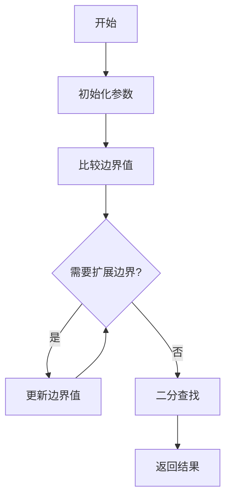
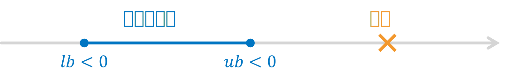

# 指数拓展的二分搜索

二分法搜索是一种非常高效的搜索算法，它可以在 $O(\log n)$ 的时间复杂度内找到目标值，适用于搜索目标在给定的范围内的情况。

然而，在某些情况下，搜索的目标可能不在给定的范围内。在这种情况下，我们可以使用指数拓展的二分搜索。


## 基本思想

指数拓展的二分搜索的基本思想是，我们首先确定一个初始范围。如果目标值在这个范围内，则直接使用二分搜索；如果目标值不在这个范围内，我们就不断地将范围扩大一倍，直到目标值在这个范围内，然后在最后一个增长的区间内使用二分搜索。



### 范围判别

假设我们可以通过某个函数判断目标值是否在给定的范围内。在这里，我们将这个判断函数定义为 `compare(x, obj)`，用于模拟判断结果。`obj` 为目标值，`x` 为试验值：

- 如果 `obj` 在 `x` 的左侧，则返回 -1；
- 如果 `obj` 在 `x` 的右侧，则返回 1；
- 如果 `obj` 等于 `x`，则返回 0。

显然，如果 $lb$ 和 $ub$ 分别是搜索范围的下界和上界，如果它们同时为-1 或 1，则说明目标值不在这个范围内（对应 $lb$ 和 $ub$ 同时小于或大于目标）。

范围过小，`compare(x, obj)` 返回 -1


范围过大，`compare(x, obj)` 返回 1


受到二分法的思路启发，如果我们以指数级别扩展范围，那么我们也可以很快地找到包含目标值的范围。范围扩展的步骤可以用下面这张图描述


到达这一步，我们就可以使用二分搜索来找到目标值了。

## 代码实现

<iframe src="https://mcw.zhhuu.top/#/H4sIAAAAAAAACu2WW2sTQRTH+xzIdzgEShO6G3djk4J0+0kKZTeZtFsnu2F2ButbsWqrjRfsBa1VRAr6YkxBofb2abKb9MmvILP3XGrpQwVhfg+bzcyZc/5nz9mZrdo1NHHLKIqiVCoz/FedLSvpX87dSkmdUGdmSzMldXa2UppQS2VV5etuWxiHOVQnE4pCdWLoGK84V9hdN/+fIsvgbn5wv2y5rT1vt+O9aGczTWJaNF8AkGXwjp9cvjv03l70Dk+yGWxXdQy2sQIalMrlStm36e187Z689H5u9b/v9vYf9963vU8b7tpZNpPNcP/t/e6vZ973nf7Furtx7u12spk6s6rUtC2o2o2mTlB+VeJuC9kMAIBZh1WY8+PQZWQBQZQRC2Q1mEbYQb7J/IhJyiIaUgBZtWzGv/h6vNYGz3Rr2z3icrsnLXfzqff6oPfjc0oYWm0uGqalk4eLDtJJdTmPDQmYIUGToKrpmLYVqpVl6Lcveufty9O3/fah++qRnyKfwgZo/GKTWDzjQ8wfCkdif6Cl7m0CSjAfRwkepHu0drn+dUBa9FT9kH6J4jTGpRDq5uiOgwjNMwPmuVAJcszQclAsconFIuSgwRwKBgLDXFpCBOiybgEObXDa1YNlEyO+TOYZz6dSqdmJVSKxYdZAgzw2YJprgjtQGmdGkMMwBS3ulIZZS/dKhFmPTTWQVb8rBi3igjTM2uhM0PQOJaa1VKzbpKHTfM5BlC+hNkzWcxJfWBgKG/ZiEvqqyOzmkdm1kUedGQTp94cMrVTQgT/hGzJQAwmCJglfpMg8acLNQ2/vGzbcN63IaGwCYbnuwWRNgslaTooLyP3z+iUjLByJUgwq71CdokW/YsNLR81Y2owNmAXXoD0Tn1qyMN2fY3PBhjZZlxYo47+56AmlCzK0rSQTZj2JOQfKmOaINoRpyIcvz1Chx0pyO0+ZEQRzNzu+qkFFYWPGwefHBo82KPmmwfFQcDwYPN1lyd21FU2M/lLP0Z7sd9b9Myi9kaf6+4o9MDkRgvXRLpredySom5aOF/mi4M4XNno4FKJjcyoQ0Dvd9j4e/D7bn5JiV1MLtHv8vHu81dttBTOjzgv/+Pxv6s6tf9Fc8/3HGf7+uyu+/wQCgUAgEAgEAoFAIBAIBAKBQCAQCAQCgeBm/AE/gTYoACgAAA==" width="100%" height="600" style="border-radius:8px;"></iframe>

🔗 [在 MicroCityWeb 中打开](https://microcity.github.io/#snzd6a)

源代码：

```lua
-- 初始化数据
print()  -- 清除显示
local obj = 25565  -- 用于测试的目标值

-- 定义比较函数
function compare(x, obj)
    if x < obj then return -1
    elseif x > obj then return 1
    else return 0 end
end

-- 指数拓展的二分搜索
function exp_binary_search(lb, ub, precision)
    -- 设置默认参数
    lb = lb or -1
    ub = ub or 1
    precision = precision or 0
    
    -- 定义局部binary_search函数
    local function binary_search(lb, ub)
        assert(ub >= lb, "ub=" .. ub .. " must be bigger than lb=" .. lb)
        while ub - lb > precision do
            local mid = (lb + ub) / 2
            local result = compare(mid, obj)
            if result == -1 then
                lb = mid
                print(string.format("set lb to %f", mid))
            elseif result == 1 then
                ub = mid
                print(string.format("set ub to %f", mid))
            else
                break
            end
        end
        return (lb + ub) / 2, lb, ub
    end
    
    -- 判断lb和ub
    print(string.format("compare: %d, %d", compare(lb, obj), compare(ub, obj)))
    local state_lb = compare(lb, obj)
    local state_ub = compare(ub, obj)
    
    while state_lb == state_ub do
        print(string.format("lb=%f,\tub=%f", lb, ub))
        -- 指数拓展
        if state_lb < 0 then
            ub = ub + (ub - lb)
            print(string.format("将ub拓展到%f", ub))
        elseif state_lb > 0 then
            lb = lb - (ub - lb)
            print(string.format("将lb拓展到%f", lb))
        end
        
        state_lb = compare(lb, obj)
        state_ub = compare(ub, obj)
    end
    
    -- 调用二分搜索
    return binary_search(lb, ub)
end

-- 调用函数
local result, final_lb, final_ub = exp_binary_search()
print('搜索结果：', result, '\t上下界：', final_lb, final_ub)
```
