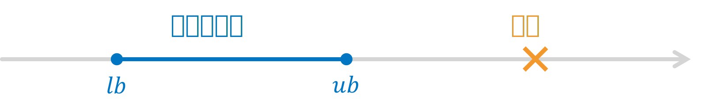
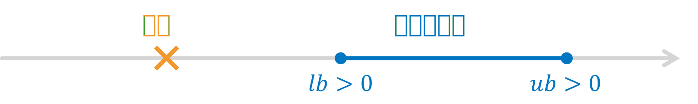
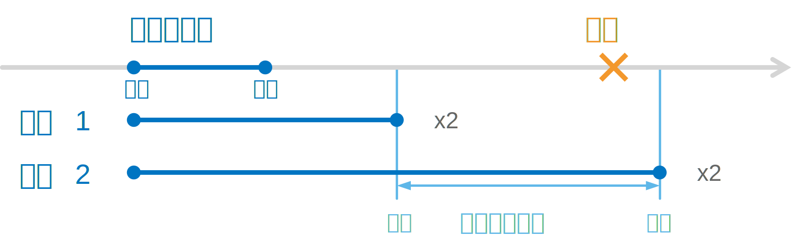

# 指数拓展的二分搜索

二分法搜索是一种非常高效的搜索算法，它可以在 $O(\log n)$ 的时间复杂度内找到目标值，适用于搜索目标在给定的范围内的情况。

然而，在某些情况下，搜索的目标可能不在给定的范围内。在这种情况下，我们可以使用指数拓展的二分搜索。



## 基本思想

指数拓展的二分搜索的基本思想是，我们首先确定一个初始范围。如果目标值在这个范围内，则直接使用二分搜索；如果目标值不在这个范围内，我们就不断地将范围扩大一倍，直到目标值在这个范围内，然后在最后一个增长的区间内使用二分搜索。

```mermaid
flowchart TD
    Start[开始] --> Init[初始化参数]
    Init --> CompareCheck[比较边界值]
    CompareCheck --> Expand{需要扩展边界?}

    Expand -->|是| UpdateBounds[更新边界值]
    UpdateBounds --> Expand

    Expand -->|否| BinarySearch[二分查找]

    BinarySearch --> End[返回结果]
```



### 范围判别

假设我们可以通过某个函数判断目标值是否在给定的范围内。在这里，我们将这个判断函数定义为 `compare(x, obj)`，用于模拟判断结果。`obj` 为目标值，`x` 为试验值：

- 如果 `obj` 在 `x` 的左侧，则返回 -1；
- 如果 `obj` 在 `x` 的右侧，则返回 1；
- 如果 `obj` 等于 `x`，则返回 0。

显然，如果 $lb$ 和 $ub$ 分别是搜索范围的下界和上界，如果它们同时为-1 或 1，则说明目标值不在这个范围内（对应 $lb$ 和 $ub$ 同时小于或大于目标）。

范围过小，`compare(x, obj)` 返回 -1


范围过大，`compare(x, obj)` 返回 1


受到二分法的思路启发，如果我们以指数级别扩展范围，那么我们也可以很快地找到包含目标值的范围。范围扩展的步骤可以用下面这张图描述



到达这一步，我们就可以使用二分搜索来找到目标值了。

## 代码实现

<iframe src="https://microcity.github.io/#/H4sIAAAAAAAACu2WW2vbMBTH8xzIdzgEQhNqZ3aaC4ymn6RQ7Fhp3Cl2kG3WvZV1tNmaXVibMrpujFFYX5amsEHX26eJ7fRpX2HItziXUvpQxph+D7YjHZ3zl86RopquoMQDIwiCUC4X6VuslIT4m7JQKCwkxGKlUBRFsShUEmKhWCnScQ8tjGIZpkQSgmBKRJYwXjNusbur/x+F58Fuf7K/7didfafbd173Ukms1yQMurwGVSiUSuUSAM+Du3c8OH/j/NwZnnTdgxfux57zZdveuEwlU0nqpXcw+PXSOdkbXm/a21dOt59K1i2tZqq6BjW92ZIIyq5z1G0ulQQAUOuwDoteHLOBNCDItIgGvOh3I2wgz2RpyiRmETYJgDQllfQenh6ns03ns7Nrn1K5g/OO3d5y3h26P77GhKH11oqsahJ5tmIgidQaWSxzYMkctAiqqYaqa4Fanodh79q96t1cfBj2juy3z70p0i4sQ5U+dBKJt2iT5TUFLZE/qMa+dQICFRxE8BfRPt242TwekxWuqBfOS080hVnyA80UyTAQMbOWDEtUJAdpS66mIZ+n8vJ5SEPTMkyQEcjq6ioiYDYkDXBgg+OunjZUjOgwns52KTYNRR9ZjSQ2VQWqkMUyzFNN8AgKs8wIMixsQjWqkqaqxOskRK1HplXgRa8ixi2iZDRVZbqnRVTNzBomUbXVfF0nTcnMpg1k0iGmDpl6mqMDcxNhgzochb4tsnX/yNadkaedyQRJTyYMtVjQsR/B7hjLAQd+kQSbyN8xEBRg+8jZ/45l+30nNJgpPkjVY8goHGSUNBclj/qmuRu1WEFLOD2/jCbt6cpOjhirq5k6sFzN1Lll06LvdDiz+EKqdZrfRRBmZC3cpfOQDap6IgMzY9r9LUv2Dxa73ffCjocMKsbbI7PChucFf9+weCIsHg8bJj6W0iD/t5wRo9Ny2N90947DUya+Lzmoq5qEV+gg/8tbtemDM5dK+rrn/FPWvdh1Ph/+vjyY4yJXc8vm4OzV4GzH7Xb8nmnnub/9l/hf0ZKMB7/R3HH/o0zc/0pimd3/GAwGg8FgMBgMBoPBYDAYDAaDwWAwGAwG4178AVEjTe0AKAAA" width="100%" height="600" style="border-radius:8px;"></iframe>

🔗 [在 MicroCityWeb 中打开](https://microcity.github.io/#snzd6a)

源代码：

```lua
-- 初始化数据
local obj = 25565  -- 用于测试的目标值

-- 定义比较函数
function compare(x, obj)
    if x < obj then return -1
    elseif x > obj then return 1
    else return 0 end
end

-- 指数拓展的二分搜索
function exp_binary_search(lb, ub, precision)
    -- 设置默认参数
    lb = lb or -1
    ub = ub or 1
    precision = precision or 0

    -- 定义局部binary_search函数
    local function binary_search(lb, ub)
        assert(ub >= lb, "ub=" .. ub .. " must be bigger than lb=" .. lb)
        while ub - lb > precision do
            local mid = (lb + ub) / 2
            local result = compare(mid, obj)
            if result == -1 then
                lb = mid
                print(string.format("set lb to %f", mid))
            elseif result == 1 then
                ub = mid
                print(string.format("set ub to %f", mid))
            else
                break
            end
        end
        return (lb + ub) / 2, lb, ub
    end

    -- 判断lb和ub
    print(string.format("compare: %d, %d", compare(lb, obj), compare(ub, obj)))
    while compare(lb, obj) == compare(ub, obj) do
        print(string.format("lb=%f,\tub=%f", lb, ub))
        if lb < 0 then
            ub = ub + (ub - lb)
            print(string.format("将ub拓展到%f", ub))
        elseif lb > 0 then
            lb = lb - (ub - lb)
            print(string.format("将lb拓展到%f", lb))
        end
    end

    return binary_search(lb, ub)
end

-- 调用函数
local result, final_lb, final_ub = exp_binary_search()
print('搜索结果：', result, '\t上下界：', final_lb, final_ub)
```
