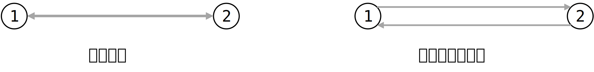

---
head:
  - - meta
    - name: keywords
      content: MicroCity,网络,拓补,network
---

# 操作网络
## 网络拓补化
网络拓补化简单来说就是一个网络有节点，有节点之间的连线。如果把连线理解为道路，那么你需要解决以下问题：
1. 这条路是单向通行的还是双向通行？
2. 这条路的起点是哪？终点是哪？

一般认为一个网络图中，每条道路都是单向的。如果需要一条双向通行的道路，只需要反向添加一条道路即可。像这样：

这样，每条路就有了通行方向。一般规定出发点的符号为O，目的点的符号为D，这样，使用O和D就能清晰地描述每条路的方向。

对于上图的示例，上方的道路O=1，D=2，所以方向描述为从1到2；下方的道路O=2，D=1，方向描述为从2到1。

## 使用函数对网络进行拓补
MicroCity可以处理网络，所有函数的具体用法见参考文档：[4.6 网络](../docs/4.6_networks.md)

此处简单列举几种创建MicroCity中网络对象的方法：
```lua
local network = CreateNetwork() 
```
创建一个空网络对象并返回此对象。`network`就是返回得到的空网络对象。

创建对象后，可以使用`AddLink`和`DelLink`等函数在网络对象中创建连接。具体用法见参考文档。

```lua
local network, nodes, links = CreateNetwork(Lines)
```
此处的`Lines`为一个矢量图形对象，类型为`Line`。MicroCity中的`CreateNetwork()`函数在这种用法中可以直接帮你在道路连线上添加起点和终点，并自动在返回的`links`对象中标上O点和D点的编号。

也就是说，你只需要提供网络连线即可，剩下的拓补化工作可以由函数自动完成。我认为这可能是最常用的创建网络图并进行拓补化的方法。

## 网络拓补的简单示例
```lua
-- 打开连线图层
Shapes = Open("Shapes.shp")

-- 拓补化网络
network, network_nodes, network_links = CreateNetwork(Shapes)

-- 创建图层，用于存放拓补后的网络节点
Nodes = CreateShapes("Nodes", "point")
-- 将拓补化网络得到的网络节点复制到图层中
AddField(Nodes, "ID", "int")
for i = 1, GetRecCount(network_nodes) do
	CopyShapeTo(Nodes, 0, 0, GetShape(network_nodes, i))
end

-- 创建图层，用于存放拓补后的网络连线
Links = CreateShapes("Links", "line")
-- 将网络连线中原有的属性字段复制到图层中
for i = 1, GetFieldCount(Shapes) do
	AddField(Links, GetField(Shapes, i))
end
-- 为连线添加属性字段，稍后会通过函数将对应的数据添加到其中
AddField(Links, "ID", "int")
AddField(Links, "O", "int")
AddField(Links, "D", "int")
AddField(Links, "IMPEDANCE", "double") --阻抗
AddField(Links, "DIRECTION", "int") --方向
AddField(Links, "CAPACITY", "double") --容量
-- 将拓补化网络得到的网络线路复制到图层中（包括对应数据）
for i = 1, GetRecCount(network_links) do
	CopyShapeTo(Links, 0, 0, GetShape(network_links, i))
end

-- 更新图层
Update(Nodes)
Update(Links)
```
> 示例改自MicroCity自带的编辑器

虽然一开始就输入了网络连线，但是在拓补化的过程中可能由于连线上的节点重合，在拓补化的过程中会把连续的连线拆成多段，因此得到的`Links`图层可能与输入的图层存在不同。而拓补化得到的节点`Nodes`和得到的连线`Links`是对应的，因此推荐使用拓补化处理完的Links图层作为网络节点之间的连线。

### 踩坑经验：创建网络对象
如果需要使用`CreateNetwork(Nodes, Links)`函数再次建立网络，需要保留以下在拓补化过程中添加的属性，否则将会出现网络初始化错误的问题：
```lua
AddField(Links, "ID", "int")
AddField(Links, "O", "int")
AddField(Links, "D", "int")
AddField(Links, "IMPEDANCE", "double") --阻抗
AddField(Links, "DIRECTION", "int") --方向
AddField(Links, "CAPACITY", "double") --容量
```

如果只是一次性地进行网络拓补，不会再用拓补化过的网络重新创建网络对象，也需要先创建以上属性。拓补化后数据并不会根据属性名称填入，而是根据位置填入。

如果只创建了`O`和`D`两个属性，则`O`的属性中会被填入`ID`数据，而`D`的属性中会被填入`O`的数据。而如果只根据上面的顺序创建了`ID`、`O`、`D`三个属性，由于数据顺序根据位置填入，则最终的填入的数据是正确的。

### CopyShapeTo函数
拓补的操作中使用了`CopyShapeTo()`函数，其作用是将一个`Shape`对象复制到`Shapes`图层中的对应位置，并根据输入的`dx`和`dy`在`Shapes`图层中进行位置变换。其中，`dx`和`dy`分别为在`x`和`y`方向上的位移量（理解为deltax和deltay）。
```lua
CopyShapeTo(TargetShapes, dx, dy, Shape1 [, Shape2, ...])
```
根据函数的用法可以看到，还支持复制到多个图层上的对应位置后再进行变换。
如果只想将图形复制到对应图层的对应位置，而不进行变换，可以将`dx`和`dy`设为`0`，像这样：
```lua
CopyShapeTo(TargetShapes, 0, 0, Shape1 [, Shape2, ...])
```
`CopyShapeTo()`函数的具体用法见 [4.3 矢量图形和表格](../docs/4.3_shapes_and_tables.md)

## 网络拓补化后算法的使用
对网络进行拓补化后，可以使用自带的函数求解很多问题，如：最短路径生成树、最短路径、最短距离等。本文以计算最短路径和最短路长为例介绍一下计算最短路径的流程及踩过的坑

### 计算最短路径和最短路长
要计算最短路径，首先必须要清楚计算网络中哪两个点之间的最短路径。这里以`startID`和`endID`分别表示起点和终点。本文假设你已经创建了网络对象，并存入名为`Network`的变量中。如果你不知道该如何创建一个网络图，可以参考上方介绍的 [网络拓补化](#网络拓补化) 流程。

#### 创建最小生成树
**第一步**，先要以`startID`为开始点创建最短路径生成树。理论上以始点创建最短路径生成树后，就可以获取始点到网络上任意一点的最短距离。创建最短路径生成树可以调用`GenSTPTree()`函数实现。
```lua
GenSTPTree (Network, startID [, endID])
```
此处的endID不是必须的，如果有可以提供给函数。也就是说，您共有两种做法实现这一步：
```lua
GenSTPTree (Network, startID) --方法1
GenSTPTree (Network, startID , endID) --方法2（建议）
```
一般认为提供的信息越完备，执行的效果越好。由于在计算最短路径之前就知道`endID`，因此建议将其提供给函数。
> 此处已经对函数的这种中括号写法进行了解释，后文中将会直接使用这种写法。

**第二步**，获取最短路径对应的信息。前面提到，确定起点和终点后才能确定两点之间的最短线路。由于前面使用始点`startID`创建了最小生成树，因此现在只需要提供终点`endID`就能获取到最短路径和最短路长。下面介绍了使用网络对象`Network`获取最短路长和最短路径的方法。

#### 获取最短路长
MicroCity的文档中提供了3种获取最短路径的方式。

**第一种**，由于前面计算了最短路径生成树，已经输入了起始点的信息。因此现在只需要提供终点信息即可。（即使刚刚可能已经提供了终点信息）函数需要网络对象`Network`和终点`endID`用法如下。
```lua
local len = GetSTPLen (Network, endID)
```

**第二种**，通过提供始点`startID`和终点`endID`计算两个点在网络上的最短路长。这种用法不要求在计算最短路径前先生成最短路径生成树，可以直接使用。`Network`为网络对象，用法如下：
```lua
local len = GetSTPLen (Network, startID, endID)
```

**第三种**，通过提供始点和终点的xy坐标计算两个点在网络上的最短路长。这种用法也不需要在计算最短路径前先生成最短路径生成树，可以直接使用。起点的坐标设为`x1`，`y1`；终点的坐标设为`x2`，`y2`，`Network为`网络对象，用法如下：
```lua
local len = GetSTPLen (Network, x1, y1, x2, y2)
```

#### 获取最短路径
MicroCity的文档中提供了3种信息可供获取，分别为：
1. 点或线的**ID**序列
2. 点或线的索引(**index**)序列
3. 点或线的形状(**Shape**)序列。

函数的详细用法请参阅 [4.6 网络 - 算法](../docs/4.6_networks.md#algorithms)，此处仅以第2种：点或线的索引序列作为示例。

返回点的序列：
```lua
GetSTPPath (Network, endID, "iNodeShp")
```
返回线的序列：
```lua
GetSTPPath (Network, endID, "iLinkShp")
```
这样就能返回所有点或线的索引序列了。

---

### 踩坑经验：序列
在[LUA语言快速上手](./lua)中介绍过LUA中的**集合**，它提供了丰富的特性帮助编写代码。但是没有听说过序列。**序列**是下面这个东西：
```lua
local x, y = GetCenterXY(Shapes) --借用一下这个函数
```
里面的`x,y`就是一个序列。还有这种情况：
```lua
GetDistance (x1, y1, x2, y2 [, x3, y3, ...]) --再次借用一个函数
```
在这种情况下，输入的点越多，返回值也越多。如果输入4个点，可以这样处理：
```lua
-- 正常情况
d1, d2, d3, d4 = GetDistance (x1, y1, x2, y2, x3, y3, x4, y4)

-- 也可以仅取前两个返回值
d1, d2 = GetDistance (x1, y1, x2, y2, x3, y3, x4, y4)

-- 当然，只取一个返回值也可以
d1 = GetDistance (x1, y1, x2, y2, x3, y3, x4, y4)
```

上面的函数输入参数数量和输出参数数量是有关系的。如果输入了n个点的参数，就会返回n个点的距离。但是对于网络拓补来说，在返回最短路径的时候返回的都是参数序列，而我并不知道函数会给我传出多少个参数；而且当输出参数的个数太多的时候，也不太可能手动创建很多个变量存放这些参数。
```lua
-- 错误做法：
local indexList = GetSTPPath (Network, endID, "iLinkShp")
-- GetSTPPath()函数不会返回一个table
-- 这里获取到的indexList只是第一个Link的index，是一个数值。
```

既然等号左边没有办法改变，就从等号右边做出改变。还记得怎么定义一个最简单的table吗？
```lua
local list = {1, 2, 3, 4, 5}
```
右边的`1, 2, 3, 4, 5`其实可以看做一个序列。所以，只要给函数的返回值加上括号就能把他们全部捞起来 ( •̀ ω •́ )✧
```lua
local indexList = { GetSTPPath (Network, endID, "iLinkShp") }
```
上面的这种做法得到的`indexList`就是一个table类型的变量了。然后就可以开始执行集合的各种操作了捏😋