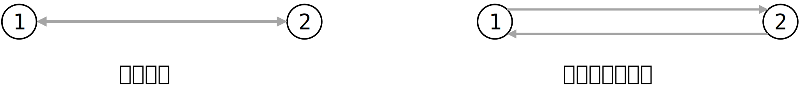

---
head:
  - - meta
    - name: keywords
      content: MicroCity 网络 拓补 network
---

# 操作网络
## 网络拓补化
说人话就是，一个网络有节点，有节点之间的连线。如果把连线理解为道路，那么你需要解决以下问题：
1. 这条路是单向通行的还是双向通行？
2. 这条路的起点是哪？终点是哪？

一般认为一个网络图中，每条道路都是单向的。如果需要一条双向通行的道路，只需要反向添加一条道路即可。像这样：

这样，每条路就有了通行方向。一般规定出发点的符号为O，目的点的符号为D，这样，使用O和D就能清晰地描述每条路的方向。

对于上图的示例，上方的道路O=1，D=2，所以方向描述为从1到2；下方的道路O=2，D=1，方向描述为从2到1。

## 使用函数对网络进行拓补
MicroCity可以处理网络，所有函数的具体用法见参考文档：[4.6 网络](../docs/4.6_networks.md)

此处简单列举几种创建MicroCity中网络对象的方法：
```lua
local network = CreateNetwork() 
```
创建一个空网络对象并返回此对象。`network`就是返回得到的空网络对象。

创建对象后，可以使用`AddLink`和`DelLink`等函数在网络对象中创建连接。具体用法见参考文档。

```lua
local network, nodes, links = CreateNetwork(Lines)
```
此处的`Lines`为一个矢量图形对象，类型为`Line`。MicroCity中的`CreateNetwork()`函数在这种用法中可以直接帮你在道路连线上添加起点和终点，并自动在返回的`links`对象中标上O点和D点的编号。

也就是说，你只需要提供网络连线即可，剩下的拓补化工作可以由函数自动完成。我认为这可能是最常用的创建网络图并进行拓补化的方法。

## 网络拓补的简单示例
```lua
-- 打开连线图层
Shapes = Open("Shapes.shp")

-- 拓补化网络
network, network_nodes, network_links = CreateNetwork(Shapes)

-- 创建图层，用于存放拓补后的网络节点
Nodes = CreateShapes("Nodes", "point")
-- 将拓补化网络得到的网络节点复制到图层中
AddField(Nodes, "ID", "int")
for i = 1, GetRecCount(network_nodes) do
	CopyShapeTo(Nodes, 0, 0, GetShape(network_nodes, i))
end

-- 创建图层，用于存放拓补后的网络连线
Links = CreateShapes("Links", "line")
-- 将网络连线中原有的属性字段复制到图层中
for i = 1, GetFieldCount(Shapes) do
	AddField(Links, GetField(Shapes, i))
end
-- 为连线添加属性字段，稍后会通过函数将对应的数据添加到其中
AddField(Links, "ID", "int")
AddField(Links, "O", "int")
AddField(Links, "D", "int")
AddField(Links, "IMPEDANCE", "double") --阻抗
AddField(Links, "DIRECTION", "int") --方向
AddField(Links, "CAPACITY", "double") --容量
-- 将拓补化网络得到的网络线路复制到图层中（包括对应数据）
for i = 1, GetRecCount(network_links) do
	CopyShapeTo(Links, 0, 0, GetShape(network_links, i))
end

-- 更新图层
Update(Nodes)
Update(Links)
```
> 示例改自MicroCity自带的编辑器

虽然一开始就输入了网络连线，但是在拓补化的过程中可能由于连线上的节点重合，在拓补化的过程中会把连续的连线拆成多段，因此得到的`Links`图层可能与输入的图层存在不同。而拓补化得到的节点`Nodes`和得到的连线`Links`是对应的，因此推荐使用拓补化处理完的Links图层作为网络节点之间的连线。

### CopyShapeTo函数
拓补的操作中使用了`CopyShapeTo()`函数，其作用是将一个`Shape`对象复制到`Shapes`图层中的对应位置，并根据输入的`dx`和`dy`在`Shapes`图层中进行位置变换。其中，`dx`和`dy`分别为在`x`和`y`方向上的位移量（理解为deltax和deltay）。
```lua
CopyShapeTo(TargetShapes, dx, dy, Shape1 [, Shape2, ...])
```
根据函数的用法可以看到，还支持复制到多个图层上的对应位置后再进行变换。
如果只想将图形复制到对应图层的对应位置，而不进行变换，可以将`dx`和`dy`设为`0`，像这样：
```lua
CopyShapeTo(TargetShapes, 0, 0, Shape1 [, Shape2, ...])
```
`CopyShapeTo()`函数的具体用法见[4.3 矢量图形和表格](../docs/4.3_shapes_and_tables.md)