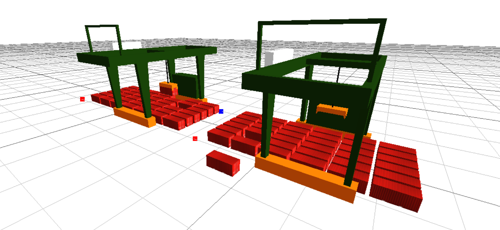

# 面向对象编程

面向对象编程（Object Oriented Programming）是一种编程思想，它将真实世界中的事物抽象成程序世界中的对象，对象之间通过消息传递进行通信，从而构成程序的功能。



网上说的面向对象编程具有三大特征，即封装、继承和多态。但是我认为在这个仿真中用得最多的就是封装，继承和多态用的机会很少。此外，我暂时还没有在MicroCity中实现过对象的消息传递，如果实现了会继续更新本文。因此下面主要介绍一下如何在适用于MicroCity的lua代码中使用封装。

::: tip
本文中的代码示例适用于MicroCityWeb，对于桌面版的MicroCity不一定适用。此外，本文均为个人感悟，不保证概念绝对的正确性。
:::

## 面向对象编程的基本概念
### 类和对象

通俗来说，**类是对象的模板，对象是类的实例（实体）。**

类是面向对象编程的基本概念，它是对一类事物的抽象。类的概念可以理解为一类对象，比如AGV、货架、场桥等。你可以把类理解为一类事物的模板，而对象则是根据这个模板创建出来的具体的事物。

一个比较好的例子是上面提到的货架。货架是一个类，那么具体的货架就是一个对象。货架类中包含了货架的各种属性，比如货架的位置，装载的货物等。通过货架类创建出来的不同的货架对象都属于货架类，比如货架1、货架2等，尽管它们的属性可能不同，但是它们都是货架类的对象。

### 类的属性和方法

在MicroCity的仿真中，就我个人遇到的情况而言，类一般会有属性，但是不一定会有方法。延续上面举的货架的例子来说，属性是类的特征，比如货架的位置、货架上的货物等。方法是类的行为，通常使用函数体现，比如AGV将货架抬起、放下、AGV移动或者带动货架移动。

## 仿真中使用面向对象的优点和缺点
### 优点
在MicroCity中，就涉及到多个同类物体移动、播放物体移动动画等场景而言（如AGV、货架、场桥移动等），需要进行比较大量的坐标计算和位置设置。如果对每个对象都实现一次，那么修改各个对象坐标的代码将会非常冗长，而且不易于维护。**如果使用面向对象的编程思想，可以将数据处理的代码封装成一个个的对象，也能使代码更加更具有可读性和可维护性。**

此外，如果在场景中创建多个同类对象，各个对象的参数也可能各不相同。如果使用面向对象的方法封装，可以将各个对象的参数封装在各个对象自身中。当仿真流程或者规模变得复杂时，**能够增加代码的复用性。**

对于仿真来说，最重要的是搞清楚仿真的业务流程和业务逻辑。**使用面向对象编程可以使仿真的业务流程和业务逻辑体现得更清晰，使代码的可读性提高，更具有可维护性。** 此外，当需要修改一类对象的业务逻辑时，只需要进入类中修改即可。比如修改一个港口中所有场桥的调度算法，由于所有场桥共用一套调度算法，因此只需要修改一次即可。

就我个人的情况而言，采用面向对象的方法封装对象时大多是希望创建一个通用的对象，然后在后续的仿真中通过自动或手动的方式创建多个同类对象，而各个对象的参数各不相同。这么做会使得代码通用性增加，而且也能够使得代码更加易懂，为后续的维护和修改提供便利，为大规模的仿真打下基础。

### 缺点
**如果仿真规模很小，代码量不大的简单的操作，不建议使用面向对象的方法封装代码。** 使用面向对象的方法会增加代码行数，甚至会使代码看起来显得比原问题更加复杂。（当然你要用也不会有什么后果，只是看起来会比较奇怪而已）具体可以参考下文提供的代码示例，不难发现，代码主要篇幅用在描述类及其业务逻辑上，而业务流程的代码很简单，且占比很小。

## 面向对象在Lua中的实现
在Lua中，面向对象的概念通常使用table实现。table是Lua中的一种数据结构，它可以用来表示数组、字典、对象等。在面向对象的编程中，table也可以用来表示对象。

### 示例
由于MicroCity中创建的对象都是table，因此我们可以在创建对象时，将对象的属性直接封装在table中，然后返回这个table。

下面是一个例子：

```lua
-- 函数将返回一个AGV对象
function AGV()
    -- 在MicroCity中创建一个AGV的3d对象
    local agv = scene.addobj('/res/agv.glb')

    -- 设置对象的属性
    agv.position = {0, 0, 0} -- 设置对象的位置
    agv.speed = 1 -- 设置对象的速度

    function agv:move(dx, dy, dz)
        agv.position = {agv.position[1] + dx, agv.position[2] + dy, agv.position[3] + dz} -- 修改对象坐标

        agv:setpos(agv.position[1], agv.position[2], agv.position[3]) -- 设置对象位置
        scene.render() -- 渲染场景，不建议在这里调用，这里只是为了演示
    end

    return agv -- 返回对象
end

-- 对象的使用
local obj = AGV() --创建对象
obj:move(1, 0, 0) --对象向x方向移动1个单位
```

或者你也可以选择在创建对象后，将对象的封装在一个table中，然后返回这个table。

```lua
-- 函数将返回一个AGV对象
function AGV()
    -- 直接在要返回的table中设置对象属性
    local agv = {
        object = scene.addobj('/res/agv.glb'),
        position = {0, 0, 0},
        speed = 1
    }

    function agv:move(dx, dy, dz)
        agv.position = {agv.position[1] + dx, agv.position[2] + dy, agv.position[3] + dz} -- 修改对象坐标

        agv.object:setpos(agv.position[1], agv.position[2], agv.position[3]) -- 设置对象位置
        scene.render() -- 渲染场景，不建议在这里调用，这里只是为了演示
    end

    return agv -- 返回对象
end

-- 对象的使用
local agv = AGV() --创建对象
agv:move(1, 0, 0) --对象向x方向移动1个单位
```

还有一种创建对象的方法是使用`setmetatable`，这属于高级用法，但是感觉用到的场景不多后来我也用得比较少了。但是使用这种方法好像可以实现类的继承，如果你感兴趣可以自行搜索。这里提供我早期作业中创建货架类的代码实现供参考。（现在感觉这个类写得不算很好😂，比如 `x`,`y` 可以用 `pos = {x, y}` 代替，`x_origin` 和 `y_origin` 可以使用 `origin = {x, y}` 代替）

```lua
-- 货架
Shelf = {
    x = 1,
    y = 1,
    cargo = {"box"}, -- 货物
    x_origin = 1, -- 货架原始x坐标
    y_origin = 1 -- 货架原始y坐标
}

function Shelf:New(x, y)
    local self = {}
    setmetatable(self, {
        __index = Shelf
    })
    self.__index = self

    self.x = x
    self.y = y
    -- 设置原始坐标
    self.x_origin = x
    self.y_origin = y
    return self
end
```

## 类的类型
我在这里还想总结一下我创建过的类主要有什么类型。

1. **3D实体类。** 主要控制3D实体的运动，如AGV、场桥等，它们大多具有实体且需要移动。有的甚至还包含子对象，比如场桥对象具有吊具、绳索、吊车等子对象。
2. **数据模型。** 比如堆场，货架、货物。具体来说比如堆场类中包含堆场的长宽、堆场中的货物、堆场中的集装箱等数据。

需要注意的是，我认为这些类型也不是严格区分的，某些类甚至共同具有这些类的特性，严格区分这个类属于哪种类型也没有太大意义。比如AGV类中也包含了AGV的位置、速度等数据，而货架类只是存储了货架模型，货架模型的移动还是交由AGV控制，而其更重要的功能是记录货架上货物的信息。因此，我认为这些类型只是一种大致的划分，具体的实现还是要根据实际业务流程和需求情况来。