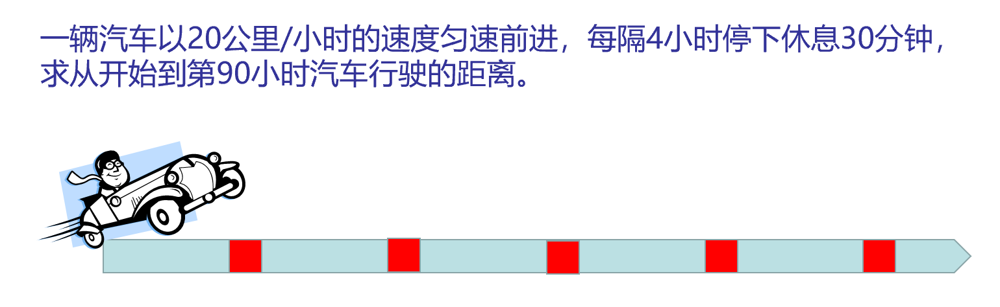

# 时间推进法
仿真中的时间推进法是指在仿真过程中，如何推进仿真时间。

## 时间推进法的分类
常见的仿真时间推进方法有三大类：
* 事件调度法：事件调度法是一种基于事件的仿真方法，它通过对仿真系统中各个事件进行排序，按照事件发生的先后顺序来进行仿真。
* 固定增量推进法：固定增量推进法是指在仿真过程中，固定一个时间增量，在设定起始时间后，在起始时间的基础上根据时间的增量来对时间进行推进模拟。
* 主导时钟推进法：主导时钟推进法是指在仿真过程中，由一个主导时钟控制整个仿真系统的运行，它通过控制时钟来控制仿真过程。

## 实例
### 事件调度法
事件调度法是一种基于事件的仿真方法，它通过对仿真系统中各个事件进行排序，按照事件发生的先后顺序来进行仿真。在仿真过程中，仿真系统会根据当前仿真时间和各个事件发生的时间来确定下一个要发生的事件，并将仿真时间推进到该事件发生的时间。

也就是说，事件调度法主要分为以下3个主要步骤，这3个步骤也是控制事件调度法的主控程序的主要步骤：
* 时间扫描：确定下—事件发生时间并将仿真时钟推进到该时刻
* 事件辨识：正确地辨识当前要发生的事件
* 事件执行：正确地执行当前发生的事件

流程图如下：
```flow
init=>start: 初始化
scan=>operation: 事件扫描
exec=>operation: 事件执行
ise=>condition: 判断是否结束
e=>end: 仿真结束

init->scan->exec->ise
ise(no)->scan
ise(yes)->e
```

#### 自动化仓库仿真中使用的简单事件调度法
[自动化仓库仿真思路](./warehouse-simulation.md)中使用的是简单的事件调度法，由于当时还没有完整了解事件调度法，因此可能不太成熟，但是也可以作为一种思路参考。主要流程如下:
1. 事先生成任务队列
2. 依次执行任务队列中的任务（事件扫描+事件执行）

由于这个仿真的目的是为了测试仓库的效率，因此在这个仿真中省去了任务相继到达的时间差。所以，每个任务执行完毕后立即执行下一个任务，不需要在任务结束后推进到下一个任务的开始时间（推进量为0）。因此，只需要计量每个任务花费的时间并叠加到总时长（Tick）中。

由于题目没有给出具体数据（如AGV移动速度等，因此相关指标都用单位1表示），因此最终只得到执行任务所需的单位时间。

此外，在[自动化仓库仿真思路](./warehouse-simulation.md)中提到的[改进空间](./warehouse-simulation.md#改进空间)也还使用了一部分的事件调度法。在改进的部分中，设定了从货架上装卸货物的时间，而这个时间一般不需要在仿真的过程中体现，且整个仿真中只有一个AGV在对货架进行操作，因此在**出库事件发生时，直接推进到装卸完毕的时间，进行货架归位操作。**

### 固定增量推进法
固定增量推进法是指在仿真过程中，固定一个时间增量，在设定起始时间后，在起始时间的基础上根据时间的增量来对时间进行推进模拟。在每个步长内，若无事件发生，则仿真钟再推进一个单位时间T；若在该步内有若干个事件发生，则认为这些事件均发生在该步的结束时刻。

::: center


例题
:::

#### 代码流程示例
```lua
while scene.render() do
    t = t + dt
    if t % cycle ~= work_time then
        d = d + v * dt
        print("出发后", t, "小时")
    else
        print("出发后", t, "小时,休息")
    end

    car:setpos(CastToLine(d)) --直线轨迹

    os.sleep(200)
end
```
> 此为代码主要流程，无法直接使用

### 主导时钟推进法
主导时钟推进法是指在仿真过程中，由一个主导时钟控制整个仿真系统的运行，它通过控制时钟来控制仿真过程。主导时钟推进法可以分为两类：同步主导时钟和异步主导时钟。同步主导时钟是指所有模块都使用相同的主导时钟进行推进；异步主导时钟是指不同模块使用不同的主导时钟进行推进。

[自动化仓库仿真思路](./warehouse-simulation.md)的最后一部分提到了[改进空间](./warehouse-simulation.md#改进空间)，最终实现了同步主导时钟的主导时钟推进法。
> 实现了但是没有放出代码

#### 自动化仓库仿真向主导时钟推进法的改变
具体来说，只在原来的基础上做了如下改动：
* 删除大部分与事件调度法有关的 `os.sleep()`。
  > 由于仿真流程比较简单，保留了与装卸货有关的事件调度法，优化资源占用。
* 设置全局仿真时钟，将 `Agv:Move()` 函数的思路从“固定步长执行任务并刷新场景”的改为“监测仿真时钟时长变化，根据时长变化执行任务并刷新场景”
* 新增仿真速度调整。

从以上的改动可以看出，仿真的核心从事件任务转向了仿真时钟。其中，场景刷新的部分使用了 `os.clock()` 实现。下面是一个有关于主导时钟推进法和 `os.clock()` 函数的简单的示例，修改自MicroCityWeb中内置的方块旋转案例。

```lua
local obj = scene.addobj('box')

-- 初始位置
local x = 1
local y = 1
local z = 0

local rx, ry = 0.1, 0.1 -- x方向和y方向的旋转速度
local simspeed = 10 -- 仿真速度

local t = 0 -- 全局仿真时钟
local t0 = os.clock() -- 记录仿真开始的时间
while scene.render() do
    local dt = os.clock() - t0 -- 计算自上次记录时间以来的时间差
    t = t + dt -- 仿真时钟走过相应时间差长度的时间
    
    -- 设置方块此刻的旋转位置
	x = x + rx * dt * simspeed 
	y = y + ry * dt * simspeed 
	obj:setrot(x, y, z)
	
    t0 = os.clock() -- 记录仿真时间
end
```
相关说明
* 当仿真速度 `simspeed` 为1时，表示仿真时钟与真实世界时钟的速度相同。`simspeed` 可以视作加速倍率。
* `dt` 表示两次记录时间之间的时间差，仿真中的时间步进根据 `dt*simspeed` 计算得到。
  ::: info
  需要注意的是，时间增量 `dt` 的数值在每个循环周期一般都不相同，`dt` 的具体大小一般取决于电脑的运算能力
  :::
  ::: tip
  有时两次记录时间之间没有太多耗时的操作，计算得到的 `dt` 可能为0。一般两次时间记录之间存在一个 `scene.render()`，这样一般能够保证两次采样的时间之间能够计算得到一个不为0的时间差值。
  :::