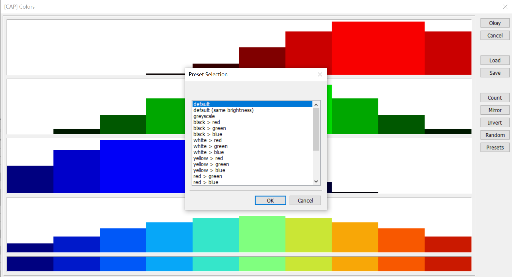

---
head:
  - - meta
    - name: keywords
      content: MicroCity,结果,可视化
---
# 结果可视化
本文介绍了多种将计算结果可视化的方法。包括改变内容的颜色，改变形状大小，改变元素显示的属性标签等。

## 改变形状颜色
在程序界面左下角的图形属性框内可以通过改变`Colors`栏目下的`Type`属性改变显示颜色的种类。共有3种选项：
- Unique Symbol：为同一个图层的所有图形指定某种颜色，此处不做过多介绍。
- [Lookup Table](#lookup-table-通过表中值改变颜色)：通过数值查询表格显示对应的颜色。
- [Graduated Color](#graduated-color-根据值的大小显示渐变色)：根据表中数值大小设置渐变色。

### Lookup Table 通过表中值改变颜色
将`Type`的属性值改为`Lookup Table`，根据表格中的数值改变图形的颜色，达到选中指定图形的效果。


此处示例将`Lookup Table`中的`Attribute`改为表格中的`SELECT`，通过表中的`SELECT`列值控制线的颜色（属性设置见上图）。当值为0时显示黑色，值为1时显示红色。表格中`SELECT`列的值和`Lookup Table`中的具体设置如下图。


最终实现的效果


### Graduated Color 根据值的大小显示渐变色
将`Type`的属性值改为`Graduated Color`，根据表格中不同数值的大小显示不同的颜色，达到显示渐变色的效果。


此处示例根据每个国家的人口数量显示渐变色。可以看到中国人口数量大，因此显示红色，印度人口数量也较大，因此显示橙色。其他地区人口数量较低，但也能通过颜色看出一些差别。


`Graduated Color`下的`Colors`属性中还可以调整其他配色方案。设置界面如下图，此处就不不一一列举了。



如果感兴趣可以参考文档[2.1 展示世界地图](../docs/2.1_showing_a_world_map.md)中的示例手动尝试更改此属性。


## 更改图形和标签的显示大小
### 参考系的选择
显示内容尺寸的参考系有2个，一个是以地图为参考系，一个是以屏幕为参考系。此处将图形和标签的显示尺寸都设置为相同的参考系。

内容以地图为参考系时，显示内容的大小会根据地图大小同步缩放，如下图：
::: center

(以地图为参考系放大)


(以地图为参考系缩小)
:::

内容以屏幕为参考系时，无论地图怎么缩放内容的大小都差不多，如下图：
::: center

(以屏幕为参考系放大)


(以屏幕为参考系缩小)
:::

因此，绘图的时候**要根据绘图的目的选定参考系**。
- 如果需要在地图上绘制确定尺寸的形状或者标明确定尺寸的标签，如绘制一个半径为10km的圆，此时应选用**以地图为参考系**。
- 如果仅需要在任何尺寸下都能清晰显示标签和图形，此时可以选择**以屏幕为参考系**。

#### 参考系应用实例
在图中绘制圆点，将圆的半径设置为圆的大小，并将圆的中心设置在每个绿点的中心上，**灰色圆的大小表示每个绿点的覆盖范围大小**。


图中**以地图为参考系(Map Units)**，以16为半径为每个绿点都绘制了一个灰色的圆，表示每个绿点的覆盖范围。这些灰色的圆存放在名为`Range.shp`的图层内，图层类型为`Points`。

### 参考系的设定
在程序界面左下角的图形属性框内可以设置图形及其标签的尺寸参考系。


如图标记的两个位置可以分别调整图形尺寸的参考系和标签尺寸的参考系。
- **图形尺寸参考系设置**：`Size`栏目下的`Size relates to...`调整图形尺寸的参考系，`Default Size`调整图形的相对于坐标系的尺寸。
- **标签尺寸参考系设置**：`Labels`栏目下的`Size relates to...`调整标签尺寸的参考系，`Default Size`调整的是标签(Labels)相对于坐标系的尺寸。

## 更改显示的标签
### 手动更改显示的标签
在程序界面左下角的图形属性框内可以设置图形及其标签的尺寸参考系。上图中显示的标签为`ID`，如果需要改为表格中的其他列，可以更改`Lables`栏目下的`Attribute`属性实现。

需要更改的属性位置如图，图中需要显示表中对应`MSG`列的值，只需要将`Labels`栏目下的`Attribute`属性值改为`MSG`即可。


但是每次更改图形并执行`Update()`函数后标签（Label）会取消显示。如果需要执行的脚本中含有此对于此图层的`Update()`函数，不必在每次执行完脚本后手动重新设置显示的标签，**可以通过脚本自动选择显示的标签**。

### 自动更改显示的标签
**通过`SetParameter()`函数可以更改属性值**。以上图`Labels`栏目下的`Attribute`属性为例，选中这条属性后可以看到底栏显示其`ID`为`LABEL_ATTRIB`，其类型为`Choice`。
> 需要注意的是，当类型为`Choice`时，参数值从1开始编号，编号顺次对应下拉菜单的内容。

点开这条属性以后，可以看到`MSG`在第二个。


由于Lua中编号一般由1开始，因此此处`ID`的编号对应1，`MSG`的编号对应2。需要操作对象为`MSG`，所以函数中需要填入`Choice`类型的参数值为2。

此时已经得到了所有需要的参数，可以使用`SetParameter()`函数对显示的标签进行更改。
```lua
-- transports为图形图层
SetParameter(transports, "LABEL_ATTRIB", 2)
```
> `SetParameter()`函数需要在`Update()`函数执行后再执行，否则效果会被`Update()`函数覆盖。

现在回过头来再看看`SetParameter()`函数的具体用法：
```lua
SetParameter (Shapes|Table|Grid|Scene|Module, "id", Number|"String"|Object)
```
|参数|含义|
|---|---|
|参数1|输入的对象，可以是`Shapes`、`Table`、`Grid`、`Scene`、`Module`|
|参数2|其中的`id`为属性对应的ID。如果是上文的情况，就是`LABEL_ATTRIB`|
|参数3|如果需要更改属性值，只接受数值(Number)、字符串(String)、对象(Object)三种类型|

`SetParameter()`函数的介绍出现在文档 [4.2 控制用户界面](../docs/4.2_ui_control.md) 中，请参阅。

## 借助栅格图
栅格图也可以用于可视化，我认为栅格图最常用的场景就是**绘制热力图**。热力图的绘制主要通过修改栅格图上每个格子的值实现。如果不清楚栅格图的具体结构，可以先参考文档 [3.3 栅格图](../docs/3.3_raster_grids.md)。关于使用脚本控制栅格图，可以参考文档 [4.4 栅格图形](../docs/4.4_grids.md)。

一种使用栅格图绘制热力图的场景就是**绘制地价图**。在绘制地价图时，我们可以遍历栅格图上的每个格点，计算该格点到每个仓库的距离之和。然后将该格点的值设置为这个值，就可以得到一张热力图。这种方法可以帮助我们可视化地价的分布情况，并且可以用来发现地价的趋势和规律。


