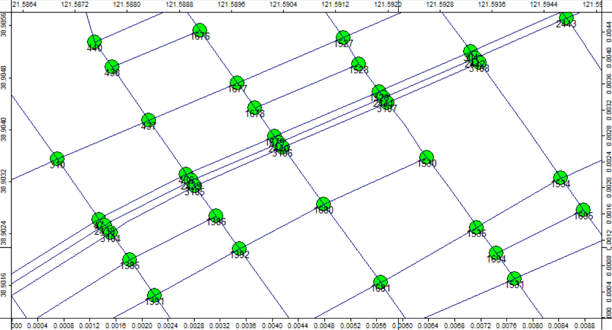

# 结果可视化
## 改变形状颜色
在程序界面左下角的图形属性框内可以通过改变`Colors`栏目下的`Type`属性改变显示颜色的种类。共有3种选项：
- Unique Symbol：指定颜色
- Lookup Table：通过数值查询表格显示对应的颜色
- Graduated Color：渐变色

### Lookup Table 通过表中值改变颜色
将`Type`为`Lookup Table`，根据表格中的数值改变图形的颜色，达到选中指定图形的效果。

此处示例将`Lookup Table`中的`Attribute`改为表格中的`SELECT`，通过表中的`SELECT`列值控制线的颜色（属性设置见上图）。当值为0时显示黑色，值为1时显示红色。表格中`SELECT`列的值和`Lookup Table`中的具体设置如下图。

最终实现的效果

### Graduated Color 根据值的大小显示渐变色
将`Type`为`Graduated Color`，根据表格中不同数值的大小显示不同的颜色，达到显示渐变色的效果。

此处示例根据每个国家的人口数量显示渐变色。可以看到中国人口数量大，因此显示红色，印度人口数量也较大，因此显示橙色。其他地区人口数量较低，但也能通过颜色看出一些差别。

`Graduated Color`下的`Colors`属性中还可以调整其他配色方案。设置界面如下图，此处就不不一一列举了。

如果感兴趣可以参考文档[2.1 展示世界地图](../docs/2.1_showing_a_world_map.md)中的示例手动尝试更改此属性。

## 更改图形和标签的显示大小
### 参考系的选择
显示内容尺寸的参考系有2个，一个是以地图为参考系，一个是以屏幕为参考系。此处将图形和标签的显示尺寸都设置为相同的参考系。

内容以地图为参考系时，显示内容的大小会根据地图大小同步缩放，如下图：

(以地图为参考系放大)

(以地图为参考系缩小)

内容以屏幕为参考系时，无论地图怎么缩放内容的大小都差不多，如下图：

(以屏幕为参考系放大)

(以屏幕为参考系缩小)

因此，绘图的时候要根据绘图的目的选定参考系。
- 如果需要在地图上绘制确定尺寸的形状或者标明确定尺寸的标签，如绘制一个半径为10km的圆，此时应选用**以地图为参考系**。
- 如果仅需要在任何尺寸下都能清晰显示标签和图形，此时可以选择**以屏幕为参考系**。

### 参考系的设定
在程序界面左下角的图形属性框内可以设置图形及其标签的尺寸参考系。

如图标记的两个位置可以分别调整图形尺寸的参考系和标签尺寸的参考系。
- **图形尺寸参考系设置**：`Size`栏目下的`Size relates to...`调整图形尺寸的参考系，`Default Size`调整图形的相对于坐标系的尺寸。
- **标签尺寸参考系设置**：`Labels`栏目下的`Size relates to...`调整标签尺寸的参考系，`Default Size`调整的是标签(Labels)相对于坐标系的尺寸。

## 更改显示的标签
在程序界面左下角的图形属性框内可以设置图形及其标签的尺寸参考系。上图中显示的标签为`ID`，如果需要改为表格中的其他列，可以更改`Lables`下的`Attribute`属性实现。