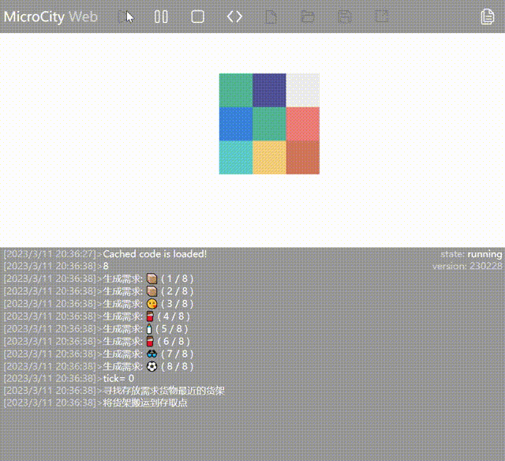
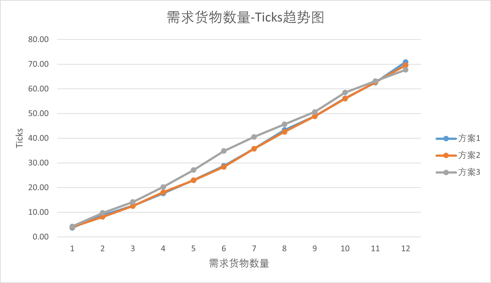

# 自动化仓库仿真思路

> 本文思路仅供参考，建议做出适当改进。

## 具体问题：基于元胞自动机的仓库仿真


其中，出入库位置可以更改，叉车为AGV。

也就是说，这其实是一个移动货架仓库的元胞自动机仿真。AGV可以从货架底部穿过，可以移动到货架底部，把货架抬起并运送到出入库点。

### 基本假设
* 所有货架上的货物相同
* 一个货架只放一个货物

因此，出库和入库可以看做完全相反的过程，所以此处只需要详细讨论出库的情况。即默认货架上本身就有货物。

### 总体实现思路
* 将整个 $3\times3$ 的仓库中每个元胞的位置赋予 $(x,y)$ 坐标，方便后续的移动操作。
* 以AGV为核心，对货架进行操作。AGV处于升起状态移动货架时，只需要将货架的坐标位置同步设为AGV的位置即可达到AGV移动货架的效果。

#### 业务流程
先按照需求数量乱序生成订单列表，AGV根据订单顺序依次将货架移动到出库点进行出库操作。

#### 业务逻辑
当执行出库时，AGV先找到最近的货架并移动到那个货架的位置，抬起货架。为货架（AGV）设定移动的终点，计算曼哈顿距离差值。
  * 每次移动前都通过是否有障碍物判断货架移动的方向（$x$ 方向或 $y$ 方向）。
  * 如果两个方向都被堵塞，则优先选择 $y$ 方向（人为规定），将这个方向的障碍物递归移走，为货架移动腾出空间。如果 $y$ 方向没有空间才选择移动 $x$ 方向。

### 过程优化：关于旧方法和新方法
这两种方法都是可用的方法，但是 **新方法对特定场景进行了优化，通过对障碍进行预判减少了操作步骤。** 问题见下图

**旧方法：无障碍预判**（进出货点在 $x=3,y=3$ 的位置）
::: center

:::

👉 AGV完成第一个货架的出库后，向第二个货架移动，但是发现第一个货架挡住了去路，因此又回到第一个货架的位置将其移开，再回到第二个货架进行出库操作。

**新方法：预判障碍**（进出货点在 $x=3,y=3$ 的位置）
::: center

:::

👉 AGV完成第一个货架的出库操作后判断后一个货架是否需要移动其他位置的货架才能到达出入库点。如果需要，则移动障碍货架后才前往后一个货架进行出库。

::: info
本着尽量少占用出入库点的原则，当有空位时AGV将把在出入口的货架移走。因此某些看起来冗余的操作并非没有考虑全面。
:::

不同数量货架对应的最优布局方案（动图）
8个货架的情况，上面已经进行了展示。下面仅展示表中货架数为5和7的情况。其他情况详见附件。

### 仿真数据收集分析
#### 出入库效率最高
仿真结果如下图所示，表示相同货架数量下得到的效率最佳货架的货架布局
* 最佳货架布局：相同货架数量下，取出所有货物操作次数（ticks）最小

**布局图说明**
* 白色：没有放置货架
* 浅灰色：货架，但是AGV一开始位于这个货架下方
* 灰色：货架。

**表格说明**
* 货架数量：存在于布局图中的货架数量
* 旧ticks：使用旧方法（无预判障碍）实现取货的操作次数。
* 新ticks：使用新方法（预判障碍）实现取货的操作次数。后面将对新方法进行说明。
* 黄色高亮：相同布局下操作次数最少（ticks最小）的方案

::: center

:::

#### 空间利用率最大
如果所有位置都放置货架，则无法访问到所有货架。因此，空间利用率最大的方法是放置8个货架。

**颜色说明**
* 绿色：有货物的货架
* 紫色：没有货物的货架
* 浅紫色：AGV抬起的货架
* 深紫色：AGV在这个货架下面，但是没有抬起货架
* 深灰色：进出货点

> 有时候刷新太快可能看不出AGV抬起

**进出货点在x=2，y=3的位置**


### 创新点
* 额外考虑货物种类不同的情况。
* 每次仿真会根据货架上的货物乱序生成需求。
* 面向对象编程。使用面向对象的思想编程有助于将问题抽象化、有助于流程细节的改进；再加上好的命名方式会让整个程序的流程和逻辑清晰很多，不至于睡一觉起来就忘了😂

不同的货物类型用不同的颜色表示。AGV状态颜色、空货架的颜色、进出库点的颜色含义与之前相同。
* 紫色：没有货物的货架
* 浅紫色：AGV抬起的货架
* 深紫色：AGV在这个货架下面，但是没有抬起货架
* 深灰色：进出货点

5个货架的情况示例
::: center

:::

8个货架的情况示例
::: center

:::


## 仿真改进：三维化自动仓库仿真


在这一部分题目也稍微有所变化，要求将元胞自动机仿真仓库案例**三维化**，进行自动化仓库仿真。具体要求如上图。

### 总体思路
#### 三维化

以[**基于元胞自动机的仓库仿真**](#具体问题-基于元胞自动机的仓库仿真)为核心，**将其中元胞自动机仿真的部分改写为内部数据表，作为内部数据模型**，对整个仿真过程的状态进行监视和控制。

由于[基于元胞自动机的仓库仿真](#具体问题-基于元胞自动机的仓库仿真)使用了**面向对象**的方法封装对象，业务逻辑和流程的构建中大面积使用了对象方法，因此此处只需要改写对象方法（如 `Agv:Move(dx, dy)` 等）即可实现由元胞自动机仿真到三维化自动仓库的仿真。
> 如果程序整体结构设计优良，应用“面向对象”将会大幅提升程序的可维护性，降低移植难度。

对于AGV、货架直接套用现成模型；对于货物，只需要设置其距离货架的相对高度列表即可实现货物自动存放于指定高度。
::: tip
如果需要套用现成模型，或者申请上传模型到本文作者维护的仓库，请参考文档 [3D对象-外部模型](./3d-objects.md#外部模型)
:::

#### 出入库需求波动极大
* 根据题目要求，基本上只存在有限的2种情况：3个货架、6个货架。
* 由于货架数量情况有限，而[基于元胞自动机的仓库仿真](#具体问题-基于元胞自动机的仓库仿真)中得到了性能最佳的仓库布局，因此可以直接套用对应货架数量的最佳布局，本问题中只需要考虑固定货架布局下货物的位置摆放问题。
* **对于3个货架的情况**，其最佳布局属于高度对称的形态，距离出入库点的距离都为1，因此这种情况下只需要对1种情况进行仿真、收集其数据。
* **对于6个货架的情况**，选取了3种情况进行多次仿真，得到每种情况出入库耗费Ticks的平均值、最大值、最小值。
  > 当前Ticks是AGV移动的次数，相当于单位操作时间。后文[改进空间](#改进空间)中提到了可以进行的改进
* 经过以上分析可以看出情况有限，因此可以通过控制货物需求总数不变，每次随机生成需求货物种类的方式对各种货物摆放位置进行仿真、对得到数据进行分析，最终确定最佳的货物布局方案。

### 改进
在测试的过程中发现原有移动货架的策略不合理，改进了移动货架的策略。

**旧策略：** 找到离AGV最近的装有需求货物的货架，将其移动到出入库点。


可以看到AGV已经将需要出库的同种货物（青色方块）移动到了出入库点，但是由于AGV移动的货架对象是旁边的货架，因此没有对已经在出入库点的货物进行出库。


**新策略：** 找到离出入库点最近的装有需求货物的货架，将其移动到出入库点。改变策略后，没有发现以上提到的不合理情况出现。


### 创新
由于测试的次数较多，因此将主体流程写入函数并进行适应性改进，实现自动对所有情况进行仿真测试并将数据输出。下图为自动仿真测试运行为示例。


自动仿真测试流程代码，仅供参考

```lua
-- 批量测试
local cargo_ubs = {1, 2, 3, 4, 5, 6, 7, 8, 9, 10, 11, 12} -- 测试需求(上限)序列

local output_string_list = {} -- 测试结果列表字符串
for k, v in ipairs(cargo_ubs) do
    local test_result = {} -- 本需求上限测试结果序列
    cargo_ub = v -- 设置需求数量上限
    for j = 1, test_count do
        scene.setenv({
            grid = 'plane',
            clear = true
        }) -- 清空场景内容

        print("测试(", j, "/", test_count, ")：需求数量为", cargo_ub)
        local tick = ModelRun() -- 运行仿真模型返回测试结果
        table.insert(test_result, tick) -- 将测试结果插入测试结果序列
    end

    local output_string = ""
    print("需求数量为", cargo_ub, "的测试结果序列:")
    for i = 1, #test_result do -- 输出测试结果序列到列表字符串
        output_string = output_string .. test_result[i] .. "\t"
    end
    print(output_string)
    table.insert(output_string_list, output_string)
end

-- 输出测试测试结果列表
for i, str in ipairs(output_string_list) do
    print("需求数量为", cargo_ubs[i], "的测试结果序列:", str)
end
```

在自动仿真测试的过程中发现了BUG，详见下文说明。

### 货架布局方案


颜色说明
* 浅蓝色：出入库点
* 白色：空格
* 深蓝、红、黄：3种货物对应的颜色

条件假设
* 每个货架上都放有2个同类货物
* 货物需求随机，没有种类偏好
* 每次只取出一个货物

### 仿真结果及分析
对每个货物布局方案中每种需求数量的情况仿真测试30次，求单方案结果中的最大值、最小值、平均值。最终得到结论为在6个货架的情况中，方案2的布局表现最优。

#### 方案3：3个货架


#### 方案6
方案6平均Ticks总趋势图


方案6最优布局方案：方案2


还应绘制分方案的“需求量-最短平均服务时间”单位趋势图。以下以方案6-1为例，横坐标为货物需求数量，纵轴为最短平均服务时间（Ticks）。


### 改进空间
由于题目没有给定具体事件的执行时间，也没有指定时间单位，因此此处只计量货架的操作次数作为耗费的时间。也就是说，时间是后计算的，我想大部分同学做到这里可能都是这样的思路。虽然最终得出的结果没有问题，但是思路还可以转变一下，适应于后面的学习。

当前思路是以任务驱动的。虽然能够得到一个正确的结果，但是没有利用仿真时间，这种做法在只控制一个实体的时候不会出现问题。当要同时处理多个实体的时候，当前思路就无法做到同时操作多个实体完成任务，只能实现多个实体依次完成任务的情况。当前思路的具体流程如下：
```flow
event=>start: 任务队列
eventcond=>condition: 还有任务
exec=>operation: 执行当前任务
addtime=>operation: 计算耗费时间
sumtime=>end: 得到总时间

event->eventcond
eventcond(yes,left)->exec->addtime->eventcond
eventcond(no,bottom)->sumtime
```

由于应用的是时间推进法，因此仿真世界中有属于它自己的时间。对于我们来说，我们可以通过在仿真时间上乘一个倍率实现控制仿真速度，这个倍率就是仿真速度。此外，这种做法更加容易支持考虑多对象的情况。具体流程如下：
```flow
event=>start: 任务队列
eventcond=>condition: 还有任务
time=>operation: 获取当前时间（考虑仿真速度）
exec=>operation: 刷新任务执行进度
sumtime=>end: 得到总时间

event->eventcond
eventcond(yes,left)->time->exec->eventcond
eventcond(no,bottom)->sumtime
```
这样就改为了以时间为核心的仿真，在刷新任务执行进度的时候就可以直接刷新场景中的所有实体。由于仿真以时间为核心，因此就需要设定各种操作的速率/时间，保证时间计算的准确性。在MicroCityWeb中，有一些技巧可以用于时间推进法的仿真。

#### 使用系统时间更新仿真时间
`os.clock()`函数可以获取系统当前的时间（以秒为单位，但是是小数）。有了这个函数就可以做到仿真与现实时间的同步。用法示例可以参考[时间推进法](./timelapse.md#主导时钟推进法)

由于整个仿真的核心为时间，因此需要对之前没有规定的操作规定其需要花费的时间长度。在改进的部分中，又额外考虑了以下操作所要花费的时间：
* 货物出入库所要花费的时间
* AGV举起和降落货架所要花费的时间