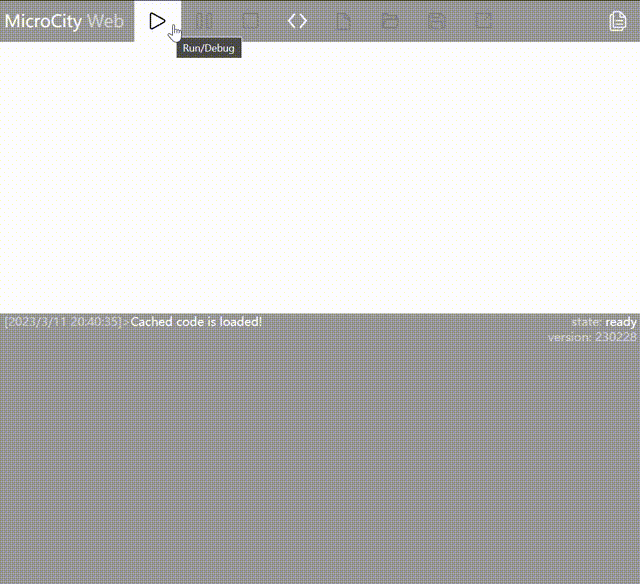
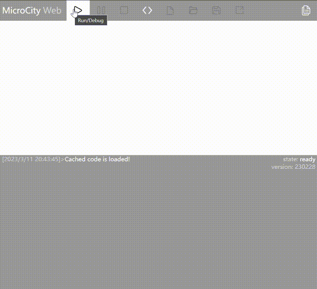
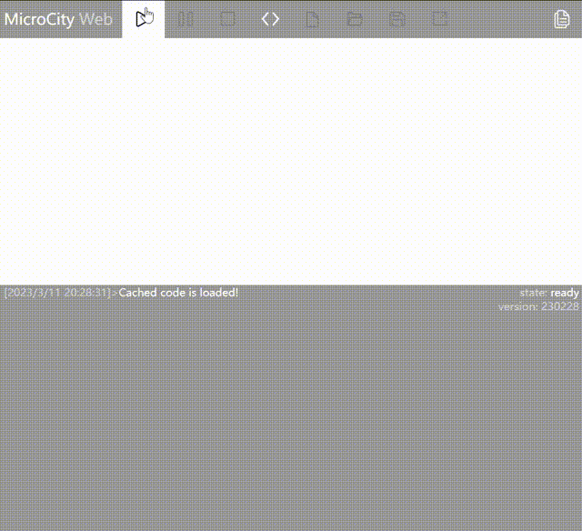

# 自动化仓库仿真思路
> 以下思路仅供参考

## 具体问题：基于元胞自动机的仓库仿真

其中，出入库位置可以更改，叉车为AGV。

也就是说，这其实是一个移动货架仓库的元胞自动机仿真。AGV可以从货架底部穿过，可以移动到货架底部，把货架抬起并运送到出入库点。

### 基本假设
* 所有货架上的货物相同
* 一个货架只放一个货物

因此，出库和入库可以看做完全相反的过程，所以此处只需要详细讨论出库的情况。即默认货架上本身就有货物。

### 总体实现思路
* 将整个3*3的仓库中每个元胞的位置赋予$(x,y)$坐标，方便后续的移动操作。
* 以AGV为核心，对货架进行操作。AGV移动货架时，只需要将货架的坐标位置同步设为AGV的位置即可达到AGV移动货架的效果。
* 当执行出库时，AGV先找到最近的货架并移动到那个货架的位置，抬起货架。为货架（AGV）设定移动的终点，计算曼哈顿距离差值。
  * 每次移动前都通过是否有障碍物判断货架移动的方向（x方向或y方向）。
  * 如果两个方向都被堵塞，则优先选择y方向（人为规定），将这个方向的障碍物递归移走，为货架移动腾出空间。如果y方向没有空间才选择移动x方向。

### 过程优化：关于旧方法和新方法
这两种方法都是可用的方法，但是**新方法对特定场景进行了优化，通过对障碍进行预判减少了操作步骤。**问题见下图

**旧方法：无障碍预判**（进出货点在x=3,y=3的位置）

👉 AGV完成第一个货架的出库后，向第二个货架移动，但是发现第一个货架挡住了去路，因此又回到第一个货架的位置将其移开，再回到第二个货架进行出库操作。

**新方法：预判障碍**（进出货点在x=3,y=3的位置）

👉 AGV完成第一个货架的出库操作后判断后一个货架是否需要移动其他位置的货架才能到达出入库点。如果需要，则移动障碍货架后才前往后一个货架进行出库。

提示：本着尽量少占用出入库点的原则，当有空位时AGV将把在出入口的货架移走。因此某些看起来冗余的操作并非没有考虑全面。

不同数量货架对应的最优布局方案（动图）
8个货架的情况，上面已经进行了展示。下面仅展示表中货架数为5和7的情况。其他情况详见附件。

### 仿真结果示例
#### 出入库效率最高
仿真结果如下图所示，表示相同货架数量下得到的效率最佳货架的货架布局
* 最佳货架布局：相同货架数量下，取出所有货物操作次数（ticks）最小

**布局图说明**
* 白色：没有放置货架
* 浅灰色：货架，但是AGV一开始位于这个货架下方
* 灰色：货架。

**表格说明**
* 货架数量：存在于布局图中的货架数量
* 旧ticks：使用旧方法（无预判障碍）实现取货的操作次数。
* 新ticks：使用新方法（预判障碍）实现取货的操作次数。后面将对新方法进行说明。
* 黄色高亮：相同布局下操作次数最少（ticks最小）的方案

#### 空间利用率最大
如果所有位置都放置货架，则无法访问到所有货架。因此，空间利用率最大的方法是放置8个货架。

**颜色说明**
* 绿色：有货物的货架
* 紫色：没有货物的货架
* 浅紫色：AGV抬起的货架
* 深紫色：AGV在这个货架下面，但是没有抬起货架
* 深灰色：进出货点

> 有时候刷新太快可能看不出AGV抬起

**进出货点在x=2，y=3的位置**

### 可以考虑的创新点
* 额外考虑了货物种类不同的情况。
* 每次仿真会根据货架上的货物生成需求，但是会打乱需求顺序

不同的货物类型用不同的颜色表示。AGV状态颜色、空货架的颜色、进出库点的颜色含义与之前相同。
* **紫色：**没有货物的货架
* **浅紫色：**AGV抬起的货架
* **深紫色：**AGV在这个货架下面，但是没有抬起货架
* **深灰色：**进出货点

5个货架的情况示例

8个货架的情况示例
