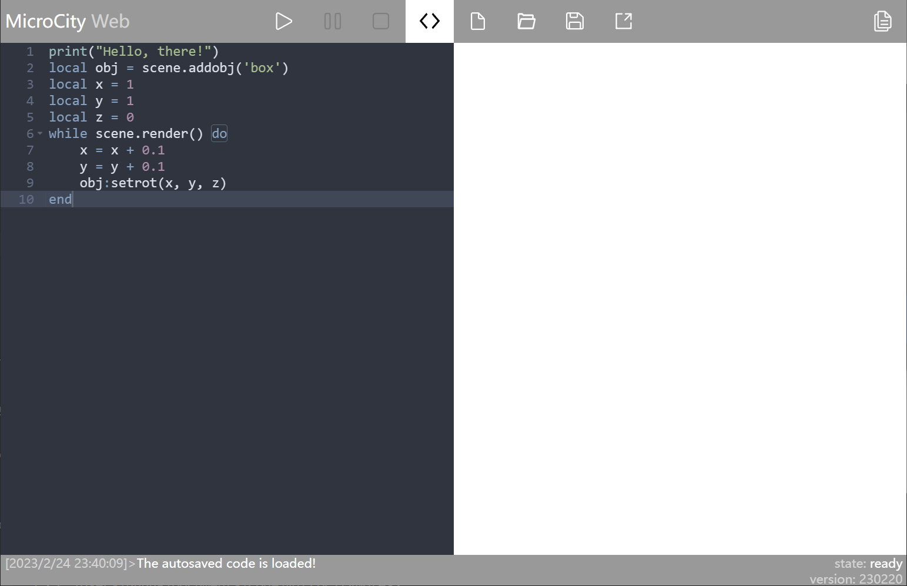
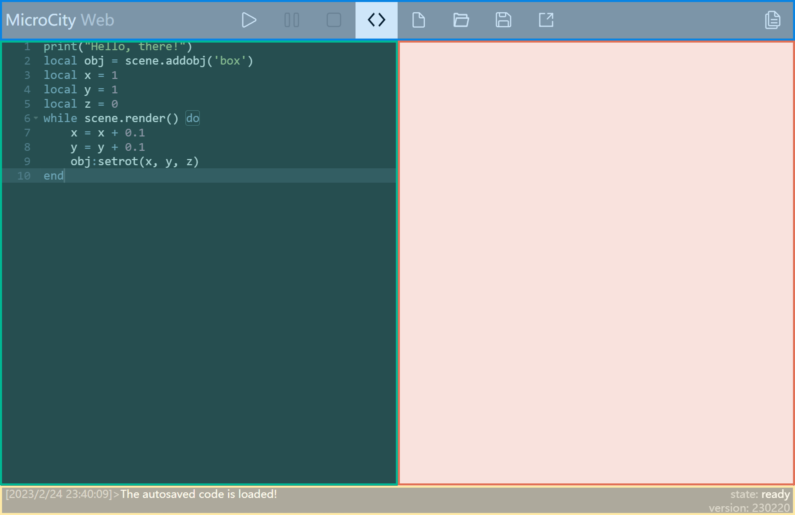
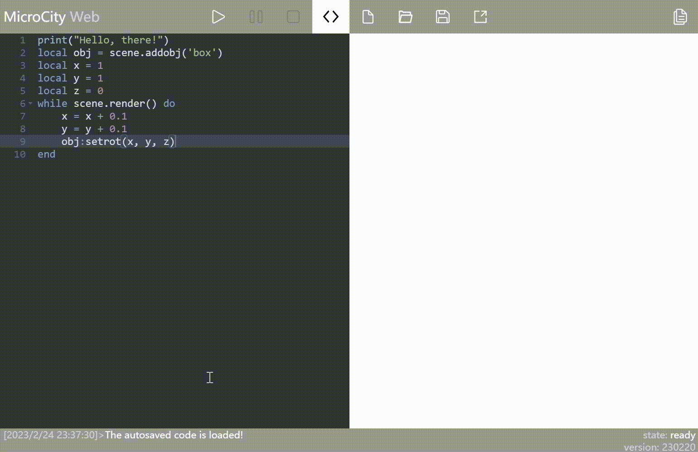
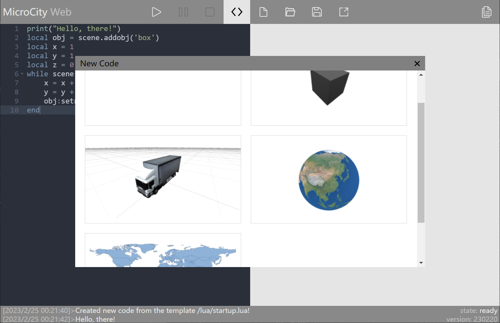
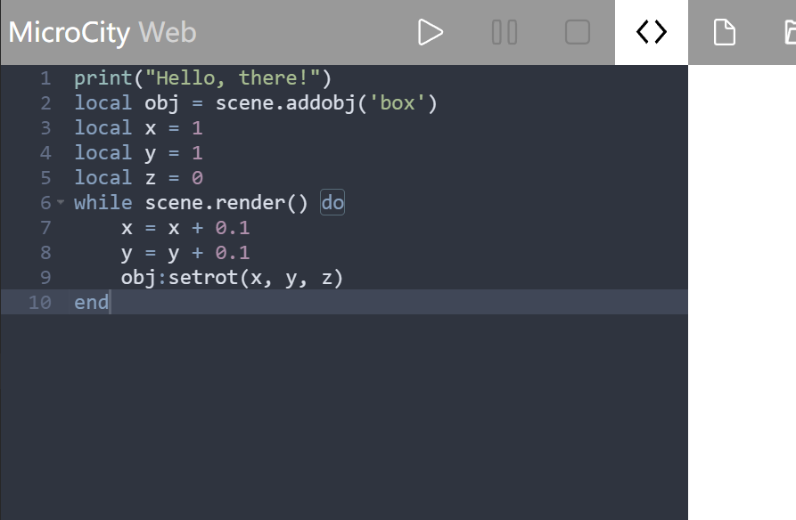
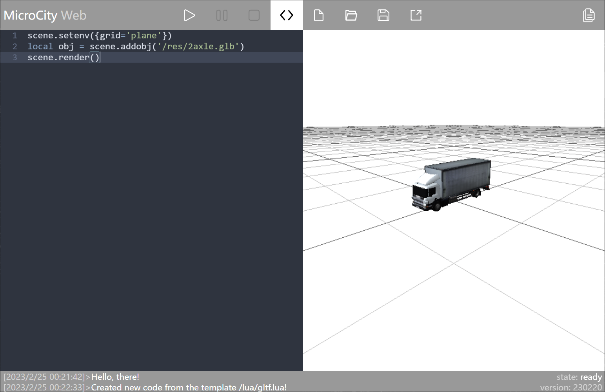
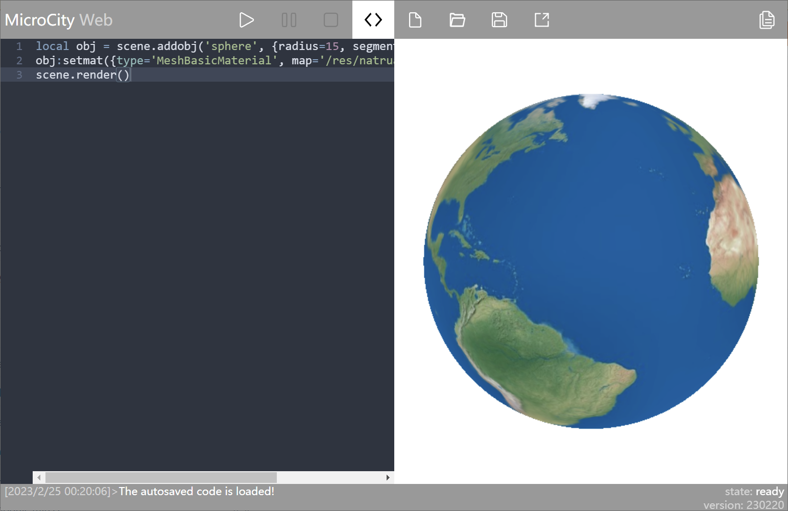
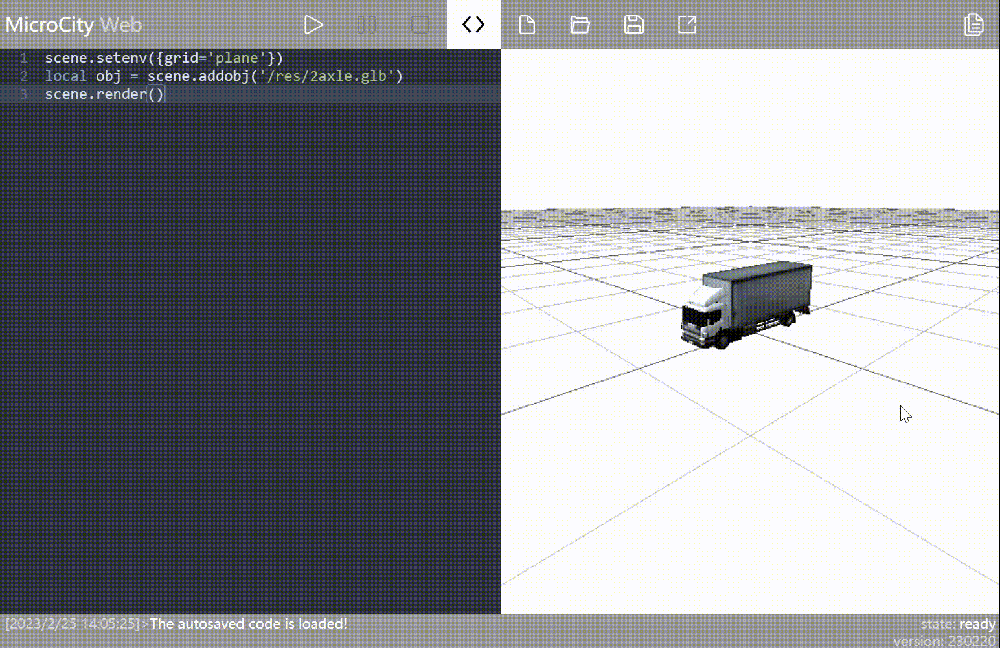
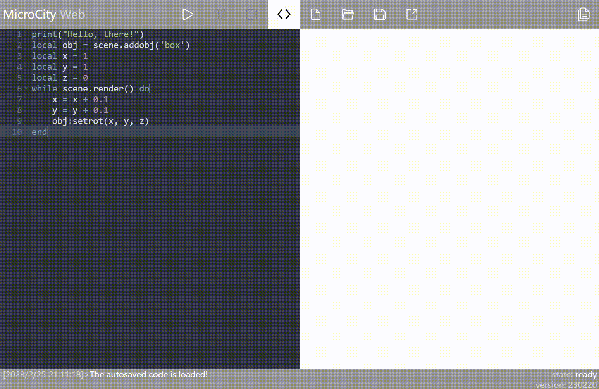
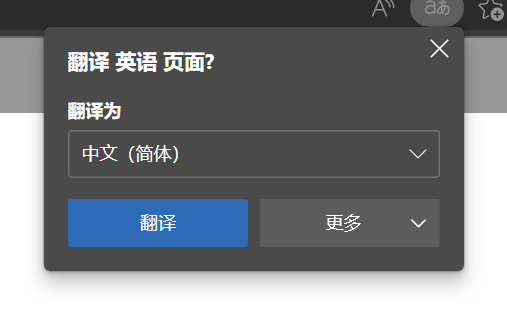

# 用户界面简介
MicroCity Web的总体界面如下图，本文将详细介绍MicroCity Web的用户界面（UI）操作。

## 界面分区概览
整体来看，MicroCity Web的界面大致可以划分为4个区域。
* [顶部-蓝色区域](#蓝色-命令区域)：对代码、文件执行各种操作
* [左侧-绿色区域](#绿色-代码编辑器)：代码编辑器
* [右侧-红色区域](#红色-画布区域)：视图区域
* [底部-黄色区域](#黄色-代码输出区域)：输出信息、识别程序运行状态

下面将详细介绍这几个区域的用法和功能。

## 蓝色：命令区域
此区域的的内容如下图所示，共有9个可用按钮。

### 程序控制
前3个按钮的功能大致都用于控制程序运行。详细作用分别如下：

1. **开始运行/debug:** 左键点击后将运行网页左侧[代码编辑器](#绿色代码编辑器)内的代码；右键点击后进行代码调试（debug）

2. **暂停运行:** 如果程序正在运行，点击后程序将**暂停**运行（如果程序支持）。

3. **停止运行/强行停止:** 如果程序正在运行，左键点击后程序将停止运行。有时存在左键点击无法停止运行脚本的情况，右键点击可以强行终止其运行。

### 代码编辑
编号4~7的按钮主要与代码编辑有关。

4. **显示/隐藏编辑器。** 如果左侧的代码编辑器为开启状态，点击这个按钮后将关闭。如果为关闭状态，点击后会重新打开。如果使用右键点击，编辑器可以展开到全屏状态。

5. **打开内置的代码** 可以直接载入内置的代码（导入内置模型），如立方体、卡车、地球、世界地图等。具体的模型将在介绍[画布区域](#红色画布区域)时详细介绍。
::: center

内置代码列表
:::
6. **打开本地代码/上传文件** 
   
   **左键点击**：弹出打开文件的对话框，您可以选择本机上的某个代码文件(.lua)。确定打开文件后，代码文件文本将自动导入到左侧代码编辑器中。
   
   **右键点击**：可以选择一个或多个文件上传到MicroCity Web中。右键“保存”按钮(⑦)可以查看已上传的文件列表。

7. **保存代码/下载** 
   
   **左键点击**：当您第一次保存文件时，点击保存按钮后会弹出保存文件对话框，您可以选择保存位置并填写文件名。如果您之前已经将该文件保存到本地，而此时您又对该文件进行了修改并想要保存更改，直接点击保存按钮即可直接将更改保存到之前保存的文件中。
   
   **右键点击**：可以查看已上传的文件列表，您可以点击列表中的文件并下载到本地。

### 其他
8. **共享。** 点击按钮后，将会弹出一个输入密码的对话框。随后，您将会得到一个链接，任何人都可以通过这个链接打开您的共享。

   如果您在弹出的对话框中输入了密码，那么在其他人打开链接后，他们只能运行您的程序代码并观察运行结果，而无法查看您的代码（除非您告知他们密码）；如果您没有输入密码，则其他人不仅可以运行您的代码查看运行结果，还可以查看您编写的代码。

9. **查看帮助文档。**

## 绿色：代码编辑器

MicroCity Web左侧整合的代码编辑器源于AceEditor，因此也具有AceEditor的一些特性。

### 快捷键
下面将介绍一些常用的快捷键，帮助你更好地编辑代码。

**最常用**
* <kbd>Ctrl</kbd>+<kbd>Z</kbd>：撤销

**行操作**
* <kbd>Ctrl</kbd>+<kbd>D</kbd>：删除一行
* <kbd>Ctrl</kbd>+<kbd>Shift</kbd>+<kbd>D</kbd>：复制一行
* <kbd>Alt</kbd>+<kbd>↑</kbd>：行代码上移
* <kbd>Alt</kbd>+<kbd>↓</kbd>：行代码下移

**查找内容**
* <kbd>Ctrl</kbd>+<kbd>K</kbd>：在代码中查找下一个与选中内容

**代码缩进**
* <kbd>Ctrl</kbd>+<kbd>[</kbd>：增加代码缩进
* <kbd>Ctrl</kbd>+<kbd>]</kbd>：减少代码缩进

**修改数值**
* <kbd>Ctrl</kbd>+<kbd>Shift</kbd>+<kbd>↑</kbd>：光标前的数字数值+1
* <kbd>Ctrl</kbd>+<kbd>Shift</kbd>+<kbd>↓</kbd>：光标前的数字数值-1

## 红色：画布区域
可以从内置代码导入场景，详见 [命令区域 - 代码编辑](#代码编辑)
> 导入场景代码后要点击“运行”按钮才会载入场景

::: center

内置汽车模型

内置地球模型
:::

### 场景操作
对场景的操作包括视角移动、旋转都需要在画布区域进行。因此，下面将介绍画布区域的基本操作。
* 场景的放大缩小：鼠标滚轮向上滚动为放大，向下滚动为缩小。
* 平移：按住鼠标右键拖动。
* 旋转
  * 场景旋转：按住鼠标左键拖动，以你的视角进行旋转
  * 对象旋转：点击对象，对象颜色改变后从对象上按住鼠标左键拖动，以对象为中心旋转。
  

无论是二维对象还是三维对象都遵循上述操作逻辑。

## 黄色：代码输出区域
打开MicroCity Web后，代码输出区域如下。点击代码输出区域后整个区域会上移，能够看到更多的历史输出信息。

说到这个区域输出的信息，代码输出区域会输出以下信息：
* **脚本输出:** 左侧是脚本的输出，包含输出时间、脚本输出内容。
* **脚本运行状态:** 右边第一行为脚本运行状态。`state:ready`表示脚本已经准备好开始运行（未运行），`state:running`表示脚本正在运行。
* **MicroCityWeb版本号:** 表示当前使用的MicroCityWeb版本号。如果与已知版本有差异，可以通过强制刷新加载最新版本。

## 注意事项

**关闭自动翻译：** 如果你的操作系统语言不是英语且浏览器开启了自动翻译，需要手动关闭，否则代码运行将出现错误。